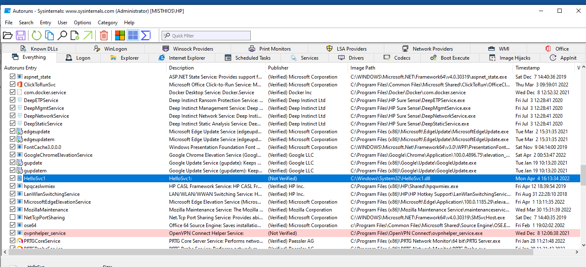

https://blogs.blackberry.com/en/2013/08/windows-registry-persistence-part-1-introduction-attack-phases-and-windows-services

### steps to do persistence

1. Identify user account IDs with remote access rights (VPN, Citrix, SSH, etc.)
2. Obtain clear text passwords so they that can be typed, for use with RDP, OWA, VPN, Citrix, etc.
3. Access VPN client software and certificates specific to your network (or similar "client" installation software)
4. Learn about the use of two-factor authentication controls present on your network. After all there is no need to obtain the above items if only to find out that a smart card is required for VPN access. Knowing this ahead of time allows them to focus on finding weak systems that can circumvent the stronger access controls.
5. Move to get access to higher privilege accounts within AD and within the user community with access to what they are interested in. This allows them to create or control user accounts and gain access to data stores that contain the information they seek.

Tool Persistence
Early stage persistence is typically done with registry modifications to run RAT tools as a hosted service and late stage tools are done with less noticeable piggyback module loading. The persistence options available are:

Registry
File system configuration files
Search Order Hijacking
More esoteric means

Technique of persistence	Risk Assessment	Usage
HKLM\System\CurrentControlSet\Services	- Runs as SYSTEM, very stealthy, safe	Used for long-term remote access in early stages and as backup access
HKLM\Software - run keys	Runs as Administrator, less stealthy	Used for initial compromise
HKCU run keys- Early stage droppers & downloaders, noisy and dangerous	Initial exploit, day zero activity

Attackers love Windows Services because they run under NT AUTHORITY\SYSTEM, which is the highest level of privileged account available permitting them to do almost anything they want on the system and bypasses UAC on Windows 7 and 8. Windows services come in two types: "Own Process" and "Share Process". Own Process services are implemented as stand-alone executables and exist in their own running process. Share Process are "hosted" by the Windows Service Host (svchost.exe) and are implemented as modules, also called Dynamic Link Libraries (DLLs).

Autorun.exe utility in sysinternals can help us get what are the autorun processes.

Valuelist is still running as service. -sample service.

## netsvcs 

Registry Locations of Interest
 HKLM\System\CurrentControlSet\services 
The keys located here get loaded by the Service Controller at various times during the operation of the computer. Some are loaded at system startup and others are loaded on demand or when triggered by other events. The attackers want to load at startup so that even if no user logs in they can connect to the computer.

This is where the "Share Process" DLLs are configured to be loaded by the host process, SvcHost.exe. This has been the most common location for attackers to locate their remote access tools, often called "RATs" by response investigators. Because Windows ships with 136 hosted DLLs and a number of these are not in use they become locations that can be used to persist malicious code without breaking any existing services.

 HKLM\Software\Microsoft\Windows NT\CurrentVersion\SvcHost 
Here windows implements a sort of role-based access control (RBAC) by grouping services that have similar privilege needs. Services that don't access the network are listed in groups that don't have access to the network. Services that need unfettered access to the network are grouped together and called "netsvcs" as defined in the string array found here. Because RATs need access to the network they hide here, typically in an "empty parking space" as discussed next.

### Empty Parking Spaces Within Svchost

On Windows 7 there are 47 "service names" listed in the netsvcs group list. These "service names" function as pointers to service configurations in the CurrentControlSet\Services hive. On a fresh install of Windows 7 there are 14 of these that are listed in netsvcs but are not implemented under Services. These can be maliciously configured as a means of persistence (See FIGURE 1). To do this the attacker needs to have permission to modify the registry configuration to load their code and only administrator permissions are needed.

Each hosted service can have exactly one DLL listed in a subkey called ServiceDll. In order to load their code they would have to redirect an existing DLL to one of their own which would break the functionality provided by the real DLL and risk them being discovered. Therefore they attack the netsvcs service names that are not in use. This can be done by iterating the names found in the string array for the netsvcs group and testing to see if a key already exists under Services in the CurrentControlSet branch. It there isn't one found then it's a good candidate for using.

As an example, a Windows 7 installation doesn't have an IAS hive by default under Services (FIGURE 2), and since the string array for netsvcs does contain an entry for "Ias", this is a good candidate for using. NOTE: If your organization uses Microsoft Network Policy Server (NPS), then your registry will have the "Ias" settings being used legitimately.

### Application Initialization DLLs (appinit_dlls)
 
 HKLM\SOFTWARE\Microsoft\Windows NT\CurrentVersion\Windows\AppInit_DLLs 

The AppInit_DLLs registry key has been around for a very long time (Windows NT and post Windows 95) and is a popular attack vector for persistence. It makes every process that executes load USER32.dll. Almost all processes load this DLL and this makes it a great means of loading malicious code.

reg query "HKLM\SOFTWARE\Microsoft\Windows NT\CurrentVersion\Windows"

AppInit_DLLs	REG_SZ	Space and comma delimited list of system DLLs and paths to non-system DLLs to load with every executable launched in the logon session
LoadAppInit_DLLs	REG_DWORD	0x1 = use them (default); 0x0 = don't use them
RequireSignedAppInit_DLLs	REG_DWORD	0x0 = Load any DLLs; 0x1 = 0 Load only code-signed DLLs 
Windows 7 allows non-signed DLLs by default for compatibility reasons so this value doesn't exist and must be created in Windows 7 
Server 2008 and newer require signed DLLs by default and set this value to 0x1
"All the DLLs that are specified in this value are loaded by each Microsoft Windows-based application that is running in the current log on session. The AppInit DLLs are loaded by using the LoadLibrary() function during the DLL_PROCESS_ATTACH process of User32.dll. Therefore, executables that do not link with User32.dll do not load the AppInit DLLs. There are very few executables that do not link with User32.dll. 

