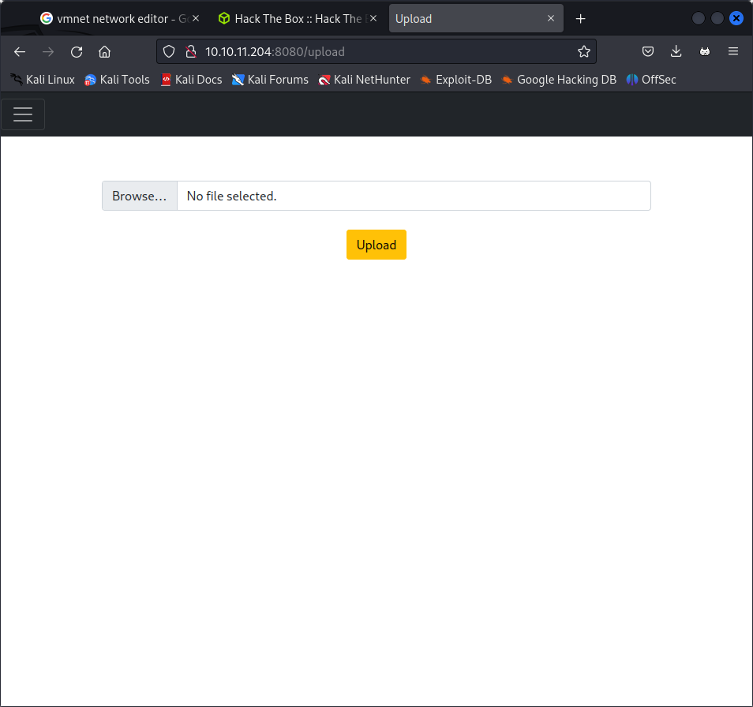
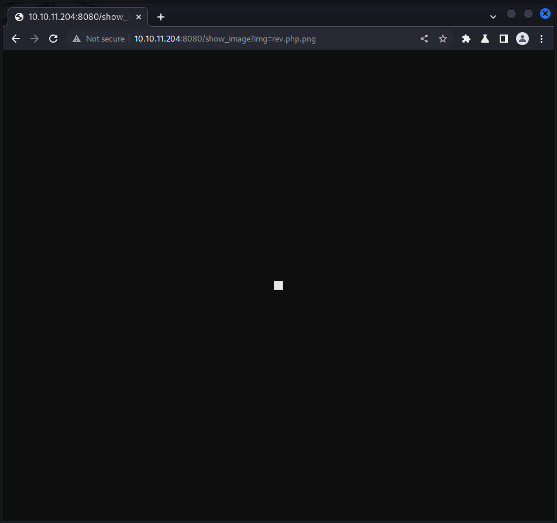
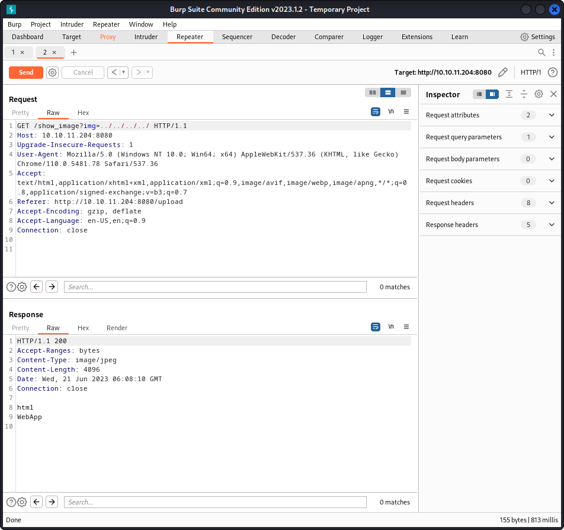

# nmap

ORT     STATE SERVICE
22/tcp   open  ssh
8080/tcp open  http-proxy


---------------------Starting Script Scan-----------------------
                                                                                                                   


PORT     STATE SERVICE     VERSION
22/tcp   open  ssh         OpenSSH 8.2p1 Ubuntu 4ubuntu0.5 (Ubuntu Linux; protocol 2.0)
| ssh-hostkey: 
|   3072 caf10c515a596277f0a80c5c7c8ddaf8 (RSA)
|   256 d51c81c97b076b1cc1b429254b52219f (ECDSA)
|_  256 db1d8ceb9472b0d3ed44b96c93a7f91d (ED25519)
8080/tcp open  nagios-nsca Nagios NSCA
|_http-title: Home
Service Info: OS: Linux; CPE: cpe:/o:linux:linux_kernel


at 8080 website is open

upload at /upload



only image files are accepted.

10.10.16.24

things that can be done to bypass

Just uploading .php file instead of jpg file.

Trying double extensions to bypass and upload php file pic.jpg.php or pic.php.jpg

Changing Content-type filtering i.e., changing Content-Type: txt/php to image/jpg

Tried Case sensitives — pic.PhP also tried pic.php5, pHP5.

Tried special characters to bypass pic.php%00 , pic.php%0a, pic.php%00



able to upload by just chaninf the location

```
/register             (Status: 200) [Size: 5654]
/blogs                (Status: 200) [Size: 5371]
/upload               (Status: 200) [Size: 1857]
/environment          (Status: 500) [Size: 712]
/error                (Status: 500) [Size: 106]
/release_notes        (Status: 200) [Size: 1086]
/http%3A%2F%2Fwww     (Status: 400) [Size: 435]
/show_image           (Status: 400) [Size: 194]
/http%3A%2F%2Fyoutube (Status: 400) [Size: 435]
/http%3A%2F%2Fblogs   (Status: 400) [Size: 435]
/http%3A%2F%2Fblog    (Status: 400) [Size: 435]
/**http%3A%2F%2Fwww   (Status: 400) [Size: 435]
/External%5CX-News    (Status: 400) [Size: 435]
/http%3A%2F%2Fcommunity (Status: 400) [Size: 435]
/http%3A%2F%2Fradar   (Status: 400) [Size: 435]
/http%3A%2F%2Fjeremiahgrossman (Status: 400) [Size: 435]
/http%3A%2F%2Fweblog  (Status: 400) [Size: 435]
/http%3A%2F%2Fswik    (Status: 400) [Size: 435]
```

there is something in th upload feature.

try for lfi

http://10.10.11.204:8080/show_image?img=rev.php.png

http://10.10.11.204:8080/show_image?img=20230621000431.png

https://medium.com/@Aptive/local-file-inclusion-lfi-web-application-penetration-testing-cc9dc8dd3601

http://10.10.16.24:8000/linpeas.sh  


LFI exploit



after checking we found that the MAven framework has spring4shell exploit

so lets try and create a poc around taht


# lessons 

1. Always check for LFI


