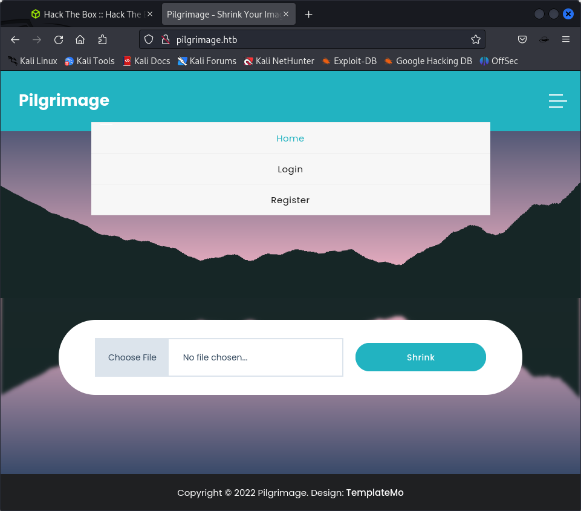

### inital enumeration

nmap results

Not shown: 998 closed tcp ports (conn-refused)
PORT   STATE SERVICE
22/tcp open  ssh
80/tcp open  http

it has a website

it has a register page

its php

so lets go dirb, gobuster

gobuster dir --url http://pilgrimage.htb --wordlist /usr/share/wordlists/dirbuster/directory-list-2.3-medium.txt -x php,html

gobuster vhost -w /usr/share/seclists/Discovery/DNS/subdomains-top1million-5000.txt -u http://pilgrimage.htb -t 50 --append-domain

nothing on the subdomain enumeration

### content upload

all shrunk pictures come on the dashboard

where pictures are stored bu there is no lfi here

lets try and load a php webshell
there is content restriction it seems

php change did not work

tried to forge  php shell across

### other things on website?

and there are other pathways available

/index.php            (Status: 200) [Size: 7621]
/.html                (Status: 403) [Size: 153]
/login.php            (Status: 200) [Size: 6166]
/register.php         (Status: 200) [Size: 6173]
/assets               (Status: 301) [Size: 169] [--> http://pilgrimage.htb/assets/]
/logout.php           (Status: 302) [Size: 0] [--> /]
/vendor               (Status: 301) [Size: 169] [--> http://pilgrimage.htb/vendor/]
/dashboard.php        (Status: 302) [Size: 0] [--> /login.php]
/tmp                  (Status: 301) [Size: 169] [--> http://pilgrimage.htb/tmp/]

but all of them are forbidden now

### git

also just through drib found that .git repo is also available here

but HEAD does not mention much

pip install git-dumper

git-dumper URL DIR

using git-dumper.py

was able to get the source code of the entire thing!

now need to go thorugh the code of the github

