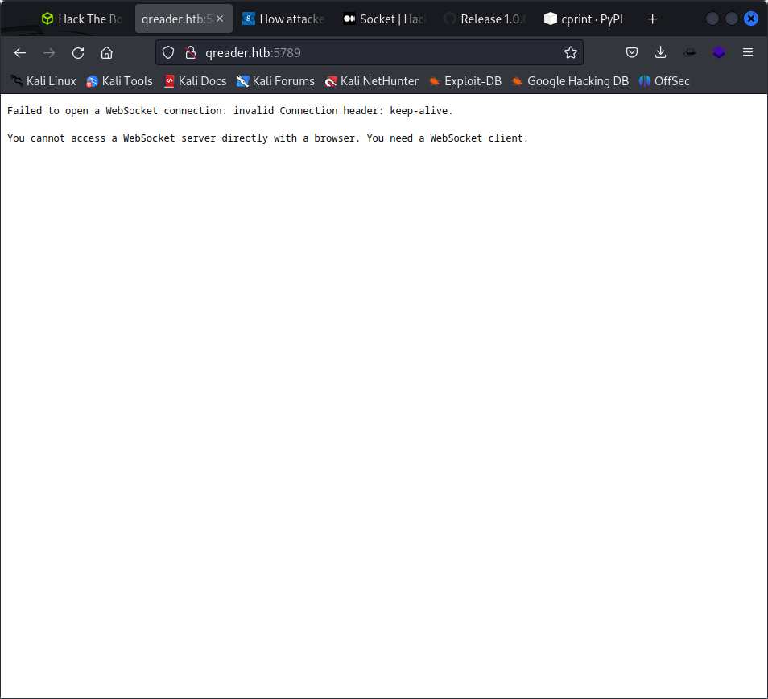

─$ nmap 10.10.11.206
Starting Nmap 7.93 ( https://nmap.org ) at 2023-07-11 23:42 EDT
Nmap scan report for 10.10.11.206
Host is up (0.53s latency).
Not shown: 998 closed tcp ports (conn-refused)
PORT   STATE SERVICE
22/tcp open  ssh
80/tcp open  http

Nmap done: 1 IP address (1 host up) scanned in 56.56 seconds
                                                        
it says that it is made with flask

use stews 

python3 STEWS-vuln-detect.py http://10.10.11.206

so  5789 oirt us also open

