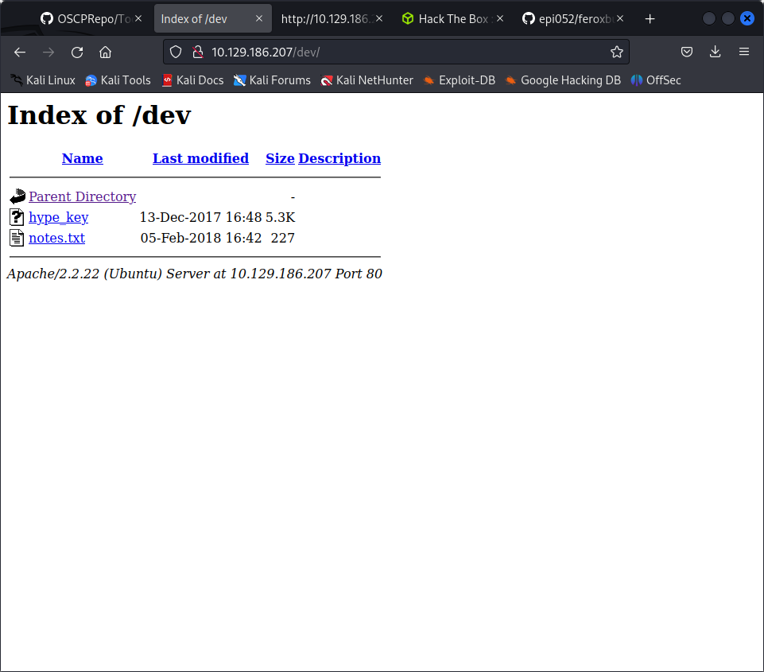

/nmap_automator.sh --host 10.129.186.207 --type All

feroxbuster -u 10.129.186.207 



To do:

1) Coffee.
2) Research.
3) Fix decoder/encoder before going live.
4) Make sure encoding/decoding is only done client-side.
5) Don't use the decoder/encoder until any of this is done.
6) Find a better way to take notes.

find ubuntu version based on nmap results

with end of life we can actually get a hit

nmap -sC -sV -oA nmap/valentine 10.129.186.207

nmap --script vuln -oA nmap/vulnscan 10.129.186.207

gobuster -u http://10.129.186.207 -w /usr/share/wordlists/dirbuster/directory-list-2/3-medium.txt -o fobuster.log -t 50

the logo was heartbleed so may want to reverse google serachthe image as well

sslscanner - sslyze

└─$ sslyze --heartbleed 10.129.186.207

 CHECKING CONNECTIVITY TO SERVER(S)
 ----------------------------------

   10.129.186.207:443        => 10.129.186.207 


 SCAN RESULTS FOR 10.129.186.207:443 - 10.129.186.207
 ----------------------------------------------------

 * OpenSSL Heartbleed:
                                          VULNERABLE - Server is vulnerable to Heartbleed

 SCANS COMPLETED IN 3.613480 S
 -----------------------------

 COMPLIANCE AGAINST MOZILLA TLS CONFIGURATION
 --------------------------------------------

    Disabled; use --mozilla_config={old, intermediate, modern}.

sudo apt-get install software-properties-common
sudo apt-add-repository universe
sudo apt-get update
sudo apt-get install python3-pip

it is vulnerable to heartbleed however there is no reverse shell for the exploit

instead we can focus on hype.key and decrypt it

We can use openssl to try to decrypt. It asks for a password… the decode of the base64 collected with heartbleed, heartbleedbelievethehype works:

```
┌──(kali㉿kali)-[~/oscp/ippsec/valentine]
└─$ ssh -i ./decrypted_key hype@10.129.29.105 
The authenticity of host '10.129.29.105 (10.129.29.105)' can't be established.
ECDSA key fingerprint is SHA256:lqH8pv30qdlekhX8RTgJTq79ljYnL2cXflNTYu8LS5w.
This host key is known by the following other names/addresses:
    ~/.ssh/known_hosts:4: [hashed name]
Are you sure you want to continue connecting (yes/no/[fingerprint])? yes
Warning: Permanently added '10.129.29.105' (ECDSA) to the list of known hosts.
sign_and_send_pubkey: no mutual signature supported
hype@10.129.29.105's password: 
```
THe problem with depreciated key:
ssh -o PubkeyAcceptedKeyTypes=+ssh-rsa -i ./decrypted_key hype@10.129.29.105 


for upgrading to root dirty cow worked

### learnings

1. images may be important
2. always scan for linux version vulns also
3. base64 shenanigans

