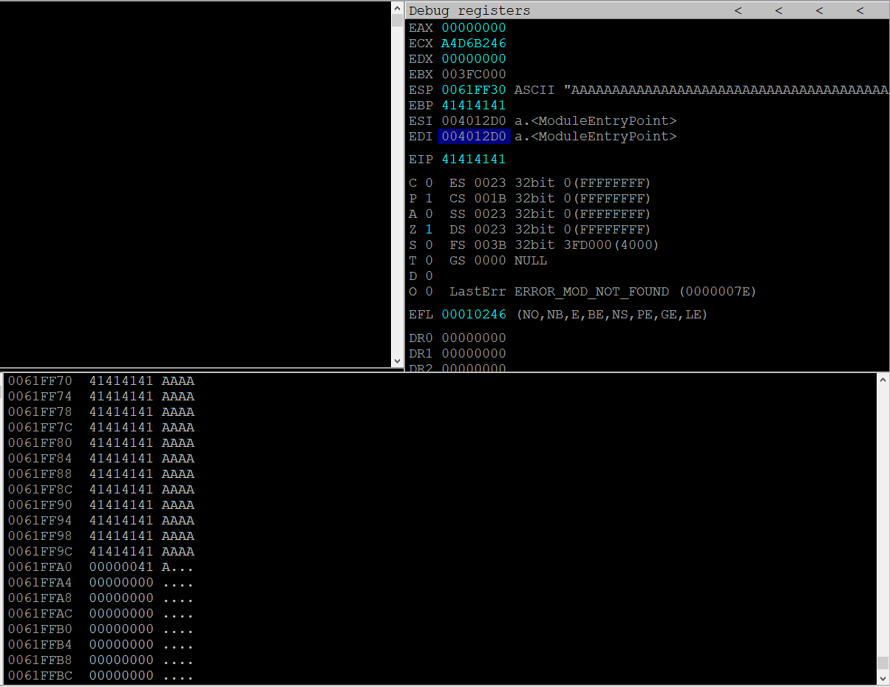

# Buffer overflows

### The stack

When a thread is running, it executes code from within the Program Image or from various Dynamic 
Link Libraries (DLLs).292 The thread requires a short-term data area for functions, local variables, 
and program control information, which is known as the stack.293 To facilitate independent 
execution of multiple threads, each thread in a running application has its own stack.
Stack memory is “viewed” by the CPU as a Last-In First-Out (LIFO) structure. This essentially means 
that while accessing the stack, items put (“pushed”) on the top of the stack are removed (“popped”) 
first. The x86 architecture implements dedicated PUSH and POP assembly instructions in order to 
add or remove data to the stack respectively.

10.2 Buffer Overflow Walkthrough
In this section, we will analyze a simple vulnerable application that does not perform proper 
sanitization of user input. We will analyze the application source code and discover that by passing 
a specifically crafted argument to the application, we will be able to copy our controlled input string 
to a smaller-sized stack buffer, eventually overflowing its limits. This overflow will corrupt data on 
the stack, finally leading to a return address overwrite and complete control over the EIP register.
Controlling EIP is the first step in creating a successful buffer overflow. In this module, we will focus 
on controlling EIP and in further modules, we will explain how to leverage this into arbitrary code 
execution

to compile program:
`gcc .\sample_vulnerable.c`

Looking at immunity debugger : This is not uncommon as often the entry point is set by the compiler to a section of 
code created to help prepare the execution of the program. Among other things, this preparation 
includes setting up all the arguments that main may expect

10.2.5 Exercises
1. Repeat the steps shown in this section to see the 12 A’s copied onto the stack.
2. Supply at least 80 A’s and verify that EIP after the strcpy will contain the value 41414141

## Windows bufer overflow

syncbreeze buffer overflow skipped.

## win32 buffer overflow exploitation

1. DEP - Data execution prevention prevents malicious code to be run from memory.

2.  ASLR - Address space layout randomisation - ensures that base address of the loaded applications or DLLs are changed everytime the Operating sustem are loaded.

3. CFG - Control flow integrity prevents illegal code branches

