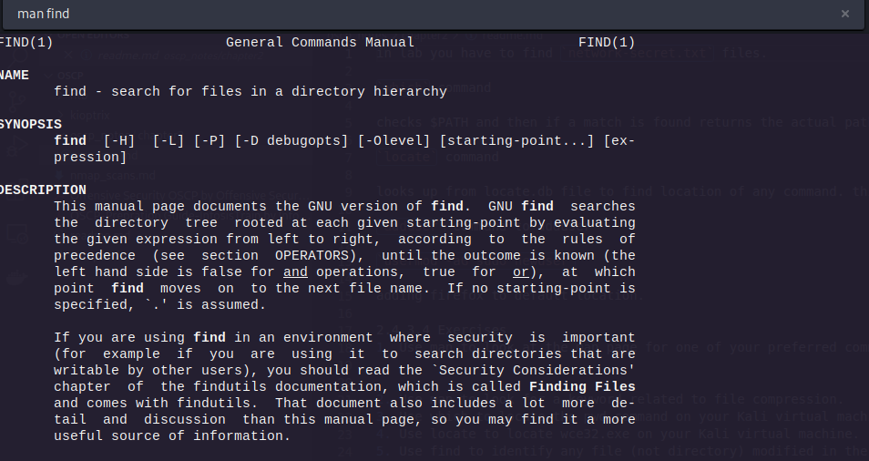
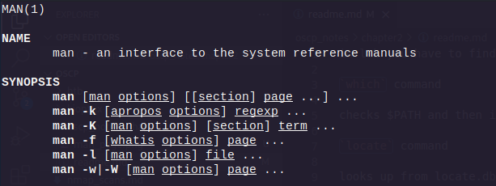
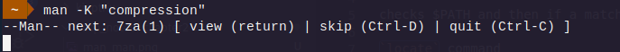
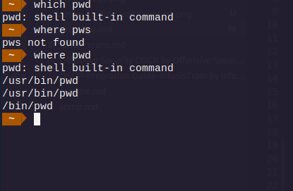
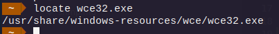

# Chapter 2

in lab you have to find `network-secret.txt` files.

`which` command

checks $PATH and then if a match is found returns the actual path.

`locate` command

looks up from locate.db file to find location of any command. this locate.db is constantly updates by cron scheduler.

`adduser` command to adduser

`usermod -aG sudo newuser`

adding firefox to default location.

### 2.4.3.4 Exercises
1. Use man to look at the man page for one of your preferred commands.


2. Use man to look for a keyword related to file compression.


using man to find compression


3. Use which to locate the pwd command on your Kali virtual machine.


4. Use locate to locate wce32.exe on your Kali virtual machine.


5. Use find to identify any file (not directory) modified in the last day, NOT owned by the root 
user and execute ls -l on them. Chaining/piping commands is NOT allowed!

```
find $HOME -mtime 0 -not -user root 

```

Dont know how to do ls -l.


