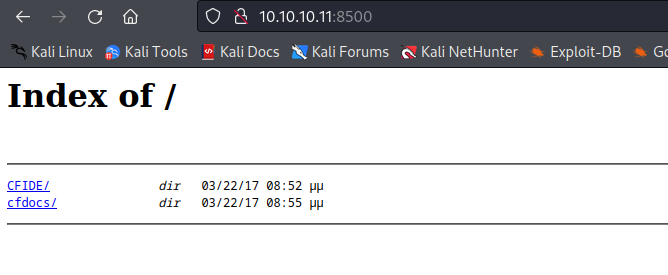
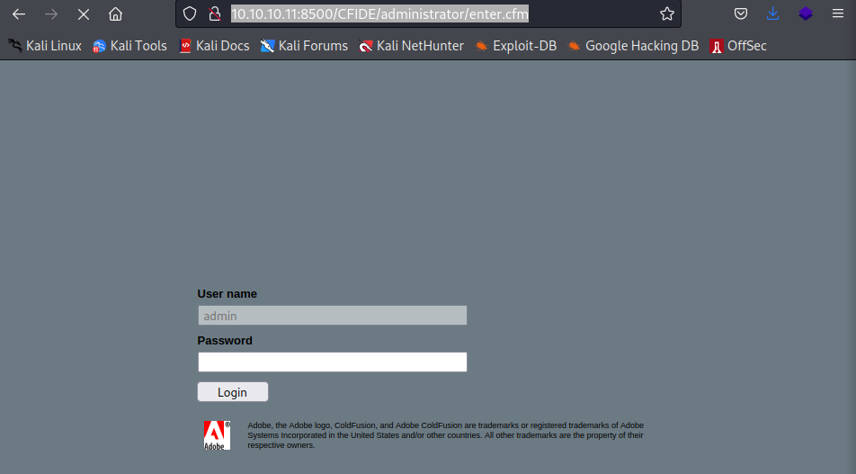
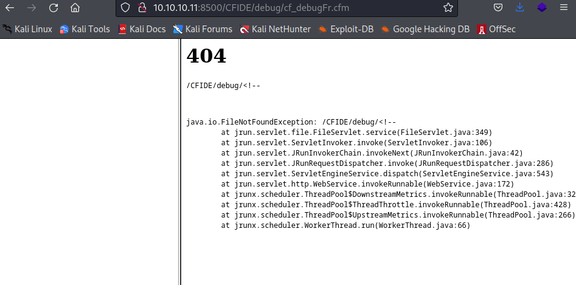

Nmap scan report for 10.10.10.11 (10.10.10.11)
Host is up (0.22s latency).
Not shown: 997 filtered tcp ports (no-response)
PORT      STATE SERVICE VERSION
135/tcp   open  msrpc   Microsoft Windows RPC
8500/tcp  open  fmtp?
49154/tcp open  msrpc   Microsoft Windows RPC
Service Info: OS: Windows; CPE: cpe:/o:microsoft:windows

at http://10.10.10.11:8500/CFIDE/administrator/enter.cfm

we have 

http://10.10.10.11:8500/CFIDE/administrator/

