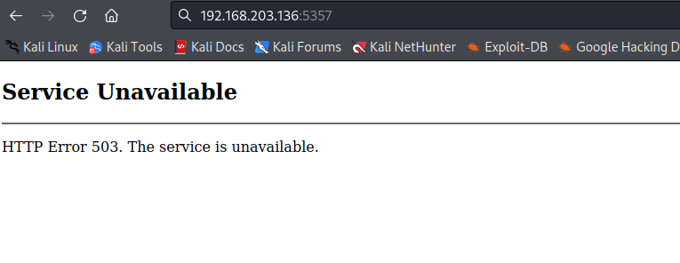

https://hummus-ful.github.io/vulnhub/2021/01/22/DC-9.html

netdiscover can also be used
```
nmap -sn 192.168.203.0/24
Starting Nmap 7.92 ( https://nmap.org ) at 2023-01-07 23:55 EST
Nmap scan report for 192.168.203.2
Host is up (0.0025s latency).
Nmap scan report for 192.168.203.146
Host is up (0.0052s latency).
Nmap done: 256 IP addresses (2 hosts up) scanned in 3.14 seconds
```

to port scan


we can also add ip to /etc/hosts file if we want

nmap scan result
`sudo nmap 192.168.203.2 -sV -p- -O -T4 -oN ./pen300/tj_null/dc-9/scan_nmap
`

```
PORT   STATE SERVICE VERSION
53/tcp open  domain  Unbound
MAC Address: 00:50:56:E7:CA:DE (VMware)
Aggressive OS guesses: VMware Player virtual NAT device (98%), Microsoft Windows XP SP3 or Windows 7 or Windows Server 2012 (93%), Microsoft Windows XP SP3 (93%), DD-WRT v24-sp2 (Linux 2.4.37) (91%), Linux 3.2 (91%), DVTel DVT-9540DW network camera (91%), Actiontec MI424WR-GEN3I WAP (90%), BlueArc Titan 2100 NAS device (89%), Linux 4.4 (89%), Pirelli DP-10 VoIP phone (88%)
No exact OS matches for host (test conditions non-ideal).
Network Distance: 1 hop

```

port 53 is open which is for DNS

when searching for DNS exploits we found - https://charlesreid1.com/wiki/Metasploitable/DNS_Bind

which will add our entries in dns to redirect and phish

but we dont need it.

however i realised that we may not be looking at the correct ip
`using netdiscover -r 192.168.203.0/24`

```
 Currently scanning: Finished!   |   Screen View: Unique Hosts                                                     
                                                                                                                   
 5 Captured ARP Req/Rep packets, from 3 hosts.   Total size: 300                                                   
 _____________________________________________________________________________
   IP            At MAC Address     Count     Len  MAC Vendor / Hostname      
 -----------------------------------------------------------------------------
 192.168.203.2   00:50:56:e7:ca:de      2     120  VMware, Inc.                                                    
 192.168.203.136 00:0c:29:4c:72:8b      2     120  VMware, Inc.                                                    
 192.168.203.254 00:50:56:f7:08:b6      1      60  VMware, Inc.                                                    


```

now nmapping 136 ip
```
PORT     STATE SERVICE       VERSION
135/tcp  open  msrpc         Microsoft Windows RPC
139/tcp  open  netbios-ssn   Microsoft Windows netbios-ssn
445/tcp  open  microsoft-ds?
5040/tcp open  unknown
5357/tcp open  http          Microsoft HTTPAPI httpd 2.0 (SSDP/UPnP)
|_http-server-header: Microsoft-HTTPAPI/2.0
|_http-title: Service Unavailable
7680/tcp open  pando-pub?
MAC Address: 00:0C:29:4C:72:8B (VMware)
Warning: OSScan results may be unreliable because we could not find at least 1 open and 1 closed port
Device type: general purpose
Running (JUST GUESSING): Microsoft Windows XP|7|2008 (89%)
OS CPE: cpe:/o:microsoft:windows_xp::sp3 cpe:/o:microsoft:windows_7 cpe:/o:microsoft:windows_server_2008::sp1 cpe:/o:microsoft:windows_server_2008:r2
Aggressive OS guesses: Microsoft Windows XP SP3 (89%), Microsoft Windows XP SP2 (87%), Microsoft Windows 7 (85%), Microsoft Windows Server 2008 SP1 or Windows Server 2008 R2 (85%)
No exact OS matches for host (test conditions non-ideal).
Network Distance: 1 hop
Service Info: OS: Windows; CPE: cpe:/o:microsoft:windows

```

in 136 I was able to enumerate a website part



but I still think its not he dc9 machine because it doesn't have 80 of http open

because it wasnt even bridged with the dc-9!


