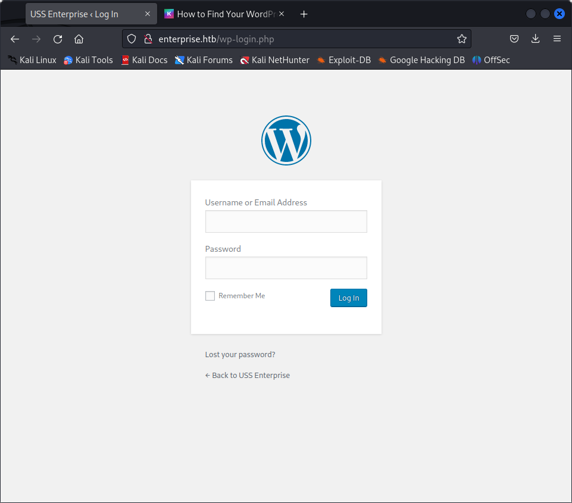

Starting Nmap 7.93 ( https://nmap.org ) at 2023-04-11 06:31 EDT
Nmap scan report for 10.129.94.125
Host is up (0.086s latency).
Not shown: 996 closed tcp ports (conn-refused)
PORT     STATE SERVICE
22/tcp   open  ssh
80/tcp   open  http
443/tcp  open  https
8080/tcp open  http-proxy

Nmap done: 1 IP address (1 host up) scanned in 5.35 seconds

START_TIME: Tue Apr 11 06:49:57 2023
URL_BASE: http://enterprise.htb/
WORDLIST_FILES: /usr/share/dirb/wordlists/common.txt

-----------------

                                                                             GENERATED WORDS: 4612

---- Scanning URL: http://enterprise.htb/ ----
                                                                             + http://enterprise.htb/index.php (CODE:301|SIZE:0)                         
+ http://enterprise.htb/server-status (CODE:403|SIZE:302)                   
                                                                             ==> DIRECTORY: http://enterprise.htb/wp-admin/
                                                                             ==> DIRECTORY: http://enterprise.htb/wp-content/
                                                                             ==> DIRECTORY: http://enterprise.htb/wp-includes/
+ http://enterprise.htb/xmlrpc.php (CODE:405|SIZE:42)                       
                                                                            
---- Entering directory: http://enterprise.htb/wp-admin/ ----
                                                                             + http://enterprise.htb/wp-admin/admin.php (CODE:302|SIZE:0)                
                                                                             ==> DIRECTORY: http://enterprise.htb/wp-admin/css/
                                                                             ==> DIRECTORY: http://enterprise.htb/wp-admin/images/
                                                                             ==> DIRECTORY: http://enterprise.htb/wp-admin/includes/
+ http://enterprise.htb/wp-admin/index.php (CODE:302|SIZE:0)                
                                                                             ==> DIRECTORY: http://enterprise.htb/wp-admin/js/
                                                                             ==> DIRECTORY: http://enterprise.htb/wp-admin/maint/
                                                                             ==> DIRECTORY: http://enterprise.htb/wp-admin/network/
                                                                             ==> DIRECTORY: http://enterprise.htb/wp-admin/user/
                                                                            
---- Entering directory: http://enterprise.htb/wp-content/ ----

   

The server is very unstable actually

based on limited walkthorugh i have seen its  about brute forcing some or the other directory ot get admin access but not able  to brute force because of website unstability.
