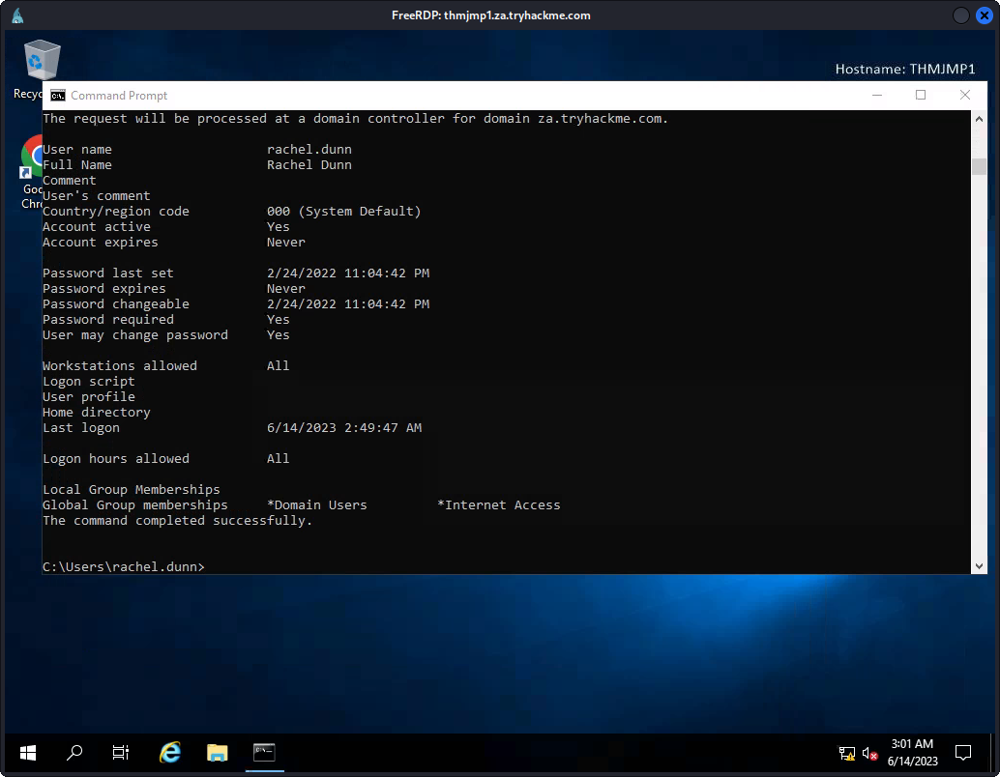

I connected the the adevnumeration ovpn file
and changed the dns to thmdc

after changing the /etc/resolv.conf

```
─$ sudo systemctl restart networking.service
                                                                             
┌──(kali㉿kali)-[~]
└─$ cat /etc/resolv.conf
# Generated by NetworkManager

search localdomain za.tryhackme.com
nameserver 10.200.49.101
nameserver 192.168.133.2

options timeout:1

options attempts:2

```

after that I got hte following credentials

`Your credentials have been generated: Username: rachel.dunn Password: Bmlj9838`

enumad - 10.50.47.172

`ssh za.tryhackme.com\\rachel.dunn@thmjmp1.za.tryhackme.com`


xfreerdp /d:za.tryhackme.com /u:'rachel.dunn' /p:'Bmlj9838' /v:thmjmp1.za.tryhackme.com /drive:.,kali-share +clipboard

Using microsoft management console to enumerate
I dont know how to enumerate through RSAT however enumerating through command prompt i need to see

`net user /domain`

`net user rachel.dunn /domain`



net group /domain

net group "Tier 1 Admins" /domain

net accounts /domain

### USER ENUMERATION

get-ADuser
get-ADGroup
Get-ADGroupMember
Get-ADObject

A more generic search for any AD objects can be performed using the Get-ADObject cmdlet. For example, if we are looking for all AD objects that were changed after a specific date:

PS C:\> $ChangeDate = New-Object DateTime(2022, 02, 28, 12, 00, 00)
PS C:\> Get-ADObject -Filter 'whenChanged -gt $ChangeDate' -includeDeletedObjects -Server za.tryhackme.com

Get-ADObject -Filter 'badPwdCount -gt 0' -Server za.tryhackme.com

Get-ADDomain
et-ADAccountPassword -Identity gordon.stevens -Server za.tryhackme.com -OldPassword (ConvertTo-SecureString -AsPlaintext "old" -force) -NewPassword (ConvertTo-SecureString -AsPlainText "new" -Force)

 Get-ADUser -Identity Beth.Nolan -properties *

  CN=annette.manning,OU=Marketing,OU=People,DC=za,DC=tryhackme,DC=com


Get-ADGroup -Identity "Tier 2 Admins"
get-aduser -Identity beth.nolan -Properties * |Select-object 'Title'