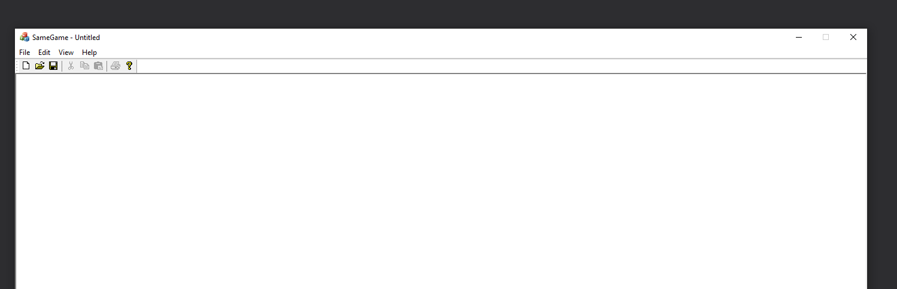

# trying to use winapi

https://docs.microsoft.com/en-us/windows/win32/learnwin32/your-first-windows-program
not running in dev cpp

### new.cpp

new.cpp creates a window

## Introduction to windows service applications

Microsoft Windows services, formerly known as NT services, enable you to create long-running executable applications that run in their own Windows sessions. These services can be automatically started when the computer boots, can be paused and restarted, and do not show any user interface.

https://www.c-sharpcorner.com/article/create-windows-services-in-c-sharp/

## Creating a MFC appliCATION

Starting initial application:

It didnt work was too complicated.

